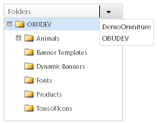
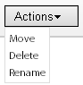
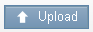
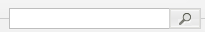
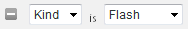
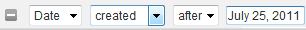

# Über Banner {#about-banners}

Sie können Banner verwenden, um die Banneranzeigen zu verwalten, die sich auf Ihrer Website befinden.

## Verwenden von Bannern {#concept_5BBE01FEC6134393B43CC917C8CC64DA}

<!-- 

c_about_banners.xml

 -->

Es gibt zwei Methoden, mit denen Sie Ihrer Website Banneranzeigen hinzufügen können.

Die erste Methode besteht darin, Banner über Zielgruppe, Search&amp;Promote hinzuzufügen. Die Banner sind HTML-Code-Snippets, die angezeigt werden, wenn ein Kunde Ihre Website durchsucht. Ihr Banner kann Text oder ein Bild im GIF-, JPEG- oder PNG-Format oder in einer Kombination beider Formate enthalten. Sie können aus voreingestellten Größen auswählen oder eigene benutzerdefinierte Dimensionen definieren, um sie an Ihre Seite anzupassen. Der HTML-Code, den Sie zum Anzeigen des Banners verwenden, kann auch Elemente wie den zu verwendenden Schriftstil und den Rand angeben. Diese Methode zum Hinzufügen eines Banners bietet grundlegende Funktionen und erfordert keine zusätzliche Angebot.

Die zweite Methode besteht in der Adobe Dynamic Media Classic, einem dynamischen Medienmanagement- und Veröffentlichungsdienst. Mit einem gültigen Dynamic Media Classic-Konto der Adobe können Sie Bannerinhalte direkt für die Zielgruppe, Search&amp;Promote und Dynamic Media Classic verwalten und bereitstellen. Bei der Site-Suche/beim Merchandising konfigurieren Sie den Zugriff auf Ihr Dynamic Media Classic-Konto. Öffnen Sie dann den Dynamic Media Classic-Medienbrowser und wählen Sie ein dynamisches Medienelement aus, das Sie als Banner verwenden möchten.

>[!NOTE]
>
>Bevor Sie dynamische Medienelemente als Banner bei der Site-Suche/beim Merchandising verwenden können, werden die Assets zunächst hochgeladen und für die Veröffentlichung im Scene7 Publishing System vorbereitet. Sie können Assets aus der Site-Suche/dem Merchandising hochladen und sie automatisch für die Veröffentlichung im Scene7 Publishing System vorbereiten. Oder Sie können Assets über das Scene7 Publishing System hochladen und veröffentlichen.

## Integration von Bannern mit dem Adobe Scene7 Publishing System {#section_D4D7ADEA6A6348E68EDA138E184FE579}

Sie können die Asset-Typen von Dynamic Media Classic als Banner bei der Site-Suche/beim Merchandising verwenden, einschließlich Bildern, dynamischen Bannern und Vorlagen, wie Bildvorlagen oder Flash-Vorlagen.

Vorlagen sind dynamisch erstellte und adressierbare Bilddateien mit mehreren Ebenen, z. B. in Bildbearbeitungsanwendungen wie Adobe Photoshop®. Im Gegensatz zu statischen Bilddateien kann eine Vorlage Parameter enthalten. Mithilfe von Parametern können Sie variable Bildeigenschaften und Bildinhalte anpassen.

>[!NOTE]
>
>Sie können auch Vorlagen aus layoutbasierten Entwürfen erstellen, indem Sie Vorlagen für Veröffentlichungen im Scene7 Publishing System und Dateien aus Adobe Illustrator und Adobe InDesign verwenden.

Siehe [Vorlagen für Veröffentlichungen](https://help.adobe.com/en_US/scene7/using/WSFBFBAD30-2694-4b18-B7CE-894F9FC5CDDF.html) im Dynamic Media Classic (Scene7)-Benutzerhandbuch.

Eine Vorlage kann eine beliebige Anzahl von Bildebenen und Textebenen enthalten. Sie können eine statische Datei, die Ebenen enthält, z. B. eine PSD-Datei mit Ebenen, in eine Vorlage konvertieren oder in Dynamic Media Classic Vorlagen erstellen. Sie können Textebenen in Vorlagen mit Schriftarten erstellen, die Sie in das Scene7 Publishing System hochgeladen haben. Nachdem Sie einer Vorlage Text hinzugefügt haben, können Sie ihn formatieren, indem Sie Ausrichtung, Schriftart, Schriftgröße und Farbe ändern.

Im Anzeigebereich &quot;Parameter&quot;von Dynamic Media Classic können Sie beliebige Aspekte einer Vorlage in einen adressierbaren Parameter konvertieren. Auf diese Weise können Sie ändern, welches Bild mit Ebenen verwendet werden soll oder welcher Textwert in der Vorlage verwendet werden soll. Parameter werden mit der URL-Zeichenfolge übergeben, sodass Sie jeden Parameter ändern können, um das vom Image-Server generierte Antwortbild dynamisch anzupassen.

Erfahren Sie mehr darüber, wie Sie mit Dynamic Media Classic Vorlagen erstellen und die Eigenschaften auf den Ebenen parametrisieren können, damit Sie sie in Bannern verwenden können.

Siehe [Vorlagen aus Grundelementen](https://help.adobe.com/en_US/scene7/using/WS60B68844-9054-4099-BF69-3DC998A04D3C.html) im Dynamic Media Classic (Scene7) Benutzerhandbuch.

**Hochladen und Veröffentlichen von Assets**

Sie müssen Assets in Dynamic Media Classic hochladen und veröffentlichen, bevor Sie sie für Banner in der Site-Suche/im Merchandising verwenden können. Diese Voraussetzung umfasst auch alle Assets, die von einer Bildvorlage oder einer Flash-Vorlage verwendet werden. Verwenden Sie Ihr Dynamic Media Classic-Konto, um digitale Assets hochzuladen und zu veröffentlichen. Oder Sie können die Site-Suche/das Merchandising verwenden, um ein digitales Asset hochzuladen und es dann gemäß Ihren Upload-Einstellungen automatisch für Sie veröffentlichen zu lassen. Wenn Sie versuchen, ein Asset auszuwählen, das noch nicht hochgeladen und veröffentlicht wurde, werden Sie in der Benutzeroberfläche benachrichtigt und haben die Möglichkeit, es hochzuladen, bevor Sie fortfahren.

Weitere Informationen zum Hochladen und Veröffentlichen digitaler Assets mit dem Scene7 Publishing System.

Siehe [Assets hochladen und veröffentlichen](https://help.adobe.com/en_US/scene7/using/WS3673AD39-098B-4f08-8A24-CA51261B7366.html) im Dynamic Media Classic (Scene7)-Benutzerhandbuch.

>[!NOTE]
>
>Um die Upload-Funktion im Asset-Viewer von Dynamic Media Classic zu verwenden, stellen Sie sicher, dass für das von Ihnen verwendete Dynamic Media Classic-Konto die Rolle &quot;SPS Firma Admin&quot;bereits festgelegt ist.

Siehe [Administrationseinstellungen](https://help.adobe.com/en_US/scene7/using/WS662101DF-D697-47a7-A7D8-B52FD8E94438.html) im Dynamic Media Classic (Scene7)-Benutzerhandbuch.

**Ändern von Dynamic Media Classic-Vorlagenparametern in einem Banner mithilfe von Geschäftsregeln**

Wenn Sie ein Asset aus dynamischen Medien Classic als Banner hinzugefügt haben, können Sie es mit [!DNL Visual Rule Builder] in [!DNL Business Rules] einem beliebigen Bannerbereich auf Ihrer Website hinzufügen. Sie fügen beispielsweise das Banner Ihren Suchergebnisseiten hinzu, genau wie bei jedem anderen Banner. Sie können die Standardparameterwerte in Dynamic Media Classic-Vorlagen auch überschreiben, indem Sie sie an Ihre spezifischen Anforderungen anpassen. Mit dieser Funktion können Sie Dynamic Media Classic-Vorlagen mit unterschiedlichen Marketingmeldungen und Hyperlinks zu verschiedenen Endpunkten anpassen.

Siehe auch [Hinzufügen einer neuen Geschäftsregel](../c-about-rules-menu/c-about-business-rules.md#task_BD3B31ED48BB4B1B8F1DCD3BFA2528E7).

Siehe auch [Bearbeiten einer Geschäftsregel](../c-about-rules-menu/c-about-business-rules.md#task_375CFA75D1D94D9E92A35DE1228E5087).

## Hinzufügen eines Banners {#task_549D02B5F73B4158B105A94E39D937B7}

Sie können [!DNL Banners] verwenden, um die Banneranzeigen und deren Position auf Ihrer Website zu verwalten. Wenn Sie ein Banner hinzufügen, verweisen Sie extern auf das Bild mithilfe von HTML-Code-Snippets, die zur Suchzeit angezeigt werden.

<!-- 

t_adding_a_new_banner.xml

 -->

Wenn Sie über ein gültiges Dynamic Media Classic-Konto verfügen, können Sie Banneranzeigen über das Scene7 Publishing System hinzufügen.

Siehe [Hinzufügen eines Banners mit der Adobe Dynamic Media Classic](../c-about-design-menu/c-about-banners.md#task_AD1E0C00A9E04B1FA819EB93288786B3).

Siehe [Konfigurieren des Zugriffs auf Ihr Adobe Dynamic Media Classic-Konto](../c-about-settings-menu/c-about-account-options-menu.md#task_CEFF88C2033D41D0B2FE86C435EDAC6D).

**So fügen Sie ein Banner hinzu**

1. Klicken Sie im Produktmenü auf **[!UICONTROL Design]** > **[!UICONTROL Banners]**.
1. Wählen Sie auf der Seite [!DNL Banners] in der Dropdown-Liste **[!UICONTROL Add Banner]** **[!UICONTROL HTML code]** aus.
1. Legen Sie im Dialogfeld [!DNL Add Banner] die gewünschten Optionen fest.

   <table> 
    <thead> 
      <tr> 
      <th colname="col1" class="entry"> 
Option 
 </th> 
      <th colname="col2" class="entry"> 
Beschreibung 
 </th> 
      </tr> 
    </thead>
    <tbody> 
      <tr> 
      <td colname="col1"> 
Name 
 </td> 
      <td colname="col2"> 
Erforderlich. Identifiziert den Namen Ihres Banners. Der Name wird verwendet, um auf das Banner zu verweisen, wenn Sie es in Visual Rule Builder in Geschäftsregeln hinzufügen. Der Name wird nicht im Banner selbst angezeigt. 
 
Siehe <a href="../c-about-rules-menu/c-about-business-rules.md#task_BD3B31ED48BB4B1B8F1DCD3BFA2528E7" type="task" format="dita" scope="local"> Hinzufügen einer neuen Geschäftsregel.</a> 
 </td> 
      </tr> 
      <tr> 
      <td colname="col1"> 
Banner-HTML 
 </td> 
      <td colname="col2"> 
 Ermöglicht das Einfügen des HTML-Codes, der mit dem Banner verknüpft ist. 
 
Jeder HTML-Code ist zulässig, einschließlich CSS-Code, der von 
        <code>
          &lt;style&gt; 
        </code>-Tags oder JavaScript-Code, der von 
        <code>
          &lt;script&gt; 
        </code>-Tags. Der folgende Codeblock ist beispielsweise für ein Textbanner vom Typ "Horizontal oben": <code> &lt;div&nbsp;style="width:&nbsp;684px;&nbsp;background-image:&nbsp;url('https://www.brough.com/blackb.gif');&nbsp; 
          padding-top:&nbsp;10px;&nbsp;padding-bottom:&nbsp;10px;&nbsp;color:&nbsp;white;&nbsp;font-family:&nbsp;verdana;&nbsp; 
          text-align:&nbsp;center;&nbsp;font-size:&nbsp;20px;"&gt;&nbsp;Sound&nbsp;Study&nbsp;ships&nbsp;free!&nbsp;&lt;/div&gt; </code>Im folgenden Beispiel ist der Codeblock für ein vollständiges Splash-Bild vorgesehen: <code> &lt;img&amp;nbsp;src='https://geometrixx.com/images/GEOAds/geometrixx-beauty-home-01.jpg'&amp;nbsp;border="0"&amp;nbsp;/&gt; </code> 
 </td> 
      </tr> 
      <tr> 
      <td colname="col1"> 
Typ  
 </td> 
      <td colname="col2"> 
Gibt die folgenden Bannertypen an: 
        <ul id="ul_6423AEDB9E664049989EB529D63C4A62"> 
          <li id="li_BF6CD60B3ED748D49CFFB9C5D607661C">  [neuer Typ]   
Hier können Sie den gewünschten Bannertyp einschließlich der Dimensionen und des Namens angeben. 
 </li> 
          <li id="li_1A29AB22AD644E60A12298187B5E898E">  Voller Startbildschirm   
Die eingestellte Dimension dieses Bannertyps ist 680 Pixel breit und 650 Pixel hoch. Sie können optional den Namen des Typs angeben oder den Standardnamen übernehmen, der dem Namen des Bannertyps selbst entspricht. 
 </li> 
          <li id="li_2BE06D013CB54DDE851051BFC038BB57">  Horizontal oben   
 Das Banner wird über den oberen Bereich Ihrer Website positioniert. Dieser Typ ist nützlich, wenn Sie Links links oder rechts vom Banner einfügen möchten. Die eingestellte Dimension dieses Bannertyps ist 468 Pixel breit und 60 Pixel hoch. Sie können optional den Namen des Typs angeben oder den Standardnamen übernehmen, der dem Namen des Bannertyps selbst entspricht. 
 </li> 
          <li id="li_EC35AB92234749F08AA8A9BD26D0EA8D">  Horizontaler Anfang - Volle Breite   
Dieser Typ ist der Standardtyp, wenn Sie ein neues Banner hinzufügen. Das Banner wird über den oberen Bereich Ihrer Website positioniert und nimmt die gesamte Breite der Seite ein. Die eingestellte Dimension dieses Bannertyps ist 670 Pixel breit und 150 Pixel hoch. Sie können optional den Namen des Typs angeben oder den Standardnamen übernehmen, der dem Namen des Bannertyps selbst entspricht. 
 </li> 
        </ul> 
 </td> 
      </tr> 
      <tr> 
      <td colname="col1"> 
Tags 
 </td> 
      <td colname="col2"> 
Fügt Tags oder Suchbegriffe hinzu, die Sie mit dem Banner verknüpfen möchten. Wenn Sie viele Banner verwenden, können Sie mit Tags Ihre Bannersuche verfeinern, sodass Sie schnell genau das richtige Banner für Ihre Anforderungen finden können. Sie können auch alle Tags löschen, die Sie hinzugefügt haben. 
 </td> 
      </tr> 
    </tbody> 
    </table>

1. Klicken **[!UICONTROL Save]**.
1. (Optional) Führen Sie einen der folgenden Schritte aus:

   * Klicken Sie auf **[!UICONTROL History]**, um alle vorgenommenen Änderungen wiederherzustellen.

      Siehe [Verwenden der Option Verlauf](../t-using-the-history-option.md#task_70DD3F87A67242BBBD2CB27156F43002).

   * Klicken **[!UICONTROL Live]**.

      Siehe [Live-Einstellungen anzeigen](../c-about-staging.md#task_401A0EBDB5DB4D4CA933CBA7BECDC10F).

   * Klicken **[!UICONTROL Push Live]**.

      Siehe [Pushing stage settings live](../c-about-staging.md#task_44306783B4C0408AAA58B471DAF2D9A4).

## Bearbeiten eines Banners {#task_D4081083BE7B40F5A003D1A2F1435AEA}

Verwenden Sie [!DNL Edit Banner], um z. B. den Bannernamen, Banner-HTML, den Bannertyp und alle zugehörigen Tags zu ändern.

<!-- 

t_editing_a_banner.xml

 -->

Wenn Sie ein Banner mit der Site-Suche/dem Merchandising hinzugefügt haben, bearbeiten Sie das Banner auch mit der Adobe Dynamic Media Classic.

Siehe auch [Bearbeiten eines Banners mit der Adobe Dynamic Media Classic](../c-about-design-menu/c-about-banners.md#task_C3E782477FBF428ABEA220751781ACA9).

**So bearbeiten Sie ein Banner**

1. Klicken Sie im Produktmenü auf **[!UICONTROL Design]** > **[!UICONTROL Banners]**.
1. Klicken Sie auf der Seite [!DNL Banners] auf .

   über einer Bannerminiatur, die Sie bearbeiten möchten.
1. Legen Sie auf der Seite [!DNL Edit Banner] die gewünschten Optionen fest.

   Siehe die Tabelle der Optionen unter [Hinzufügen eines Banners](../c-about-design-menu/c-about-banners.md#task_549D02B5F73B4158B105A94E39D937B7).
1. Wenn Sie die Bearbeitung des Banners abgeschlossen haben, klicken Sie auf **[!UICONTROL Save]**.
1. (Optional) Führen Sie einen der folgenden Schritte aus:

   * Klicken Sie auf **[!UICONTROL History]**, um alle vorgenommenen Änderungen wiederherzustellen.

      Siehe [Verwenden der Option Verlauf](../t-using-the-history-option.md#task_70DD3F87A67242BBBD2CB27156F43002).

   * Klicken **[!UICONTROL Live]**.

      Siehe [Live-Einstellungen anzeigen](../c-about-staging.md#task_401A0EBDB5DB4D4CA933CBA7BECDC10F).

   * Klicken **[!UICONTROL Push Live]**.

      Siehe [Pushing stage settings live](../c-about-staging.md#task_44306783B4C0408AAA58B471DAF2D9A4).

## Hinzufügen eines Banners mit der Adobe Dynamic Media Classic {#task_AD1E0C00A9E04B1FA819EB93288786B3}

Sie können [!DNL Banners] verwenden, um die Banneranzeigen auf Ihrer Website zu verwalten. Wenn Sie ein Banner mit Adobe Dynamic Media Classic hinzufügen, können Sie aus einem beliebigen digitalen Asset wählen, das Sie in das Scene7 Publishing System hochgeladen haben.

<!-- 

t_adding_a_banner_using_adobe_scene7.xml

 -->

Um ein Banner mit Adobe Dynamic Media Classic hinzuzufügen, stellen Sie sicher, dass Sie den Zugriff auf Ihr gültiges Dynamic Media Classic-Konto konfiguriert haben.

Siehe [Konfigurieren des Zugriffs auf Ihr Adobe Dynamic Media Classic-Konto](../c-about-settings-menu/c-about-account-options-menu.md#task_CEFF88C2033D41D0B2FE86C435EDAC6D).

**So fügen Sie ein Banner mit der Adobe Dynamic Media Classic hinzu**

1. Klicken Sie im Produktmenü auf **[!UICONTROL Design]** > **[!UICONTROL Banners.]**
1. Klicken Sie auf der Seite [!DNL Banners] in der Dropdown-Liste **[!UICONTROL Add Banner]** auf **[!UICONTROL Adobe Scene7]**.
1. Verwenden Sie im Dialogfeld [!DNL Pick an Asset] im linken Bereich die Navigationsoptionen in der Benutzeroberfläche, um den Ordner zu suchen, der das digitale Asset enthält, das Sie für ein Banner verwenden möchten.

   Mit Ausnahme der Navigationsoptionen für Assets sind alle anderen Optionen von dem digitalen Asset abhängig, das Sie zum Hinzufügen oder Bearbeiten ausgewählt haben.

   Verwenden Sie die Optionen für die Asset-Navigation, um ein Asset zu suchen, das Sie für ein neues Banner bei der Site-Suche/beim Merchandising verwenden möchten. Die Navigationsoptionen gelten für alle ausgewählten digitalen Assets.

   >[!NOTE]
   >
   >Die Navigationsoptionen für Assets werden nicht angezeigt, wenn Sie das Banner im Dialogfeld [!DNL Change Parameters] bearbeiten.

   Siehe [Bearbeiten eines Banners mit der Adobe Dynamic Media Classic](../c-about-design-menu/c-about-banners.md#task_C3E782477FBF428ABEA220751781ACA9).

   **Asset-Navigationsoptionen**

   <table> 
    <thead> 
      <tr> 
      <th colname="col1" class="entry"> 
Navigationsoption 
 </th> 
      <th colname="col2" class="entry"> 
Beschreibung 
 </th> 
      </tr> 
    </thead>
    <tbody> 
      <tr> 
      <td colname="col1"> 
  
 </td> 
      <td colname="col2"> 
Ermöglicht die Auswahl des Dynamic Media Classic-Kontos für Ihre bestimmte Firma aus der Dropdown-Liste sowie die Navigation in den digitalen Asset-Ordnern in diesem Konto. 
 
Wenn Sie einen Ordner auswählen, werden im rechten Bereich des Dialogfelds  Element  auswählen alle verfügbaren digitalen Assets angezeigt, die in diesem Ordner enthalten sind. 
 </td> 
      </tr> 
      <tr> 
      <td colname="col1"> 
  
 </td> 
      <td colname="col2"> 
Ermöglicht Ihnen, den Navigationsverlauf Ihres Ordners vorwärts oder rückwärts zu verfolgen. 
 </td> 
      </tr> 
      <tr> 
      <td colname="col1"> 
  
 </td> 
      <td colname="col2"> 
Aktualisiert die Liste der digitalen Assets, die für einen ausgewählten Ordner angezeigt werden. 
 
Möglicherweise müssen Sie auf dieses Steuerelement klicken, wenn Sie ein ausgewähltes Asset mit der Dropdown-Liste  Aktionen  verschieben, löschen oder umbenennen. 
 </td> 
      </tr> 
      <tr> 
      <td colname="col1"> 
  
 </td> 
      <td colname="col2"> 
Zeigt digitale Assets in einer Liste-Ansicht an. In der Liste werden das zugehörige Symbol oder Miniaturbild, der Dateiname, der digitale Asset-Typ, die Dimensionen (sofern zutreffend) und das Datum der letzten Bearbeitung angezeigt. 
 
In der Raster-Ansicht werden digitale Assets im ausgewählten Ordner als Symbole, Miniaturansichten oder beides angezeigt. 
 </td> 
      </tr> 
      <tr> 
      <td colname="col1"> 
  
 </td> 
      <td colname="col2"> 
In der Ansicht "Liste"können Sie ausgewählte digitale Assets verschieben, löschen oder umbenennen. 
 
In der Raster-Ansicht können Sie ausgewählte digitale Assets verschieben oder löschen. 
 </td> 
      </tr> 
      <tr> 
      <td colname="col1"> 
  
 </td> 
      <td colname="col2"> 
Öffnet das Dialogfeld   Hochladen, in dem Sie ein ausgewähltes digitales Asset von Ihrem Desktop oder von einem externen Server hochladen können, damit Sie es als Banner verwenden können. 
 
Nach dem Hochladen des Assets wird automatisch ein Veröffentlichungsauftrag im Scene7 Publishing System für Sie geplant. 
 
Siehe die Tabelle der Optionen unter <a href="../c-about-design-menu/c-about-banners.md#task_AD1E0C00A9E04B1FA819EB93288786B3" type="reference" format="dita" scope="local"> Hinzufügen eines Banners mit der Adobe Dynamic Media Classic </a>. 
 
Weitere Informationen zum Hochladen und Veröffentlichen digitaler Assets mit dem Scene7 Publishing System. 
 
Siehe <a href="https://help.adobe.com/en_US/scene7/using/WS3673AD39-098B-4f08-8A24-CA51261B7366.html" scope="external" format="html"> Hochladen und Veröffentlichen von Assets </a> im Scene7 Publishing System-Benutzerhandbuch. 
 </td> 
      </tr> 
      <tr> 
      <td colname="col1"> 
  
 </td> 
      <td colname="col2"> 
Ermöglicht die Suche nach einem digitalen Asset nach Schlüsselwörtern oder nach einem Dateispeicherort innerhalb des ausgewählten Ordners und der zugehörigen Unterordner. 
 
Wenn Sie auf das Suchfeld klicken, wird automatisch ein optionales Filterfeld hinzugefügt. 
 </td> 
      </tr> 
      <tr> 
      <td colname="col1"> 
  
 </td> 
      <td colname="col2"> 
Fügt einen weiteren Asset-Filter hinzu, damit Sie die Liste der angezeigten digitalen Assets nach Typ oder Datum weiter verfeinern können. 
 </td> 
      </tr> 
      <tr> 
      <td colname="col1"> 
  
 </td> 
      <td colname="col2"> 
Verfeinern Sie die Liste der angezeigten digitalen Assets, sodass nur solche Elemente eines bestimmten Typs wie Flash, Bild, Vorlage oder Beliebig angezeigt werden. 
 
Klicken Sie auf , um den Filter aus der Suche zu löschen. 
 </td> 
      </tr> 
      <tr> 
      <td colname="col1"> 
  
 </td> 
      <td colname="col2"> 
Verfeinern Sie die Liste der angezeigten digitalen Assets, sodass nur die vor einem bestimmten Datum oder nach einem bestimmten Datum erstellten oder bearbeiteten Assets angezeigt werden. 
 
Klicken Sie auf , um den Filter aus der Suche zu löschen. 
 </td> 
      </tr> 
      <tr> 
      <td colname="col1"> 
  
 </td> 
      <td colname="col2"> 
Hiermit können Sie den Schieberegler nach links oder rechts ziehen, um die gesamte Ansicht des Bereichs für digitale Assets zu verkleinern oder zu vergrößern. 
 </td> 
      </tr> 
    </tbody> 
    </table>

   **Eigenschaftenoptionen**

   Die Eigenschaftenoptionen werden angezeigt, wenn Sie eine Bildvorlage, eine Bildvorlage oder ein Flash auswählen. Je nach ausgewähltem digitalen Asset stehen nicht alle Optionen zur Verfügung.

   <table> 
    <thead> 
      <tr> 
      <th colname="col1" class="entry"> 
Eigenschaften, Option 
 </th> 
      <th colname="col2" class="entry"> 
Beschreibung 
 </th> 
      </tr> 
    </thead>
    <tbody> 
      <tr> 
      <td colname="col1"> 
Name 
 </td> 
      <td colname="col2"> 
Der beschreibende Name der Vorlage oder des Bildes ohne Leerzeichen. Sie können optional die Bildgrößenspezifikation in den Namen aufnehmen, um Benutzern die weitere Identifizierung des Assets zu erleichtern. 
 </td> 
      </tr> 
      <tr> 
      <td colname="col1"> 
Format 
 </td> 
      <td colname="col2"> 
Identifiziert das Format des Bildes oder der Bildvorlage. 
 
Sie können zwischen den folgenden Formaten wählen: 
 
        <ul id="ul_9A19421BCC424CF585645049DCB87F10"> 
        <li id="li_A4913D783BD547F9AFA1A259C56EC2B3">jpeg </li> 
        <li id="li_66237D7BE8754FB0B0088CE5A02C0214">png </li> 
        <li id="li_4EDDFD7C8AB04677BEC20EFC9AEBBF1F">png-alpha </li> 
        <li id="li_4FCB03C29AE647ACBAF5105016DF7579">gif </li> 
        <li id="li_B884BD7DFF1845FAA9C58EF09B888A77">gif-alpha </li> 
        </ul> 
Diese Option gilt nicht für Flash-Vorlagen. 
 </td> 
      </tr> 
      <tr> 
      <td colname="col1"> 
Qualität 
 </td> 
      <td colname="col2"> 
Steuert die Komprimierungsstufe von Bildern im JPEG- oder GIF-Format. Diese Einstellung wirkt sich sowohl auf die Dateigröße als auch auf die Bildqualität aus. Die Qualitätsskala ist 1-100. 
 
Wenn Sie den Schieberegler nach links oder rechts ziehen, wird das Vorschau-Fenster entsprechend der Qualitätsänderung aktualisiert. 
 
Diese Option gilt nicht für Flash-Vorlagen. 
 </td> 
      </tr> 
      <tr> 
      <td colname="col1"> 
Breite 
 </td> 
      <td colname="col2"> 
Gibt die Breite des digitalen Assets in Pixel an. Diese Dimension ist die Breite, mit der das Asset von Kunden gesehen wird, die Ihre Website besuchen. 
 
Diese Option gilt nicht für Flash-Vorlagen. 
 </td> 
      </tr> 
      <tr> 
      <td colname="col1"> 
Höhe 
 </td> 
      <td colname="col2"> 
Gibt die Höhe des digitalen Assets in Pixel an. Diese Dimension ist die Höhe, auf der das Asset von Kunden gesehen wird, die Ihre Website besuchen. 
 
Diese Option gilt nicht für Flash-Vorlagen. 
 </td> 
      </tr> 
    </tbody> 
    </table>

   **Optionen für Bannerverknüpfungen**

   Die Optionen für den Bannerlink werden nur angezeigt, wenn Sie ein Bild oder eine Bildvorlage für Ihr Banner auswählen.

   <table> 
    <thead> 
      <tr> 
      <th colname="col1" class="entry"> 
Option "Bannerlink" 
 </th> 
      <th colname="col2" class="entry"> 
Beschreibung 
 </th> 
      </tr> 
    </thead>
    <tbody> 
      <tr> 
      <td colname="col1"> 
Link-URL 
 </td> 
      <td colname="col2"> 
Gibt die URL-Adresse an, mit der das Banner verknüpft werden soll, wenn ein Kunde auf das Bild klickt. 
 
Wenn Sie nicht möchten, dass das Banner mit irgendetwas verknüpft wird, lassen Sie das Feld "Link-URL"leer. 
 </td> 
      </tr> 
      <tr> 
      <td colname="col1"> 
Target 
 </td> 
      <td colname="col2"> 
Gibt an, wo das verknüpfte Banner geöffnet werden soll, z. B. ein neues Browserfenster oder eine neue Registerkarte. 
 </td> 
      </tr> 
    </tbody> 
    </table>

   **Option &quot;Links ändern&quot;**

   Die Option &quot;Links ändern&quot;wird nur angezeigt, wenn Sie eine Vorlage für den Flash für das Banner ausgewählt haben.

   <table> 
    <thead> 
      <tr> 
      <th colname="col1" class="entry"> 
Option "Links ändern" 
 </th> 
      <th colname="col2" class="entry"> 
Beschreibung 
 </th> 
      </tr> 
    </thead>
    <tbody> 
      <tr> 
      <td colname="col1"> 
  
 </td> 
      <td colname="col2"> 
Ermöglicht die Bearbeitung des Felds "URL-Link", das in der Vorlage "Flash"verwendet wird. 
 </td> 
      </tr> 
    </tbody> 
    </table>

   **Textoptionen ersetzen**

   Die Optionen zum Ersetzen von Flashs werden nur angezeigt, wenn Sie für Ihr Banner eine Textvorlage mit bearbeitbaren Textebenen auswählen.

   Alle Textänderungen, die Sie in der Textvorlage des Flashs vornehmen, werden im Fenster &quot;Vorschau&quot;angezeigt.

   >[!NOTE]
   >
   >Wenn Sie einen Befehl zum Suchen und Ersetzen hinzufügen, um &quot;Kuh&quot;durch &quot;Apfel&quot;zu ersetzen, und dann einen zweiten Befehl erstellen, um &quot;Apfel&quot;durch &quot;Orange&quot;zu ersetzen, hat der zweite Befehl keine Auswirkungen.

   <table> 
    <thead> 
      <tr> 
      <th colname="col1" class="entry"> 
Option "Text ersetzen" 
 </th> 
      <th colname="col2" class="entry"> 
Beschreibung 
 </th> 
      </tr> 
    </thead>
    <tbody> 
      <tr> 
      <td colname="col1"> 
  
 </td> 
      <td colname="col2"> 
Fügt ein Feld zum Suchen und Ersetzen hinzu. 
 </td> 
      </tr> 
      <tr> 
      <td colname="col1"> 
  
 </td> 
      <td colname="col2"> 
Löscht ein Feld "Suchen und Ersetzen"und stellt den zuvor verwendeten Text wieder her. 
 </td> 
      </tr> 
      <tr> 
      <td colname="col1"> 
Suche  
 </td> 
      <td colname="col2"> 
Ermöglicht die Eingabe eines Suchbegriffs für nicht verknüpften Flash in den Ebenen der Textvorlage. 
 </td> 
      </tr> 
      <tr> 
      <td colname="col1"> 
Ersetzen Sie 
 </td> 
      <td colname="col2"> 
Hier können Sie den Text angeben, den Sie anstelle des gesuchten Textes einfügen möchten. 
 
Wenn Sie in diesem Feld   eingeben, wird das Fenster "Vorschau"mit Ihrem Ersatztext aktualisiert. 
 </td> 
      </tr> 
    </tbody> 
    </table>

   **Parameteroptionen**

   Die Parameteroptionen werden nur angezeigt, wenn Sie eine Bildvorlage oder eine Vorlage für den Flash für das Banner ausgewählt haben. Die tatsächlichen Parameteroptionen variieren je nach Erstellung und Parametrisierung der Vorlage im Scene7 Publishing System. Ihre Vorlage kann beispielsweise parametrisierte Felder verwenden, mit denen Sie beispielsweise Text, Schriftschnitt, Preis, spezielle Codes für den kostenlosen Versand, die Größe des Bildes im Banner oder sogar ein anderes Bild für die Verwendung suchen können.

   >[!NOTE]
   >
   >Beachten Sie, dass Änderungen an Parametern durch Geschäftsregeln überschrieben werden können. Die Parameter dienen nur dann als Standard, wenn keine Geschäftsregeln erstellt werden, die sonst die Parameter ändern würden.

   Siehe [Hinzufügen einer neuen Geschäftsregel](../c-about-rules-menu/c-about-business-rules.md#task_BD3B31ED48BB4B1B8F1DCD3BFA2528E7).

   Siehe [Bearbeiten einer Geschäftsregel](../c-about-rules-menu/c-about-business-rules.md#task_375CFA75D1D94D9E92A35DE1228E5087).

   **Optionen für die Ebenensichtbarkeit umschalten**

   Die Option &quot;Ebenensichtbarkeit ein-/ausschalten&quot;gilt nur, wenn Sie eine Vorlage für den Flash für das Banner ausgewählt haben.

   <table> 
    <thead> 
      <tr> 
      <th colname="col1" class="entry"> 
Ebenensichtbarkeit umschalten, Option 
 </th> 
      <th colname="col2" class="entry"> 
Beschreibung 
 </th> 
      </tr> 
    </thead>
    <tbody> 
      <tr> 
      <td colname="col1"> 
  
 </td> 
      <td colname="col2"> 
Hiermit können Sie die Sichtbarkeit der verschiedenen Ebenen, aus denen die Vorlagendatei des Flashs besteht, aktivieren oder deaktivieren. 
 
Jedes Mal, wenn Sie die Sichtbarkeit einer Ebene aktivieren oder deaktivieren, wird das Fenster "Vorschau"aktualisiert, um die Anzeige zu aktualisieren. 
 </td> 
      </tr> 
    </tbody> 
    </table>

   (Optional) Wenn das digitale Asset, das Sie für ein Banner verwenden möchten, im ausgewählten Ordner nicht verfügbar ist, müssen Sie es möglicherweise hochladen. Klicken Sie auf **[!UICONTROL Upload]** und wählen Sie dann die gewünschte Datei und die gewünschten Optionen aus. Die Datei wird in den ausgewählten Ordner hochgeladen.

   >[!NOTE]
   >
   >Wenn Sie die Upload-Funktion im Scene7 Asset Viewer verwenden möchten, stellen Sie sicher, dass für das von Ihnen verwendete Scene7-Konto die Rolle &quot;SPS Firma Admin&quot;bereits festgelegt ist.

   Siehe [Administrationseinstellungen](https://help.adobe.com/en_US/scene7/using/WS662101DF-D697-47a7-A7D8-B52FD8E94438.html) im Scene7 Publishing System-Benutzerhandbuch.

   **Grundlegende Optionen**

   <table> 
    <thead> 
      <tr> 
      <th colname="col1" class="entry"> 
Option 
 </th> 
      <th colname="col2" class="entry"> 
Beschreibung 
 </th> 
      </tr> 
    </thead>
    <tbody> 
      <tr> 
      <td colname="col1"> 
Durchsuchen 
 </td> 
      <td colname="col2"> 
 Ermöglicht das Durchsuchen der Datei, die Sie hochladen, veröffentlichen und dann als Banner verwenden möchten. 
 </td> 
      </tr> 
      <tr> 
      <td colname="col1"> 
 Überschreiben 
 </td> 
      <td colname="col2"> 
Dateien, die Sie hochladen, ersetzen vorhandene Dateien im ausgewählten Ordner durch denselben Dateinamen. 
 </td> 
      </tr> 
      <tr> 
      <td colname="col1"> 
E-Mail-Voreinstellung 
 </td> 
      <td colname="col2"> 
 Hier können Sie auswählen, welche E-Mail-Benachrichtigung Sie für den Upload erhalten, oder Sie können festlegen, dass keine Benachrichtigung für einen Upload-Auftrag erfolgt. 
 </td> 
      </tr> 
    </tbody> 
    </table>

   **Erweiterte Optionen**

   Wenn Sie PostScript- (EPS-) oder Illustrator- (AI-) Bilddateien hochladen, können Sie diese auf verschiedene Weise formatieren. Sie können die Dateien rastern, sie für die Vorlagenveröffentlichung in FXG konvertieren, den transparenten Hintergrund beibehalten, eine Auflösung wählen und einen Farbraum wählen.

   PSD (Photoshop-Dokument-Dateien) werden in Dynamic Media Classic am häufigsten zum Erstellen von Vorlagen verwendet. Wenn Sie eine PSD-Datei hochladen, können Sie aus der Datei automatisch eine Dynamic Media Classic-Vorlage erstellen (wählen Sie die Option **[!UICONTROL Create Template]**).

   Scene7 Publishing System erstellt mehrere Bilder aus einer PSD-Datei mit Ebenen, wenn Sie die Datei zum Erstellen einer Vorlage verwenden. Es wird für jede Ebene ein Bild erstellt.

   <table> 
    <thead> 
      <tr> 
      <th colname="col1" class="entry"> 
Name der Optionsgruppe 
 </th> 
      <th colname="col02" class="entry"> 
Option 
 </th> 
      <th colname="col2" class="entry"> 
Beschreibung 
 </th> 
      </tr> 
    </thead>
    <tbody> 
      <tr> 
      <td colname="col1"> 
Profil-Farboptionen 
 </td> 
      <td colname="col02"> 
Color Profil 
 </td> 
      <td colname="col2"> 
 Hier können Sie aus den folgenden Optionen auswählen: 
 
        <ul id="ul_6927BC08CA2647EDB2C85DAD2B82AE31"> 
        <li id="li_CA3F44FF9C0F4CE987DCB0AF9303C2E4">  In SRGB konvertieren   
Konvertiert das Bild in SRGB (Standard Red Green Blue). SRGB ist der empfohlene Farbraum für die Anzeige von Bildern auf Webseiten. 
 </li> 
        <li id="li_FCCEE6B14CCD4246ADA152932010ABF1">  Originalfarbraum beibehalten   
Behält den ursprünglichen Farbraum bei. 
 </li> 
        </ul> </td> 
      </tr> 
      <tr> 
      <td colname="col1"> 
Bildbearbeitungsoptionen 
 </td> 
      <td colname="col02"> 
Maske aus Beschneidungspfad erstellen 
 </td> 
      <td colname="col2"> 
Erstellen Sie eine Maske für das Bild basierend auf den Informationen zum Beschneidungspfad. Diese Option gilt für Bilder, die mit Bildbearbeitungsanwendungen erstellt wurden, in denen ein Beschneidungspfad erstellt wurde. 
 </td> 
      </tr> 
      <tr> 
      <td colname="col1"> 
PostScript-Optionen 
 
Illustrator-Optionen 
 </td> 
      <td colname="col02"> 
Verarbeitung 
 </td> 
      <td colname="col2"> 
  Mit der   Option "Rastern"werden Vektorgrafiken in der Datei in das Bitmapformat konvertiert. 
 </td> 
      </tr> 
      <tr> 
      <td colname="col1"> 
 PostScript-Optionen 
 
Illustrator-Optionen 
 </td> 
      <td colname="col02"> 
 Auflösung 
 </td> 
      <td colname="col2"> 
 Legt die Auflösungseinstellung fest. Diese Einstellung bestimmt, wie viele Pixel pro Zoll in der Datei angezeigt werden. Die Standardeinstellung ist „150“. 
 </td> 
      </tr> 
      <tr> 
      <td colname="col1"> 
 PostScript-Optionen 
 
Illustrator-Optionen 
 </td> 
      <td colname="col02"> 
 Farbraum 
 </td> 
      <td colname="col2"> 
Ermöglicht die Auswahl eines Farbraums für die Illustrator-Datei. Der RGB-Farbraum ist für die Onlineanzeige vorzuziehen. 
 
Sie können aus den folgenden Farbraumoptionen wählen: 
 
        <ul id="ul_0E83E2762A574480B243F963A7FB2ACD"> 
        <li id="li_B9FEC7D220D04CCABACD30839051DAE4">  Automatisch erkennen   
 Behält den Farbraum der PDF-Datei bei. 
 </li> 
        <li id="li_ED0EB3B12BCF41C7AFC435447010B6FF">  Immer RGB   
 Konvertiert die Datei in den RGB-Farbraum. 
 </li> 
        <li id="li_3FB5DD8887C540BC97148A4D63B38F72">  Immer CMYK   
 Konvertiert die Datei in den CMYK-Farbraum. 
 </li> 
        <li id="li_6C018D3A4B254880AD41896E9F4AF3D9">  Immer Graustufen   
 Konvertiert die Datei in den Graustufen-Farbraum. 
 </li> 
        </ul> </td> 
      </tr> 
      <tr> 
      <td colname="col1"> 
 PostScript-Optionen 
 
Illustrator-Optionen 
 </td> 
      <td colname="col02"> 
 Transparenten Hintergrund beibehalten 
 </td> 
      <td colname="col2"> 
Behält die Hintergrundtransparenz der Datei bei. 
 </td> 
      </tr> 
      <tr> 
      <td colname="col1"> 
Photoshop-Optionen 
 </td> 
      <td colname="col02"> 
 Ebenen beibehalten 
 </td> 
      <td colname="col2"> 
Rippt die Ebenen in der PSD-Datei (sofern vorhanden) in einzelne Assets. Die Asset-Ebenen bleiben mit der PSD verknüpft. 
 </td> 
      </tr> 
      <tr> 
      <td colname="col1"> 
 Photoshop-Optionen 
 </td> 
      <td colname="col02"> 
Erstellen von Vorlagen 
 </td> 
      <td colname="col2"> 
 Erstellt eine Vorlage aus den Ebenen in der PSD-Datei. 
 </td> 
      </tr> 
      <tr> 
      <td colname="col1"> 
 Photoshop-Optionen 
 </td> 
      <td colname="col02"> 
 Text extrahieren 
 </td> 
      <td colname="col2"> 
 Extrahiert den Text, damit Kunden in einem Banner nach Suchbegriffen suchen können. 
 </td> 
      </tr> 
      <tr> 
      <td colname="col1"> 
Photoshop-Optionen 
 </td> 
      <td colname="col02"> 
 Ebenen erweitern 
 </td> 
      <td colname="col2"> 
Erweitert die Größe der gerippten Bildebenen auf die Größe der Hintergrundebene. 
 </td> 
      </tr> 
      <tr> 
      <td colname="col1"> 
Photoshop-Optionen 
 </td> 
      <td colname="col02"> 
 Name der Ebene 
 </td> 
      <td colname="col2"> 
Ebenen in der PSD-Datei werden als separate Bilder hochgeladen. Sie können aus den folgenden Optionen auswählen, um zu entscheiden, wie Sie diese Bilder im Scene7 Publishing System benennen möchten: 
 
        <ul id="ul_C2A25177A07740CA90B32C638304D39F"> 
        <li id="li_477D5BFF7238454BBF0E04B22DE378F7">  Ebenenname aus PSD-Datei verwenden   
Benennt die Bilder nach ihren Ebenennamen in der PSD-Datei. Beispielsweise wird eine Ebene mit dem Namen  Price Tag  in der Original-PSD-Datei zu einem Bild mit dem Namen  Price Tag . Wenn es sich bei den Namen der Ebenen in der PSD-Datei jedoch um standardmäßige Photoshop-Ebenennamen handelt (Hintergrund, Ebene 1, Ebene 2 usw.), werden die Bilder nach den Nummern der Ebenen in der PSD-Datei und nicht nach den Standardnamen der Ebenen benannt. 
 </li> 
        <li id="li_EB4173B884FC41328CFBDE27DA6D43AA">  Verwenden Sie den Namen der PSD-Datei und hängen Sie die Nummer an   
Benennt die Bilder nach den Nummern der Ebenen in der PSD-Datei, wobei die ursprünglichen Ebenennamen ignoriert werden. Die Bilder werden mit dem Dateinamen und einer angehängten Nummer der Ebene benannt. Die zweite Ebene einer Datei mit dem Namen  Spring Ad.psd  trägt den Namen  Spring Ad_2 , auch wenn sie in Photoshop einen nicht standardmäßigen Namen hatte. 
 </li> 
        <li id="li_10B2D2DE2FD24BD08DB56D1D95ABA53D">  Name und Nummer der PSD-Datei verwenden   
Benennt die Bilder nach der PSD-Datei, gefolgt vom Namen der Ebene oder der Nummer der Ebene. Die Nummer der Ebene wird verwendet, wenn die Ebenennamen in der PSD-Datei standardmäßige Photoshop-Ebenennamen sind. Beispiel: Eine Ebene mit dem Namen  Price Tag  in einer PSD-Datei mit dem Namen  SpringAd  trägt den Namen  Spring Ad_Price Tag . Eine Ebene mit dem Standardnamen  Ebene 2  erhält den Namen  Frühjahrsannonce_2 . 
 </li> 
        <li id="li_5E57AC0719D4484B9C9BD14DB42B4455">  Erstellen eines Ordners basierend auf dem PSD-Dateinamen   
Erstellt einen Ordner für die Ebenenbilder unter Verwendung des Dateinamens der PSD-Datei. 
 </li> 
        </ul> </td> 
      </tr> 
      <tr> 
      <td colname="col1"> 
Photoshop-Optionen 
 </td> 
      <td colname="col02"> 
Anker 
 </td> 
      <td colname="col2"> 
Geben Sie an, wie Bilder in Vorlagen verankert werden, die aus der aus der PSD-Datei erzeugten Komposition mit Ebenen generiert werden. 
 
Standardmäßig ist der Anker in der Mitte. Mit einem mittleren Anker können Ersatzbilder unabhängig vom Seitenverhältnis des Ersatzbilds denselben Raum am besten füllen. Bilder mit einem anderen Aspekt, die dieses Bild ersetzen, nehmen beim Referenzieren der Vorlage und bei der Verwendung der Parameterersetzung effektiv denselben Platz ein. Wechseln Sie zu einer anderen Einstellung, wenn Ihre Anwendung die Ersatzbilder benötigt, um den zugewiesenen Raum in der Vorlage auszufüllen. 
 </td> 
      </tr> 
      <tr> 
      <td colname="col1"> 
PDF-Optionen 
 </td> 
      <td colname="col02"> 
Verarbeitung 
 </td> 
      <td colname="col2"> 
  Die   Option "Rastern"extrahiert die Seiten in der PDF-Datei und konvertiert Vektorgrafiken in Bitmapbilder.  
        <!--Choose this option to create an eCatalog. (This option is thedefault.)--> 
 </td> 
      </tr> 
      <tr> 
      <td colname="col1"> 
PDF-Optionen 
 </td> 
      <td colname="col02"> 
 Auflösung 
 </td> 
      <td colname="col2"> 
Legt die Auflösungseinstellung fest. Diese Einstellung bestimmt, wie viele Pixel pro Zoll in der PDF-Datei angezeigt werden. Die Standardeinstellung ist „150“. 
 </td> 
      </tr> 
      <tr> 
      <td colname="col1"> 
PDF-Optionen 
 </td> 
      <td colname="col02"> 
 Farbraum 
 </td> 
      <td colname="col2"> 
Ermöglicht die Auswahl eines Farbraums für die PDF-Datei. Die meisten PDF-Dateien haben RGB- und CMYK-Farbbilder. Der RGB-Farbraum ist für die Onlineanzeige vorzuziehen. 
 
Sie können aus den folgenden Farbraumoptionen wählen: 
 
        <ul id="ul_44A8C39DEB21473F9375E3962F14D3C6"> 
        <li id="li_1046FA0017934C5EB7C0100F8F78507D">  Automatisch erkennen   
 Behält den Farbraum der PDF-Datei bei. 
 </li> 
        <li id="li_561CCF705EDD451993D2DA2EB33F05F7">  Immer RGB   
 Konvertiert die Datei in den RGB-Farbraum. 
 </li> 
        <li id="li_D9E8CF61C40140979484EDEF7DAD2C44">  Immer CMYK   
 Konvertiert die Datei in den CMYK-Farbraum. 
 </li> 
        <li id="li_F3606B45C0F84BA594263EA12243F67A">  Immer Graustufen   
 Konvertiert die Datei in den Graustufen-Farbraum. 
 </li> 
        </ul> </td> 
      </tr> 
      <tr> 
      <td colname="col1"> 
PDF-Optionen 
 </td> 
      <td colname="col02"> 
E-Katalog aus mehrseitiger PDF automatisch erstellen 
 </td> 
      <td colname="col2"> 
 Erstellt automatisch einen E-Katalog aus der PDF-Datei. Der E-Katalog wird nach der hochgeladenen PDF-Datei benannt. 
 </td> 
      </tr> 
      <tr> 
      <td colname="col1"> 
 PDF-Optionen 
 </td> 
      <td colname="col02"> 
Suchbegriffe extrahieren 
 </td> 
      <td colname="col2"> 
Extrahiert Wörter aus der PDF-Datei, damit die Datei nach Schlüsselwörtern durchsucht werden kann. 
 </td> 
      </tr> 
    </tbody> 
    </table>

1. Klicken Sie im rechten Bereich auf die gewünschte Bild-, Vorlagen- oder Flash-Datei.

   Das Popup-Fenster [!DNL Pick An Asset] wird angezeigt.
1. (Optional) Führen Sie im Popupfenster [!DNL Pick An Asset] in der Dropdown-Liste [!DNL Actions] einen der folgenden Schritte aus:

   * Klicken **[!UICONTROL Move]**. Wählen Sie im Dialogfeld [!DNL Select a folder to move to] den Ordner aus, in den Sie das digitale Asset verschieben möchten. Klicken **[!UICONTROL Move]**.

      Sie können auch mehrere digitale Assets auswählen, die Sie in einen anderen Ordner verschieben möchten.

   * Klicken **[!UICONTROL Delete]**. Klicken Sie im Dialogfeld [!DNL Delete Selected Assets] auf **[!UICONTROL Delete]**.

      Sie können auch mehrere digitale Assets auswählen, die Sie aus dem Ordner löschen möchten.

   * Klicken **[!UICONTROL Rename]**. Geben Sie im Dialogfeld [!DNL Enter a new name for] im Textfeld einen neuen Namen für das digitale Asset ein. Klicken **[!UICONTROL Rename]**.

1. (Optional) Je nach ausgewähltem digitalen Asset legen Sie im linken Bereich des Popupfensters [!DNL Pick an Asset] die gewünschten Optionen fest.
1. Klicken Sie auf das Asset, um es als Banner auszuwählen.
1. (Optional) Führen Sie einen der folgenden Schritte aus:

   * Klicken Sie auf **[!UICONTROL History]**, um alle vorgenommenen Änderungen wiederherzustellen.

      Siehe [Verwenden der Option Verlauf](../t-using-the-history-option.md#task_70DD3F87A67242BBBD2CB27156F43002).

   * Klicken **[!UICONTROL Live]**.

      Siehe [Live-Einstellungen anzeigen](../c-about-staging.md#task_401A0EBDB5DB4D4CA933CBA7BECDC10F).

   * Klicken **[!UICONTROL Push Live]**.

      Siehe [Pushing stage settings live](../c-about-staging.md#task_44306783B4C0408AAA58B471DAF2D9A4).

## Bearbeiten eines Banners mit der Adobe Dynamic Media Classic {#task_C3E782477FBF428ABEA220751781ACA9}

Verwenden Sie [!DNL Edit Banner], um die Eigenschaften und Parameter eines Banners zu ändern, das Sie mit Adobe Dynamic Media Classic hinzugefügt haben.

<!-- 

t_editing_a_banner_using_adobe_scene7.xml

 -->

Wenn Sie ein Banner hinzugefügt haben, indem Sie HTML-Code hinzufügen, bearbeiten Sie das Banner stattdessen mit der Site-Suche/dem Merchandising.

Siehe auch [Bearbeiten eines Banners](../c-about-design-menu/c-about-banners.md#task_D4081083BE7B40F5A003D1A2F1435AEA).

**So bearbeiten Sie ein Banner mit Adobe Dynamic Media Classic**

1. Klicken Sie im Produktmenü auf **[!UICONTROL Design]** > **[!UICONTROL Banners]**.
1. Klicken Sie auf der Seite [!DNL Banners] auf  über einer Bannerminiatur mit einem S7-Symbol in der unteren linken Ecke des Bannerfensters.
1. Legen Sie auf der Seite [!DNL Change Parameter] die gewünschten Optionen fest.
1. Wenn Sie die Bearbeitung des Banners abgeschlossen haben, klicken Sie auf **[!UICONTROL Save]**.
1. (Optional) Führen Sie einen der folgenden Schritte aus:

   * Klicken Sie auf **[!UICONTROL History]**, um alle vorgenommenen Änderungen wiederherzustellen.

      Siehe [Verwenden der Option Verlauf](../t-using-the-history-option.md#task_70DD3F87A67242BBBD2CB27156F43002).

   * Klicken **[!UICONTROL Live]**.

      Siehe [Live-Einstellungen anzeigen](../c-about-staging.md#task_401A0EBDB5DB4D4CA933CBA7BECDC10F).

   * Klicken **[!UICONTROL Push Live]**.

      Siehe [Pushing stage settings live](../c-about-staging.md#task_44306783B4C0408AAA58B471DAF2D9A4).

## Löschen von Bannern {#task_32F3BADC481E4E8984B2AA04B96052EB}

Sie können gestaffelte Banner löschen, die Sie nicht mehr einzeln oder als Gruppe verwenden möchten.

<!-- 

t_deleting_banners.xml

 -->

**So löschen Sie Banner**

1. Klicken Sie im Produktmenü auf **[!UICONTROL Design]** > **[!UICONTROL Banners]**.
1. (Optional) Führen Sie einen oder mehrere der folgenden Schritte aus:

   * Wählen Sie auf der Seite [!DNL Banners] den Bannertyp aus der Dropdown-Liste **[!UICONTROL Find banner of type]** aus, den Sie suchen möchten. Geben Sie bei Bedarf im Textfeld **[!UICONTROL with tag]** einen Tag-Namen oder im Textfeld **[!UICONTROL with name]** einen Bannernamen ein. Klicken **[!UICONTROL Find.]**

   * Wählen Sie in der Dropdown-Liste **[!UICONTROL Sort]** aus, wie die Liste der Banner angeordnet werden soll.
   * Wählen Sie in der Dropdown-Liste **[!UICONTROL Show]** die Anzahl der Banner aus, die Sie auf die aktuelle angezeigte Seite laden möchten.

1. Führen Sie einen der folgenden Schritte aus:

   * Klicken Sie in der oberen linken Ecke eines Banners auf das Kontrollkästchen der Banner, die Sie löschen möchten.
   * Markieren Sie in der oberen Leiste der Seite [!DNL Banners] die Option **[!UICONTROL Select all]**, um jedes Banner auszuwählen, das auf der aktuell angezeigten Seite geladen wird.

1. Klicken Sie in der Dropdown-Liste **[!UICONTROL Bulk Actions]** auf **[!UICONTROL Delete]**.
1. Klicken Sie im Dialogfeld [!DNL Confirmation Action] auf **[!UICONTROL OK]**.
1. (Optional) Führen Sie einen der folgenden Schritte aus:

   * Klicken Sie auf **[!UICONTROL History]**, um alle vorgenommenen Änderungen wiederherzustellen.

      Siehe [Verwenden der Option Verlauf](../t-using-the-history-option.md#task_70DD3F87A67242BBBD2CB27156F43002).

   * Klicken **[!UICONTROL Live]**.

      Siehe [Live-Einstellungen anzeigen](../c-about-staging.md#task_401A0EBDB5DB4D4CA933CBA7BECDC10F).

   * Klicken **[!UICONTROL Push Live]**.

      Siehe [Pushing stage settings live](../c-about-staging.md#task_44306783B4C0408AAA58B471DAF2D9A4).

## Anzeigen einer Vorschau von Bannern {#task_6AB1F81A984A4DC2ACACD1FE030545E2}

Sie können Banner durchsuchen, die Sie der Seite [!DNL Banners] hinzugefügt haben, um deren vollständige Ansicht zu erhalten. Es wird kein CSS in der Vorlage angezeigt, das sich auf das Banner auswirkt.

<!-- 

t_previewing_banners.xml

 -->

**Vorschauen-Banner**

1. Klicken Sie im Produktmenü auf **[!UICONTROL Design]** > **[!UICONTROL Banners]**.
1. (Optional) Führen Sie einen oder mehrere der folgenden Schritte aus:

   * Wählen Sie auf der Seite [!DNL Banners] den Bannertyp aus der Dropdown-Liste **[!UICONTROL Find banner of type]** aus, den Sie suchen möchten. Geben Sie bei Bedarf im Textfeld **[!UICONTROL with tag]** einen Tag-Namen oder im Textfeld **[!UICONTROL with name]** einen Bannernamen ein. Klicken **[!UICONTROL Find.]**

   * Wählen Sie in der Dropdown-Liste **[!UICONTROL Sort]** aus, wie die Liste der Banner angeordnet werden soll.
   * Wählen Sie in der Dropdown-Liste **[!UICONTROL Show]** die Anzahl der Banner aus, die Sie auf die aktuelle angezeigte Seite laden möchten.

1. Klicken Sie auf der Seite [!DNL Banners] auf eine Bannerminiatur, um die vollständige Ansicht zu erhalten.
1. Führen Sie einen der folgenden Schritte aus:

   * Klicken Sie im Dialogfeld &quot;Banner-Vorschau&quot;auf den Nach-links- oder Nach-rechts-Pfeil, um zu den von Ihnen hinzugefügten Bannern in voller Größe zu navigieren und diese Ansicht vorzunehmen.
   * Klicken Sie auf die Schaltfläche &quot;Schließen&quot;, um das Dialogfeld &quot;Vorschau&quot;des Banners zu schließen und zur Seite [!DNL Banners] zurückzukehren.

## Pushing von Bannern live {#task_161F4FEC8362474296A566E64BF05B97}

Sie können eine oder mehrere ausgewählte Banner live auf Ihre Website übertragen.

<!-- 

t_pushing_banners_live.xml

 -->

Oder Sie können, falls gewünscht, alle Änderungen an einem Banner live übertragen, indem Sie die Option **[!UICONTROL Push Live]** unten auf der Seite [!DNL Banners] verwenden.

Siehe [Pushing stage settings live](../c-about-staging.md#task_44306783B4C0408AAA58B471DAF2D9A4).

**Banner live schalten**

1. Klicken Sie im Produktmenü auf **[!UICONTROL Design]** > **[!UICONTROL Banners]**.
1. (Optional) Führen Sie einen oder mehrere der folgenden Schritte aus:

   * Wählen Sie auf der Seite [!DNL Banners] den Bannertyp aus der Dropdown-Liste **[!UICONTROL Find banner of type]** aus, den Sie suchen möchten. Geben Sie bei Bedarf im Textfeld **[!UICONTROL with tag]** einen Tag-Namen oder im Textfeld **[!UICONTROL with name]** einen Bannernamen ein. Klicken **[!UICONTROL Find]**.

   * Wählen Sie in der Dropdown-Liste **[!UICONTROL Sort]** aus, wie die Liste der Banner angeordnet werden soll.
   * Wählen Sie in der Dropdown-Liste **[!UICONTROL Show]** die Anzahl der Banner aus, die Sie auf die aktuelle angezeigte Seite laden möchten.

1. Führen Sie einen der folgenden Schritte aus:

   * Klicken Sie in der oberen linken Ecke eines Banners auf das Kontrollkästchen der Banner, die Sie löschen möchten.
   * Markieren Sie in der oberen Leiste der Seite [!DNL Banner] die Option **[!UICONTROL Select all]**, um jedes Banner auszuwählen, das auf der aktuell angezeigten Seite geladen wird.

1. Klicken Sie in der Dropdown-Liste **[!UICONTROL Bulk Actions]** auf **[!UICONTROL Push live]**.
1. Klicken Sie im Dialogfeld [!DNL Confirmation Action] auf **[!UICONTROL OK]**.
1. (Optional) Klicken Sie auf der Seite [!DNL Banners] auf **[!UICONTROL History]**, um alle vorgenommenen Änderungen wiederherzustellen.

   Siehe [Verwenden der Option Verlauf](../t-using-the-history-option.md#task_70DD3F87A67242BBBD2CB27156F43002).
