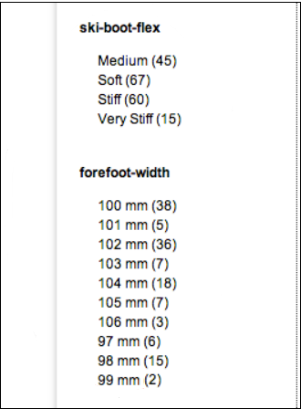
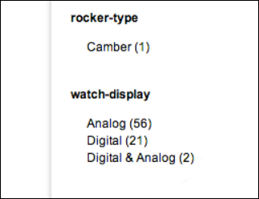
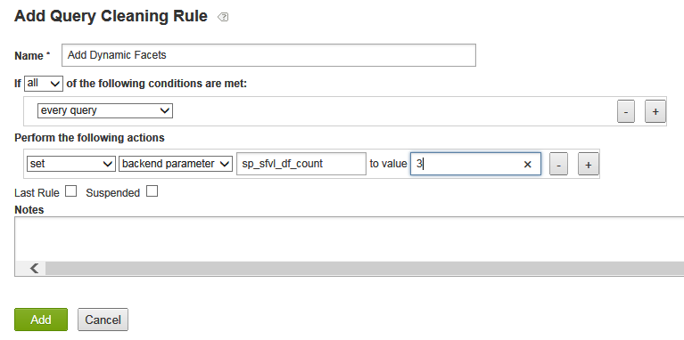
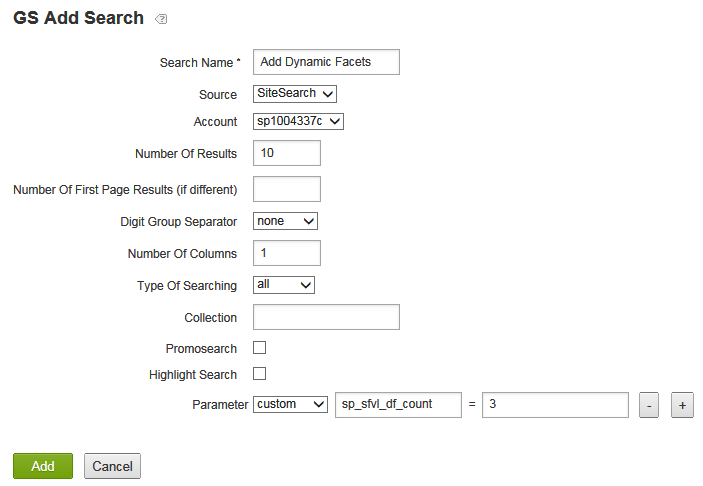
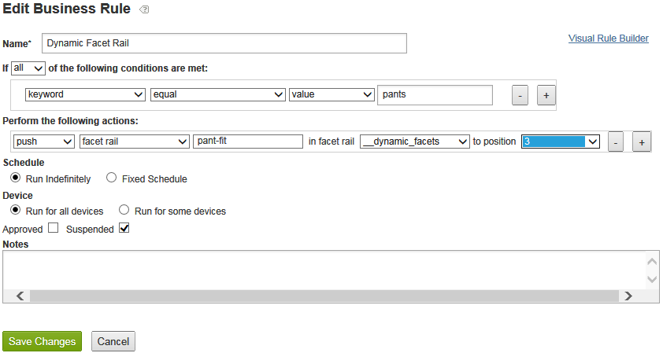

# Dynamische Facets{#about-dynamic-facets}

Verwenden Sie dynamische Facets, um beim Suchen automatisch neue Bereichsauswahlen zu erstellen. Sie können optional jedes dynamische Facettenfeld mit bis zu einem Tabellennamen in Ihrem Adobe Search&amp;Promote-Konto verknüpfen. Sie wenden diese Tabellenbeziehungen zur Suchzeit auf alle dynamischen Facettenfelder an, die an der Suche beteiligt sind.

## Verwenden dynamischer Facets {#concept_E65A70C9C2E04804BF24FBE1B3CAD899}

>[!NOTE]
>
>Diese Funktion ist in [!DNL Adobe Search&Promote]der Standardeinstellung nicht aktiviert. Wenden Sie sich an den technischen Support, um die Funktion für Ihre Verwendung zu aktivieren.

Ohne die Verwendung von dynamischen Facets mussten Sie verwandte Attribute in &quot;Slots&quot;zusammenführen und nur die Slots anzeigen, die für eine bestimmte Suche homogen waren. Das heißt, sie könnten nur die Werte eines logischen Attributs enthalten, wie &quot;Schuhgröße&quot;oder &quot;Ringgröße&quot;. Diese Methode bietet eine adäquate Suchleistung mit einer großen Anzahl einzigartiger Attribute.

Bei Verwendung von &quot;Dynamic Faceting&quot;wird jedoch die Anzahl der Facetten, die die Hauptsuche effizient verfolgen kann, nicht begrenzt. Sie können Hunderte von dynamischen Facetten definieren, aus denen die Hauptsuche die &quot;obersten `N` dynamischen Facetten&quot;für eine bestimmte Suche zurückgeben kann, bei der in der Regel ein bescheidenerer Wert von 10-20 oder weniger `N` vorliegt. Mit dieser Methode entfällt die Notwendigkeit, Attribute zu formatieren. Sie können jetzt eine eindeutige dynamische Facette für Attribute auf Ihrer Website erstellen.

## Welche Facetten sollten Sie dynamisch machen? {#section_254EE034BCAD4250A5D09FBF6158C4A5}

Facets, die dünn gefüllt sind und nur für eine Untergruppe von Suchvorgängen angezeigt werden, sind gute Kandidaten, um dynamisch zu sein. Beispielsweise kann eine Facette mit dem Namen &quot;forefoot width&quot;nur gefüllt werden, wenn nach Schuhen oder Stiefeln gesucht wird. Während eine andere Facette mit dem Namen &quot;Gesichts-Zahlenstil&quot;mit möglichen Werten von &quot;Roman&quot;und &quot;Arabisch&quot;nur bei der Suche nach Uhren oder Uhren erscheint.

Wenn Ihr Konto eine große Anzahl solcher Facetten hat, verbessert es die Suchleistung, sodass dynamische Facetten verwendet werden, anstatt immer den gesamten Satz möglicher Facetten für jede Suche auszuwählen. Generische Facetten wie &quot;SKU&quot;oder &quot;Marke&quot;, die normalerweise mit den Ergebnissen jeder Suche angezeigt werden, sind normalerweise nicht als dynamische Facetten geeignet.

## Beziehung zwischen Facetten und Meta-Tag-Feldern {#section_2869E5FCDA8B431A87BC6E5573F2B0A0}

Facets basieren auf Meta-Tag-Feldern. Ein Meta-Tag-Feld ist eine grundlegende Suchebenenfunktion [!DNL Adobe Search&Promote]. Facets hingegen sind Teil von GS (Guided Search), der übergeordneten Präsentationsebene von Adobe Search&amp;Promote. Facets verfügen über eigene Meta-Tag-Felder. Meta-Tag-Felder wissen jedoch nichts über Facetten. Wenn Sie dynamische Facets konfigurieren, fügen Sie zunächst Facetten hinzu und fügen dann Meta-Tag-Felder hinzu, wobei die Option &quot;Dynamische Facette&quot;ausgewählt ist, um die angegebene Facette als dynamisch festzulegen.

>[!NOTE]
>
>Es gibt keine Einstellung für &quot;Dynamische Facette&quot;in **[!UICONTROL Design > Navigation > Facets]**. Was eine Facette &quot;dynamisch&quot;macht, ist, dass ihr zugrunde liegendes &quot;Meta-Tag-Feld&quot;dynamisch ist, wie in **[!UICONTROL Settings > Metadata > Definitions]** festgelegt.

## Beispiele für dynamische Facetten in Aktion {#section_BC699A05E2E742EF94D41679163ACE84}

Beispiel für dynamische Facetten, die nach der Suche nach &quot;Boots&quot;angezeigt werden:



Ein weiteres Beispiel für dynamische Facetten, die nach einer Suche nach &quot;Watches&quot;angezeigt werden:



Siehe auch

* [CGI-Parameter für die Backend-Suche](../c-appendices/c-cgiparameters.md#reference_582E85C3886740C98FE88CA9DF7918E8)
* [Tags für Präsentationsvorlagen](../c-appendices/c-templates.md#reference_F1BBF616BCEC4AD7B2548ECD3CA74C64)
* [Transportvorlagen-Tags](../c-appendices/c-templates.md#reference_227D199F5A7248049BE1D405C0584751)

## Konfigurieren dynamischer Facets {#task_D17F484130E448258100BAC1EEC53F39}

Einrichten von dynamischen Facets in Search&amp;Promote.

<!-- 

t_configuring_dynamic_facets.xml

 -->

>[!NOTE]
>
>Diese Funktion ist in Adobe Search&amp;Promote standardmäßig nicht aktiviert. Wenden Sie sich an den technischen Support, um die Funktion für Ihre Verwendung zu aktivieren.

Bevor die Auswirkungen Ihrer dynamischen Facets für Kunden sichtbar sind, müssen Sie Ihren Site-Index neu erstellen.

Siehe auch

* [CGI-Parameter für die Backend-Suche](../c-appendices/c-cgiparameters.md#reference_582E85C3886740C98FE88CA9DF7918E8)
* [Tags für Präsentationsvorlagen](../c-appendices/c-templates.md#reference_F1BBF616BCEC4AD7B2548ECD3CA74C64)
* [Transportvorlagen-Tags](../c-appendices/c-templates.md#reference_227D199F5A7248049BE1D405C0584751)

**So konfigurieren Sie dynamische Facets**

1. Vergewissern Sie sich, dass Sie bereits Facetten hinzugefügt haben.

   Siehe [Hinzufügen einer neuen Facette](../c-about-design-menu/c-about-facets.md#task_FC07BFFA62CA4B718D6CBF4F2855C89B).
1. Nachdem Sie Ihre Facetten hinzugefügt haben, stellen Sie sicher, dass Sie die Facetten zu neuen, benutzerdefinierten Meta-Tag-Feldern hinzugefügt haben.

   Siehe [Hinzufügen eines neuen Meta-Tag-Felds](../c-about-settings-menu/c-about-metadata-menu.md#task_6DF188C0FC7F4831A4444CA9AFA615E5).
1. Klicken Sie im Produktmenü auf **[!UICONTROL Settings]** > **[!UICONTROL Metadata]** > **[!UICONTROL Definitions.]**
1. Klicken Sie auf der [!DNL Definitions] Seite in der [!DNL User-defined fields] Tabelle in der [!DNL Actions] Spalte auf das Stiftsymbol (Bearbeiten) in der Zeile des Metadaten-Tag-Feldnamens, der der Facette zugeordnet ist, die Sie dynamisch machen möchten.
1. Markieren Sie auf der [!DNL Edit Field] Seite **[!UICONTROL Dynamic Facet]**.

   Siehe die Tabelle der Optionen unter [Hinzufügen eines neuen Meta-Tag-Felds](../c-about-settings-menu/c-about-metadata-menu.md#task_6DF188C0FC7F4831A4444CA9AFA615E5).
1. Klicken **[!UICONTROL Save Changes]**.
1. Klicken Sie im blauen Feld auf Ihren **Staged Site-Index** neu generieren, um Ihren Staged Website-Index schnell neu zu erstellen.

   Siehe auch [Wiederherstellen des Indexes einer Live- oder Staged-Website](../c-about-index-menu/c-about-regenerate-index.md#task_B28DE40C0E9A475ABCBCBC4FF993AACD).
1. Legen Sie die Anzahl der dynamischen Facetten fest, die für eine bestimmte Suche ausgewählt werden sollen. Führen Sie dazu einen der folgenden Schritte aus:

   * Erstellen Sie eine Abfragebereinigungsregel mit den gewünschten Bedingungen, die die Aktion ausführt `set`, `backend parameter`um `sp_sfvl_df_count` den Wert `X`, wobei `X` die gewünschte Anzahl dynamischer Facetten zum Zeitpunkt der Suche anzufordern ist, und klicken Sie dann auf **[!UICONTROL Add]**.
   

   Siehe [Hinzufügen einer Abfragebereinigungsregel](../c-about-rules-menu/c-about-query-cleaning-rules.md#task_47F43988D3D9485F8AE1DFDA7E00BF54).

   Siehe auch [Backend-Suche CGI-Parameter](../c-appendices/c-cgiparameters.md#reference_582E85C3886740C98FE88CA9DF7918E8), Zeile 40 in der Tabelle für weitere Erläuterungen `sp_sfvl_df_count`.

   * Fügen Sie eine Suche hinzu, legen Sie den `sp_sfvl_df_count` Parameter &quot;custom&quot;auf den gewünschten Wert fest und klicken Sie auf **[!UICONTROL Add]**.
   

   Siehe [Hinzufügen einer neuen Suchdefinition](../c-about-settings-menu/c-about-searching-menu.md#task_98D3A168AB5D4F30A1ADB6E0D48AB648).

   Siehe auch [Backend-Suche CGI-Parameter](../c-appendices/c-cgiparameters.md#reference_582E85C3886740C98FE88CA9DF7918E8), Zeile 40 in der Tabelle für weitere Erläuterungen `sp_sfvl_df_count`.

1. Bearbeiten Sie die entsprechende Transportvorlage, um die dynamischen Facetten auszugeben, die die Hauptsuche zurückgibt.

   Siehe [Bearbeiten einer Präsentation oder einer Transportvorlage](../c-about-design-menu/c-about-templates.md#task_800E0E2265C34C028C92FEB5A1243EC3).

   Angenommen, Ihre Transportvorlage hat den Namen `guided.tpl`. Klicken Sie in diesem Fall im Produktmenü auf **[!UICONTROL Design > Templates]**. Suchen Sie auf der [!DNL Templates] Seite `guided.tpl` in der Tabelle. und klicken Sie dann **[!UICONTROL Edit]** ganz rechts neben dem Namen. Fügen Sie auf der Seite &quot;Bearbeiten&quot;den folgenden Codeblock am Ende `</facets>`hinzu: JSON-Ausgabe:

   ```
   ... 
   }<search-dynamic-facet-fields>, 
           { 
               "name" : "<search-dynamic-facet-field-name>", 
               "dynamic-facet" : 1, 
               "values" : [<search-field-value-list quotes="yes" commas="yes" data="values" sortby="values" encoding="json" />], 
               "counts" : [<search-field-value-list quotes="yes" commas="yes" data="results" sortby="values" />] 
   
           }</search-dynamic-facet-fields> 
   ...
   ```

1. Bearbeiten Sie die entsprechende(n) Präsentationsvorlage(n), um die dynamischen Facetten auszugeben.

   Siehe [Bearbeiten einer Präsentation oder einer Transportvorlage](../c-about-design-menu/c-about-templates.md#task_800E0E2265C34C028C92FEB5A1243EC3).

   Angenommen, Sie haben eine Vorlage mit dem Namen `sim.tmpl` , mit der Inhalte im Simulator ausgegeben werden. Um diese Vorlage zu bearbeiten, klicken Sie im Produktmenü auf **[!UICONTROL Design > Templates]**. Suchen Sie auf der [!DNL Templates] Seite `sim.tmpl` in der Tabelle. und klicken Sie dann **[!UICONTROL Edit]** ganz rechts neben dem Namen. Fügen Sie auf der Seite &quot;Bearbeiten&quot;im Anzeigebereich &quot;Facetten&quot;der Vorlage Folgendes hinzu:

   ```
   <h6>DF RAIL</h6> 
   <guided-facet-rail gsname="__dynamic_facets"> 
               <guided-facet ><!-- behavior=Normal --> 
               <div class="facet-block" id="facet"> 
               <p><b><guided-facet-display-name /></b></p> 
               <ul> 
                   <guided-facet-values> 
                       <guided-if-facet-value-equals-length-threshold> 
               </ul> 
               <ul id="brand" style="display:none"> 
                       </guided-if-facet-value-equals-length-threshold> 
                       <guided-if-facet-value-selected> 
                           <li><guided-facet-value> [<guided-lt>a href="<guided-facet-value-undo-path />"<guided-gt>X</a>]</li> 
                       <guided-else-facet-value-selected> 
                           <li><guided-facet-link><guided-facet-value></guided-facet-link> (<guided-facet-count>) </li> 
                       </guided-if-facet-value-selected> 
                   </guided-facet-values> 
               </ul> 
               <guided-if-facet-long> 
                 <br /><guided-lt />a href="#" onclick="moreless(this,'brand');return false;" <guided-gt /><button style="font-size:10px;">VIEW MORE</button></a> 
               </guided-if-facet-long> 
               </div> 
               </guided-facet> 
   </guided-facet-rail> 
   <h6>/DF RAIL</h6>
   ```

   Bei Bedarf würden Sie auch eine ähnliche Änderung an anderen Präsentationsvorlagen vornehmen, z. B. `json.tmpl`.

   Stellen Sie sicher, dass Sie `__dynamic_facets` für die `gsname` im `guided-facet-rail` -Tag angeben. Dieses Tag ist eine vordefinierte Facettenleiste, die für die Ausgabe dynamischer Facetten reserviert ist, die für eine bestimmte Suche zurückgegeben werden.

   Sie können diese spezielle Facettenleiste optional auch über Regeln > Geschäftsregeln und den erweiterten Regelaufbau wie unten dargestellt bearbeiten.

   

   Siehe auch [Hinzufügen einer neuen Geschäftsregel](../c-about-rules-menu/c-about-business-rules.md#task_BD3B31ED48BB4B1B8F1DCD3BFA2528E7)
