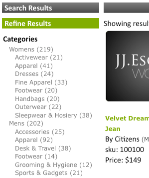

# Über Facets{#about-facets}

Sie können Facets verwenden, um Ihre Präsentationsebene anzupassen und Ihren Benutzern eine geführte Suche bereitzustellen, mit der sie einen Drilldown in ihre Suchergebnisse durchführen können.

## Verwenden von Facets {#concept_FA912B3B41EE493DB2F492D188457FF5}

Angenommen, ein Besucher einer Website, die Werkzeuge verkauft, führt eine Suche nach Fehlern durch. Die Firma könnte zwei Facetten haben: eine zur Angabe aller gefundenen Marken und die zweite zur Angabe aller Schraubengrößen. Der Kunde kann auf eine beliebige Marke oder Größe innerhalb der entsprechenden Facette klicken, um die Ergebnisse einzugrenzen und schnell den richtigen Schraubenschlüssel zu finden.

Sie können eine Facette auf einer beliebigen vorhandenen Metadatendefinition basieren. Wenn eine Facette in den Metadaten als Datumstyp definiert ist, wird sie als Facette für den Datumsbereich angezeigt.

Die Tabelle auf der Seite [!DNL Staged Facets] zeigt einen allgemeinen Überblick über die Einstellungen, aus denen jede hinzugefügte Facette besteht. Sie können neue Facetten hinzufügen und vorhandene Facetten bearbeiten oder löschen. Sie können alle Änderungen, die Sie an Facetten vornehmen, wiederherstellen, indem Sie **[!UICONTROL History]** in der oberen rechten Ecke der Seite verwenden.

Facet-Einstellungen werden standardmäßig gestaffelt, damit Sie alle Änderungen testen können, bevor Sie sie aktivieren.

Siehe [Staging](../c-about-staging.md#concept_08B8F3CA1F4241108F14BA7FC7806CA7).

Sie können **[!UICONTROL View Live Settings]** verwenden, um Ihre gestaffelten Einstellungen mit der aktuellen Live-Einstellung zu vergleichen. Verwenden Sie **[!UICONTROL View Staged Settings]**, um zum Staging-Bereich zurückzukehren. Bei einem gestaffelten Element ist die Live-Version der Einstellungen schreibgeschützt. Sie können sie daher manipulieren, indem Sie die inszenierten Einstellungen live schalten. Nachdem Sie mit den Änderungen, die Sie an der gestaffelten Facette vorgenommen haben, zufrieden sind, klicken Sie auf **[!UICONTROL Push Live]**, um sie zu aktivieren.

## Datumsbereich-Facets {#section_FEFFF6B5B6534456913189FEF559BA58}

Facets, die in den Metadaten als &quot;Date&quot;definiert sind, werden anders behandelt als andere Facetten. Statt als Wertesatz behandelt zu werden, werden sie als Datumsbereich mit einem Beginn- oder Enddatum oder beidem behandelt.

Eine Datumsbereich-Facette hat den Wert des Beginns, gefolgt von &quot;BTW&quot;(für &quot;between&quot;), gefolgt vom Enddatum. Datumsangaben haben die folgenden beiden Formate:

MM-TT-JJJJ

MM/TT/JJJJ

Es sind vierstellige Jahre erforderlich. Es muss mindestens ein Beginn- oder Enddatum geben, beides ist jedoch nicht erforderlich. Beispiel: &quot;12.1.2007 BTW1/4/2009&quot;bedeutet alle Daten zwischen dem 1. Dezember 2007 und dem 4. Januar 2009. &quot;1-1-2005BTW&quot;bedeutet jedoch alle Daten seit dem 1. Januar 2005.

Sie können das Präsentationsvorlagen-Tag `<guided-facet-value/>` verwenden, um wie eine normale Facette den Wert einer Datumsbereich-Facette abzurufen. Derzeit ist JavaScript erforderlich, damit Benutzer Datumsbereiche eingeben können, nach denen gesucht werden soll. Beispielsweise können Sie die Eingabe aus zwei Eingabefeldern für das Beginns- und Enddatum nehmen. Anschließend können Sie die Eingabe validieren und den Wert der neuen Facette (aus den beiden Eingabefeldern erstellt) und den Facettennamen an die vorhandene URL anhängen.

Siehe [Präsentationsvorlage-Tags](../c-appendices/c-templates.md#reference_F1BBF616BCEC4AD7B2548ECD3CA74C64).

Das folgende Codebeispiel zeigt, wie ein Datumsbereich auf einer Seite dargestellt wird. Zeigt den vorhandenen Datumsbereich an, falls dieser ausgewählt ist. Andernfalls wird ein einfaches Eingabefeld angezeigt. Beim Senden des Formulars wird eine einfache Überprüfung durchgeführt. Anschließend wird der Browser an eine neue URL gesendet, die zwei neue Parameter enthält:

* `q#` - Stellt den ausgewählten Datumsbereich dar, der aus den beiden Eingabefeldern zusammengestellt wurde.
* `x#` - Benennt die Facette. In diesem Beispiel erhält die Facette für den Datumsbereich den Namen &quot;Geändert&quot;.

Die `replace(/%2F/ig, '~2F')`-Teile im Code sind erforderlich, da Apache aus Sicherheitsgründen `%2F` in URL-Pfaden nicht zulässt und sich bei Verwendung von SEO-URLs die Abfrage im URL-Pfad befindet. `/` wird daher als `~2F` anstelle von `%2F` kodiert, da es sich normalerweise in einer URL befindet.

```
<div class="date_range"> 
 <p>Date Range</p> 
 <guided-if-facet-selected gsname="modified"> 
  <guided-facet-values gsname="modified"> 
   <script> 
   var modified_daterange= '<guided-facet-value />'.split(/BTW/) ; 
   if (modified_daterange[0]=='') modified_daterange[0]= '--/--/----' ; 
   if (modified_daterange[1]=='') modified_daterange[1]= '--/--/----' ; 
   document.write('From: ' + modified_daterange[0]) ; 
   document.write('<br>To: ' + modified_daterange[1]) ; 
   </script> 
  </guided-facet-values> 
 
 <guided-else-facet-selected> 
  <form action="#"> 
   From: <input name="dateFrom" size=10> 
   <br>To: <input name="dateTo" size=10> 
   <br><input type="button" value="Go" onclick="goClick(this.form)"> 
  </form> 
  <script> 
  function goClick(f) { 
   if (f.dateFrom.value=='' && f.dateTo.value=='') { 
    alert('You must enter either a From: date or a To: date.') ; 
    return ; 
   } 
   if ( f.dateFrom.value!='' && !f.dateFrom.value.match(/^\d+[\/\-]\d+[\/\-]\d\d\d\d$/) ) { 
    alert('From: date must be in "mm/dd/yyyy" or "mm-dd-yyyy" format.') ; 
    return ; 
   } 
   if ( f.dateTo.value!='' && !f.dateTo.value.match(/^\d+[\/\-]\d+[\/\-]\d\d\d\d$/) ) { 
    alert('To: date must be in "mm/dd/yyyy" or "mm-dd-yyyy" format.') ; 
    return ; 
   } 
   // Note that "/" is encoded as "~2F" instead of "%2F" to avoid Apache 404 error. 
   var new_url= '<guided-current-path />&<guided-query-param-name gsname="q#" offset="0" />=' 
    + encodeURIComponent(f.dateFrom.value).replace(/%2F/ig, '~2F') + 'BTW' 
    + encodeURIComponent(f.dateTo  .value).replace(/%2F/ig, '~2F') 
    + '&<guided-query-param-name gsname="x#" offset="0" />=modified' ; 
   location.href= new_url ; 
  } 
  </script> 
 </guided-if-facet-selected> 
</div>
```

## Verschachtelte Facetten {#section_6BC77F38DE9F43D5B6911F8CECB15DFC}

Verschachtelte Facetten sind Facetten, die mehrere Ebenen von Kategorien anzeigen, wie im Folgenden:



Die Kategorien &quot;Damen&quot;und &quot;Männer&quot;befinden sich in der oberen oder übergeordneten Facette. Die Unterkategorien wie Zubehör und Schuhe befinden sich in der unteren oder untergeordneten Facette.

Die derzeit unterstützte verschachtelte Facettentiefe beträgt zwei, kann jedoch entlang der Drilldown-Liste liegen.

Das Verhalten verschiedener Arten verschachtelter Facetten ist im Folgenden dargestellt:

<table> 
 <thead> 
  <tr> 
   <th colname="col1" class="entry"> <p>Verhalten des verschachtelten Facettentyps </p> </th> 
   <th colname="col2" class="entry"> <p>Verhalten </p> </th> 
  </tr> 
 </thead>
 <tbody> 
  <tr> 
   <td colname="col1"> <p>Normal </p> </td> 
   <td colname="col2"> <p>Das Verhalten einer normalen verschachtelten Facette ist, dass sie schrumpft, wenn andere Facetten die Suche einschränken. </p> <p>Wenn die verschachtelte Facette ausgewählt ist, schrumpft sie nach unten zu ihrer Auswahl. Wenn eine übergeordnete Facette ausgewählt ist, wird nur diese übergeordnete Facette mit allen zugehörigen untergeordneten Facetten angezeigt. Wenn eine untergeordnete Facette ausgewählt ist, zeigt die Facette nur die ausgewählte übergeordnete Facette und die ausgewählte untergeordnete Facette an. </p> </td> 
  </tr> 
  <tr> 
   <td colname="col1"> <p>Stickiness </p> </td> 
   <td colname="col2"> <p>Das Verhalten einer fixierbaren verschachtelten Facette ist, dass sie versucht, die Facette so weit wie möglich offen zu halten, je nach Zustand anderer Facetten oder Suchkriterien. Wenn die untergeordnete Facette ausgewählt ist, wird sie in Richtung der Stickiness-Tiefe gezählt. </p> </td> 
  </tr> 
  <tr> 
   <td colname="col1"> <p>Mehrfachauswahl </p> </td> 
   <td colname="col2"> <p>Das Verhalten einer Mehrfachauswahl-Facette ist, dass die Facette geöffnet bleibt. Jede neue Auswahl versucht, alle anderen Facetten-Auswahlen zu löschen, es sei denn, die Facette ist eine übergeordnete Facette der verschachtelten Facette der Kategorie. In diesem Fall bezieht sich "übergeordnet"auf Kategorien-Facetten und nicht auf Kategorien der obersten Ebene einer verschachtelten Facette. </p> </td> 
  </tr> 
  <tr> 
   <td colname="col1"> <p>Kategorie Multi-Select </p> </td> 
   <td colname="col2"> <p>Wie bei verschachtelten Facetten mit mehreren Auswahlen mit folgenden Ausnahmen: </p> 
    <ul id="ul_D5AB6AF3169A483E8F3FC6D2A2EA3A28"> 
     <li id="li_9308156EF2FF43CE9DFB933F13786C58">Alle zuvor ausgewählten Facetten werden deaktiviert, wenn diese Facette zum ersten Mal ausgewählt ist. </li> 
     <li id="li_DD96D6802A9C479283212A0FD68C6F85">Andere zuvor ausgewählte Facetten werden ebenfalls deaktiviert, wenn der Kunde direkt zur untergeordneten Facette weiterblättert, ohne auf die übergeordnete Facette zu klicken, oder wenn ein Geschwisterelement einer anderen übergeordneten Facette ausgewählt wird. </li> 
     <li id="li_8BF58F10969B4743986D5D0E0086AD6C">Sie können Eltern haben, in dem Sinne, dass Kategorien Facetten Eltern haben. Verwechseln Sie dieses Verhalten nicht mit übergeordneten und untergeordneten Beziehungen, die mit allen verschachtelten Facetten gefunden werden. </li> 
    </ul> </td> 
  </tr> 
 </tbody> 
</table>

Siehe auch [Über Facet Rail](../c-about-design-menu/c-about-facet-rails.md#concept_1FDC8BCDFFC84A0889DA670F63D5F6DB).

## Hinzufügen einer neuen Facette {#task_FC07BFFA62CA4B718D6CBF4F2855C89B}

Sie können Facetten hinzufügen, um Ihre Präsentationsebene anzupassen und Ihren Kunden eine geführte Suche zur Verfügung zu stellen, mit der sie einen Drilldown in ihre Suchergebnisse durchführen können.

<!-- 

t_adding_a_new_facet.xml

 -->

Die Facets-Tabelle auf der Seite [!DNL Facets] zeigt einen Auszug der Einstellungen, aus denen eine einzelne Facette besteht. Sie können neue Facetten hinzufügen und vorhandene Facetten bearbeiten oder löschen. Änderungen, die Sie an Facetten vornehmen, können mithilfe der Funktion Verlauf rückgängig gemacht werden.

>[!NOTE]
>
>Vergewissern Sie sich, dass Sie auf die Facette in Ihrer Präsentationsvorlage verweisen, damit sie auf der Website sichtbar ist.

Siehe auch [Über Facet Rail](../c-about-design-menu/c-about-facet-rails.md#concept_1FDC8BCDFFC84A0889DA670F63D5F6DB).

**So fügen Sie eine neue Facette hinzu**

1. Bevor Sie eine neue Facette hinzufügen können, vergewissern Sie sich, dass Sie bereits folgende Schritte durchgeführt haben, bevor Sie mit dem nächsten Schritt fortfahren:

   * Einige Meta-Tag-Felder müssen bereits definiert sein.

      Siehe [Hinzufügen eines neuen Meta-Tag-Felds](../c-about-settings-menu/c-about-metadata-menu.md#task_6DF188C0FC7F4831A4444CA9AFA615E5).
   * Fügen Sie die Metadaten in Ihren Index ein.
Siehe [Hinzufügen von Feldinjizierungsdefinitionen](../c-about-settings-menu/c-about-metadata-menu.md#task_E86566FA1FF74CF68115C0ADA05172AE).

1. Klicken Sie im Produktmenü auf **[!UICONTROL Design]** > **[!UICONTROL Navigation]** > **[!UICONTROL Facets.]**
1. Klicken Sie auf der Seite [!DNL Facets] auf **[!UICONTROL Add New Facet]**.
1. Legen Sie auf der Seite [!DNL Add Facet] die gewünschten Optionen fest.

   Diese Einstellungen wirken sich sowohl auf das Verhalten als auch auf die Standarddarstellung einer Facette aus. Sie können einige dieser Einstellungen mithilfe der Einstellungen der Präsentationsvorlage überschreiben.

   Wenn eine Facette in den Metadaten als Datumstyp definiert ist, wird sie als Datumsbereich angezeigt.

   Siehe [Datumsbereichsfacetten](../c-about-design-menu/c-about-facets.md#section_FEFFF6B5B6534456913189FEF559BA58).

   Je nach den ausgewählten Facettenoptionen stehen nicht alle Optionen zur Verfügung.

   <!-- 
   r_add_facet_options.xml
   -->

   <table> 
    <thead> 
      <tr> 
      <th colname="col1" class="entry"> <p>Option </p> </th> 
      <th colname="col2" class="entry"> <p>Beschreibung </p> </th> 
      </tr> 
    </thead>
    <tbody> 
      <tr> 
      <td colname="col1"> <p>Facet-Name </p> </td> 
      <td colname="col2"> <p>Identifiziert den Namen einer bestimmten Facette. </p> <p> <p>Hinweis:  Sie können nur über eine Facette verfügen, die auf vorhandenen, benutzerdefinierten Metadaten basiert. Wenn in der Dropdown-Liste keine Facetten verfügbar sind, müssen Sie zunächst einige Metadaten definieren. </p> </p> <p>Siehe <a href="../c-about-settings-menu/c-about-metadata-menu.md#task_6DF188C0FC7F4831A4444CA9AFA615E5" type="task" format="dita" scope="local"> Hinzufügen eines neuen Meta-Tag-Felds </a>. </p> <p>Um eine Facette basierend auf einer Feldtabelle zu erstellen, verwenden Sie den benutzerdefinierten Facet-Namen und geben Sie den Feldtabellennamen an. </p> </td> 
      </tr> 
      <tr> 
      <td colname="col1"> <p>Beschriftung anzeigen </p> </td> 
      <td colname="col2"> <p>Legt die Beschriftung einer Facette fest, die dann in einem Breadcrumb anstelle eines Metadatenfeldnamens (mit dem <span class="codeph"> &lt;guided-breadcrumb-label&gt; </span>-Tag) oder eines eigenständigen Werts (mit dem <span class="codeph"> &lt;guided-facet-display-name&gt; </span>-Tag) verwendet werden kann. </p> </td> 
      </tr> 
      <tr> 
      <td colname="col1"> <p>Verhalten </p> </td> 
      <td colname="col2"> <p>Legt eines von drei Facettenverhalten fest. </p> <p> 
      <ul id="ul_67C19E1C16224B9990F04A0D05BD3D05"> 
      <li id="li_6B232C11A61840B68CA59E1F593405A0"> <span class="uicontrol"> Normal </span> <p>Wenn ein Kunde auf eine Facette klickt, deren Verhalten auf <span class="uicontrol"> Normal </span> eingestellt ist, wird eine Drilldown in die Suchergebnisse für dieses Element durchgeführt. Von dort aus kann der Kunde die Anzahl der Suchergebnisse weiter verfeinern und eingrenzen. </p> </li> 
      <li id="li_7D7C43A7F7AB4B84A9B0FEF34627605A"> <span class="uicontrol"> Kategorie </span> <p>Facetten der Kategorie verhalten sich wie Navigationselemente. Bei diesen Facetten handelt es sich um oberste Facetten, die Kunden normalerweise durchforschen, bevor sie Facetten mit Attributoptionen offen legen. Kategorien-Facetten schränken sich nicht ein, wenn andere Facetten ausgewählt sind und offen bleiben. Wenn Sie auf einen anderen Wert in einer Facette der Kategorie klicken, werden alle anderen Facetten der Seite deaktiviert, mit Ausnahme der übergeordneten Facetten dieser Kategorie. </p> </li> 
      <li id="li_01255993D71F40DBA8870AA3FEA7D304"> <span class="uicontrol"> Kategorie Multi-Select  </span> <p>Facetten sind Facetten der Kategorie, die die Auswahl mehrerer Elemente aus der Facette unterstützen, in der die Elemente zusammen "ORed"sind. </p> </li> 
      </ul> 
      <ul id="ul_683F6D3FC8524E65AF303453ADDB6001"> 
        <li id="li_81F504D1D1294666BBBC5EA43B34B712"> <span class="uicontrol"> Stickiness </span> <p>Wenn ein Kunde auf eine Facette klickt, deren Verhalten auf <span class="uicontrol"> Sticky </span> eingestellt ist, bleibt die Facette mit der ausgewählten Option während des Drilldown geöffnet. Diese Option ist nützlich, wenn Sie einem Kunden eine vorherige Auswahl ändern möchten. </p> </li> 
      </ul> 
      <ul id="ul_8E871D63B09445268C600C8ABC20F6A4"> 
        <li id="li_F88AC5528B0C4751BC4CFE7FA9525857"> <span class="uicontrol"> Mehrfachauswahl  </span> <p>Ermöglicht die Auswahl mehrerer Elemente aus einer Facette, wobei die Elemente innerhalb der Facette "OR"zusammen sind. Diese Option ist nützlich für eine Facette, die ein kleines Attribut wie Farben anzeigen kann und Sie möchten dem Kunden die Möglichkeit geben, eine Abfrage zu erstellen, die es ihm ermöglicht, "Schuhe in meiner Größe anzuzeigen, die rot oder schwarz sind". </p> </li> 
      </ul> </p> </td> 
      </tr> 
      <tr> 
      <td colname="col1"> <p>Immer anzeigen </p> </td> 
      <td colname="col2"> <p>Legt für eine normale oder fixierbare Facette fest, dass die Facette für den Kunden jederzeit sichtbar bleibt. </p> <p>Diese Option ist nur verfügbar, wenn Sie <span class="uicontrol"> Normal </span>, <span class="uicontrol"> Kategorie </span> oder <span class="uicontrol"> Sticky </span> aus der Dropdown-Liste <span class="uicontrol"> Verhalten </span> ausgewählt haben. </p> </td> 
      </tr> 
      <tr> 
      <td colname="col1"> <p>Eltern von Facets </p> </td> 
      <td colname="col2"> <p>Diese Option ist nur verfügbar, wenn Sie in der Dropdown-Liste <span class="uicontrol"> die Option </span> Kategorie <span class="uicontrol"> oder <span class="uicontrol"> Kategorie Multi-Select </span> ausgewählt haben.</span> </span></p> <p>Gibt an, was die Eltern der Facette sind. Die ausgewählten Elemente in den übergeordneten Facetten der Kategorien werden verwendet, um die Auswahlmöglichkeiten einzuschränken, die in der Facette der aktuellen Kategorie verfügbar sind. Übergeordnete Facetten werden nicht deaktiviert, wenn ein Kunde mit der Facette "Kategorie"interagiert. Sie können mehrere durch Kommas getrennte Übergeordnete Elemente angeben. </p> </td> 
      </tr> 
      <tr> 
      <td colname="col1"> <p>Fixierbare Tiefe </p> </td> 
      <td colname="col2"> <p>Diese Option ist nur verfügbar, wenn Sie <span class="uicontrol"> Sticky </span> aus der Dropdown-Liste <span class="uicontrol"> Verhalten </span> ausgewählt haben. </p> <p>Legt die Anzahl der Optionen fest, die während des Drilldown geöffnet bleiben sollen. </p> </td> 
      </tr> 
      <tr> 
      <td colname="col1"> <p>Längenschwellenwert </p> </td> 
      <td colname="col2"> <p>Legt die vertikale Länge (1-9999) der Facette fest, die in der Anzahl der Elemente definiert ist. </p> <p>Wenn Ihre Präsentationsvorlage entsprechend eingerichtet ist, können Sie mit dieser Einstellung eine "Mehr anzeigen..."angeben. oder legen Sie fest, wann die Facette in ein durchlaufbares div-Element usw. geworfen werden soll. </p> </td> 
      </tr> 
      <tr> 
      <td colname="col1"> <p>Längenschwellenwert abschneiden </p> </td> 
      <td colname="col2"> <p>Reduziert die Anzahl der Elemente in einer Facette nach einem bestimmten Schwellenwert. </p> <p>Einige Implementierungen haben Facetten mit Tausenden von Elementen darin. Es kann teuer sein, alle Daten über das Kabel zu senden. Mit dieser Einstellung können Sie die Facette auf eine überschaubare Ebene reduzieren. Die Facette wird nach dem Sortieren abgeschnitten. </p> </td> 
      </tr> 
      <tr> 
      <td colname="col1"> <p>Breite des maximalen Werts </p> </td> 
      <td colname="col2"> <p>Gibt eine Begrenzung der Länge der Facet-Wert-Zeichenfolge (1-999) an. </p> <p>Diese Option ist nützlich, wenn Sie eine Facette in einem Layout mit fester Breite platzieren und das Umbrechen von Zeichenfolgen verhindern möchten. Standardmäßig ist die Zeichenfolge auf 3 Zeichen kürzer als der Schwellenwert gesetzt, sodass eine Auslassung hinzugefügt werden kann. </p> </td> 
      </tr> 
      <tr> 
      <td colname="col1"> <p>Werterweiterung </p> </td> 
      <td colname="col2"> <p>Gibt die Zeichenfolge an, mit der der Wert einer Facette abgeschnitten werden soll. Standardmäßig wird die Zeichenfolge "..." verwendet. </p> </td> 
      </tr> 
      <tr> 
      <td colname="col1"> <p>Trennzeichen </p> </td> 
      <td colname="col2"> <p>Gibt das Trennzeichen an, das für jede Liste mit getrennten Werten verwendet werden soll, die für die Facette gilt. </p> <p>Das verwendete Trennzeichen ist das gleiche, das in den Metadaten definiert ist, auf denen die Facette basiert. Das Standardtrennzeichen ist ein Komma. Sie können jedoch jeden beliebigen XML-konformen Wert verwenden. </p> </td> 
      </tr> 
      <tr> 
      <td colname="col1"> <p>Sortierung </p> </td> 
      <td colname="col2"> <p>Gibt an, wie Facetten auf Ihrer Website sortiert werden sollen. Sie können die Facetten nach folgenden Kriterien sortieren lassen. Bei Bedarf können Sie bis zu fünf Sorten kombinieren. </p> 
      <ul id="ul_12987F4DC7B34C63ABC906B59688A174"> 
      <li id="li_3206C96013DF431D90119F594D93D85D"> <span class="uicontrol"> alpha  </span> <p>Sortiert die Werte alphabetisch (0-9, A-Z), einschließlich Interpunktionszeichen. </p> </li> 
      <li id="li_304E4A518FBE48D18D9E9EA7339A3481"> <span class="uicontrol"> alpha (nur alphanumerisch)  </span> <p>Sortiert die Werte alphabetisch (0-9, A-Z), wobei Interpunktionszeichen ignoriert werden. </p> </li> 
      <li id="li_CADB888CC514455F9CA379C8EEE490AA"> <span class="uicontrol"> alpha (nicht zwischen Groß- und Kleinschreibung unterscheiden)  </span> <p>Sortiert die Werte alphabetisch (0-9, A-Z), wobei die Groß-/Kleinschreibung von Buchstaben ignoriert wird, einschließlich Interpunktionszeichen. </p> </li> 
      <li id="li_F61122E79AB5413792DA31F8AB1414BD"> <span class="uicontrol"> alpha (nicht zwischen Groß- und Kleinschreibung unterscheiden, nur alphanumerisch)  </span> <p>Sortiert die Werte alphabetisch (0-9, A-Z), ignoriert die Groß-/Kleinschreibung von Buchstaben und ignoriert Interpunktionszeichen. </p> </li> 
      <li id="li_F50CC298ABF046D0A39D5AE5B1261823"> <span class="uicontrol"> count </span> <p>Sortiert nach Anzahl der Ergebnisse, die mit jedem Facettenwert übereinstimmen, vom Größten bis zum Wenigsten. </p> </li> 
      <li id="li_32B6AF39E9534762B39B15181DC5AD01"> <span class="uicontrol"> numerisch  </span> <p>Sortiert die Werte numerisch. Beim Sortieren von Zahlen ist diese Option einer Alpha-Sortierung überlegen, da bei einer Alpha-Sortierung 10 vor 2 angezeigt werden. </p> </li> 
      <li id="li_CF8E76A7B1184E0C8DCC11B53E31A1DC"> <span class="uicontrol"> split </span> <p>Unterteilt die Liste in zwei separate Listen nach Zählerschwellenwert. Facet-Werte über dem Schwellenwert werden an den Anfang verschoben. Facet-Werte mit Zahlen unter dem Schwellenwert werden nach unten verschoben. Ein Bruchschwellenwert ist erforderlich, wenn Werte eines bestimmten Bereichs immer oben stehen sollen. </p> </li> 
      <li id="li_4AB8276577384B1099CBA895898205AD"> <span class="uicontrol"> break  </span> <p>Erzwingt bestimmte Werte am Anfang oder am Ende der Liste. So können Sie z. B. immer den Begriff "Sonstige"unten in der Liste verwenden. Bei der Verwendung einer Umbruchsortierung zur Identifizierung der expliziten Werte am Anfang oder am Ende der Sortierung sind entweder die oberen oder unteren Werte erforderlich. </p> </li> 
      <li id="li_227E96CFED2044FCA2F10B6913B03CFB"> <span class="uicontrol"> bestellt  </span> <p>Die Facettenwerte sollten immer in fester Reihenfolge aufgeführt werden (eine durch Trennzeichen getrennte Liste, die in der unten beschriebenen Option <span class="uicontrol"> Reihenfolge </span> definiert ist). </p> </li> 
      </ul> </td> 
      </tr> 
      <tr> 
      <td colname="col1"> <p>Facet's Alias </p> </td> 
      <td colname="col2"> <p>Zur Unterstützung vorhandener Such-URLs, die Sie eventuell im Freien haben, können Sie einen Facet-Alias verwenden, um den Namen älterer Parameter zu ändern oder einfach eine Facette mit einem anderen Namen zu erstellen. Der Alias wird nur auf eingehende Anforderungen angewendet und nicht zum Erstellen von Facettenlinks verwendet. </p> </td> 
      </tr> 
      <tr> 
      <td colname="col1"> <p>Name der Facet-Leiste </p> </td> 
      <td colname="col2"> <p>Der Name der Facettenleiste, wenn Sie Ihre Facetten alphabetisch, nach Anzahl oder nach einer benutzerdefinierten Methode sortieren möchten. </p> <p>Weitere Informationen finden Sie unter <a href="../c-about-design-menu/c-about-facet-rails.md#concept_1FDC8BCDFFC84A0889DA670F63D5F6DB" format="dita" scope="local">Info zu Facet Rail </a>. </p> </td> 
      </tr> 
      <tr> 
      <td colname="col1"> <p>Bestellung </p> </td> 
      <td colname="col2"> <p>Diese Option ist nur verfügbar, wenn Sie <span class="uicontrol"> Bestellt </span> aus der Dropdown-Liste <span class="uicontrol"> Sortieren </span> ausgewählt haben. </p> <p>Ermöglicht die Definition einer durch Trennzeichen getrennten Liste von Werten, die die zu verwendende Reihenfolge angibt. </p> </td> 
      </tr> 
      <tr> 
      <td colname="col1"> <p>Extras anhängen </p> </td> 
      <td colname="col2"> <p>Diese Option ist nur verfügbar, wenn Sie <span class="uicontrol"> Bestellt </span> aus der Dropdown-Liste <span class="uicontrol"> Sortieren </span> ausgewählt haben. </p> <p>Wenn die Werte nicht in der geordneten Liste vorhanden sind, werden die Werte an das Ende angehängt. </p> </td> 
      </tr> 
      <tr> 
      <td colname="col1"> <p>Geister anzeigen </p> </td> 
      <td colname="col2"> <p>Diese Option ist nur verfügbar, wenn Sie <span class="uicontrol"> Bestellt </span> aus der Dropdown-Liste <span class="uicontrol"> Sortieren </span> ausgewählt haben. </p> <p>Wenn die Werte fehlen, die in der geordneten Liste angegeben sind, kennzeichnet diese Option jedes fehlende Element in der Facette als "Geist", sodass die Elemente unterschiedlich angezeigt werden. </p> </td> 
      </tr> 
      <tr> 
      <td colname="col1"> <p>Verschachtelte Facette </p> </td> 
      <td colname="col2"> <p>Eine verschachtelte Facette zeigt die Kategorien und die Kategorien der untergeordneten Elemente an. Sie kann nur eine Tiefe von zwei Kategorien anzeigen, kann aber entlang des Drilldown verlaufen. </p> <p>Die Daten für diese Facette müssen bei der Beschreibung der beiden Ebenen der Kategorien einer Regel entsprechen. Ein Facettenwert kann beispielsweise "Schuhe:Stiefel"lauten, wobei die übergeordnete Kategorie "Schuhe"und die untergeordnete Kategorie "Stiefel"lautet. Das Zeichen ':' wird als Trennzeichen verwendet, um sie zu trennen. </p> <p>Weitere Informationen zum Ändern des Trennzeichens finden Sie unter Verschachteltes Trennzeichen unten. </p> <p>Um die Daten in diesem Format zu generieren, können Sie ein Filterskript verwenden, um zwei bestehende Kategorien zu kombinieren. Sie können das Verhalten "Normal", "Kategorie"und "Sticky"mit verschachtelten Facetten kombinieren. </p> </td> 
      </tr> 
      <tr> 
      <td colname="col1"> <p>Verschachtelter übergeordneter Name </p> </td> 
      <td colname="col2"> <p>Diese Dropdown-Liste ist nur verfügbar, wenn Sie <span class="uicontrol"> Verschachtelte Facette </span> ausgewählt haben. </p> <p>Hier können Sie festlegen, welches Feld die übergeordnete Kategorie darstellt. Dieses Feld wird während der Suchzeit in übereinstimmenden übergeordneten Kategorien verwendet. </p> </td> 
      </tr> 
      <tr> 
      <td colname="col1"> <p>Name des verschachtelten untergeordneten Elements </p> </td> 
      <td colname="col2"> <p>Diese Dropdown-Liste ist nur verfügbar, wenn Sie <span class="uicontrol"> Verschachtelte Facette </span> ausgewählt haben. </p> <p>Hier können Sie festlegen, welches Feld die untergeordnete Kategorie darstellt. Dieses Feld wird während der Suchzeit bei der Zuordnung von untergeordneten Kategorien verwendet. </p> </td> 
      </tr> 
      <tr> 
      <td colname="col1"> <p>Verschachtelter Facet-Trennzeichen </p> </td> 
      <td colname="col2"> <p>Diese Option ist nur verfügbar, wenn Sie <span class="uicontrol"> Verschachtelte Facette </span> ausgewählt haben. </p> <p>Das hier eingegebene Zeichen wird verwendet, um die übergeordneten Kategorien und untergeordneten Kategorien aus den Daten zu analysieren. </p> <p>Wenn beispielsweise ":"als Trennzeichen verwendet wird und das übergeordnete Element "shoes"und das untergeordnete Element "boot"ist, erwartet es, dass die Daten als "shoes:boot"formatiert werden. </p> </td> 
      </tr> 
      <tr> 
      <td colname="col1"> <p>Trennschwellenwert </p> </td> 
      <td colname="col2"> <p>Diese Option ist nur verfügbar, wenn Sie <span class="uicontrol"> </span> in der Dropdown-Liste <span class="uicontrol"> Sortieren </span> die Option  teilen ausgewählt haben. </p> <p>Bei der Verwendung der Sortierung "Teilen"definiert der Spaltschwellenwert die Anzahl, bei der die Facette in zwei separate Listen aufgeteilt werden soll. Werte, deren Werte größer als oder gleich dem Schwellenwert sind, bleiben oben, während Werte unterhalb des Schwellenwerts nach unten verschoben werden. </p> </td> 
      </tr> 
      <tr> 
      <td colname="col1"> <p>Höchstwerte </p> </td> 
      <td colname="col2"> <p>Diese Option ist nur verfügbar, wenn Sie <span class="uicontrol"> Umbruch </span> aus der Dropdown-Liste <span class="uicontrol"> Sortieren </span> ausgewählt haben. </p> <p>Bei der Verwendung einer Umbruch-Sortierung wird diese durch Trennzeichen getrennte Liste von Werten immer oben in der Liste platziert. Die Verwendung regulärer Ausdruck ist zulässig, sollte jedoch in geschweiften Klammern oder Klammern stehen, z. B.: {^Neu.*?},{^Sehr neu.*} </p> </td> 
      </tr> 
      <tr> 
      <td colname="col1"> <p>Niedrigstwerte </p> </td> 
      <td colname="col2"> <p>Diese Option ist nur verfügbar, wenn Sie <span class="uicontrol"> Umbruch </span> aus der Dropdown-Liste <span class="uicontrol"> Sortieren </span> ausgewählt haben. </p> <p>Bei der Verwendung einer Umbruch-Sortierung wird diese durch Trennzeichen getrennte Liste von Werten immer am unteren Rand der Liste platziert. Die Verwendung von regulären Ausdrücken ist zulässig, sollte jedoch in geschweiften Klammern oder Klammern stehen, wie im folgenden Beispiel: {^Old .*?},{^Sehr alt.*} </p> </td> 
      </tr> 
    </tbody> 
    </table>

1. Klicken **[!UICONTROL Add]**.
1. (Optional) Führen Sie auf der Seite [!DNL Facets] einen der folgenden Schritte aus:

   * Klicken Sie auf **[!UICONTROL History]**, um alle vorgenommenen Änderungen wiederherzustellen.

      Siehe [Verwenden der Option Verlauf](../t-using-the-history-option.md#task_70DD3F87A67242BBBD2CB27156F43002).

   * Klicken **[!UICONTROL Live]**.

      Siehe [Live-Einstellungen anzeigen](../c-about-staging.md#task_401A0EBDB5DB4D4CA933CBA7BECDC10F).

   * Klicken **[!UICONTROL Push Live]**.

      Siehe [Pushing stage settings live](../c-about-staging.md#task_44306783B4C0408AAA58B471DAF2D9A4).

## Hinzufügen einer verschachtelten Facette {#task_A132FA7EB7494A6B88E443F2C3FABBBA}

Sie können eine verschachtelte Facette hinzufügen, um mehrere Ebenen von Kategorien anzuzeigen.

<!-- 

t_adding_a_nested_facet.xml

 -->

Beachten Sie Folgendes, wenn Sie eine verschachtelte Facette erstellen:

* Für jede verschachtelte Facette ist ein benutzerdefiniertes Meta-Tag-Feld erforderlich.
* Verschachtelte Facetten bestehen aus zwei weiteren Facetten, der übergeordneten und der untergeordneten Facette. Dabei kann es sich um Facetten mit einem Wert oder um Facetten mit mehreren Werten handeln. Das Mischen von Facetten mit einem Wert und Facetten mit mehreren Werten ist nicht zulässig.
* Sie müssen ermitteln, ob diese Facette in der Suchfeldtabelle verwendet wird. Die Feldtabelle erfordert die verschachtelte Facette selbst und ihre Zusammenstellungsfacetten.
* Erwägen Sie die Verwendung von JSON zur Implementierung verschachtelter Facetten. es ist einfacher.

* [Aufgabe 1 - Hinzufügen eines Meta-Tags](../c-about-design-menu/c-about-facets.md#task_6944558325204E749C725DCFEF17EF3D)
* [Aufgabe 2 - Hinzufügen eines Filterskripts zur Generierung vorformatierter Daten](../c-about-design-menu/c-about-facets.md#task_2DFED8BCB87B4067A6CE280945D7CAF4)
* [Aufgabe 3 - Hinzufügen einer neuen Facette](../c-about-design-menu/c-about-facets.md#task_3C11A4159FC44B9494D48594941AF8CF)
* [Aufgabe 4: Suche mit geführter Suche bearbeiten](../c-about-design-menu/c-about-facets.md#task_E50EFD7BBD0F45729C15759EA4F548D8)
* [Aufgabe 5: Erstellen der Transportvorlage](../c-about-design-menu/c-about-facets.md#task_C1FEDEF11D2549DEB1A9C09BFBA64381)
* [Aufgabe 6: Erstellen der Präsentationsvorlage](../c-about-design-menu/c-about-facets.md#task_4B2ABB37B9CD4F3F8AF8E6874227A995)
* [Aufgabe 7: Bearbeiten des Breadcrumbs](../c-about-design-menu/c-about-facets.md#task_5E22409528EC4DA284821F82FDCE3438)

>[!NOTE]
>
>Dieses Thema bezieht sich auf die verschachtelte Facette als Facette n1.

## Aufgabe 1 - Hinzufügen eines Meta-Tags {#task_6944558325204E749C725DCFEF17EF3D}

hinzufügen ein neues Meta-Tag-Feld, das dem Speichern des Datums für die verschachtelte Facette gewidmet ist. Es kann sich um ein Feld mit mehreren Werten oder um ein Feld mit einem einzelnen Wert handeln.

1. Klicken Sie im Produktmenü auf **[!UICONTROL Settings]** > **[!UICONTROL Metadata]** > **[!UICONTROL Definitions]**.
1. Klicken Sie auf der Seite [!DNL Definitions] auf **[!UICONTROL Add New Field]**.
1. Legen Sie auf der Seite [!DNL Add Field] die gewünschten Optionen fest.

   Siehe [Hinzufügen eines neuen Meta-Tag-Felds](../c-about-settings-menu/c-about-metadata-menu.md#task_6DF188C0FC7F4831A4444CA9AFA615E5).
1. Klicken **[!UICONTROL Add]**.
1. (Optional) Erstellen Sie Ihren Stage-Site-Index neu, wenn Sie die Vorschauen durchführen möchten.

   Siehe [Konfigurieren eines inkrementellen Indexes einer gestaffelten Website](../c-about-index-menu/c-about-incremental-index.md#task_46A367B0786C4C90BFFA5D3F95FD86C0).

   Die übrigen Aufgaben beziehen sich auf dieses Meta-Tag-Feld als **n1**.

## Aufgabe 2 - Hinzufügen eines Filterskripts zum Generieren vorformatierter Daten {#task_2DFED8BCB87B4067A6CE280945D7CAF4}

1. hinzufügen Sie ein Filterskript, um die ursprünglichen Facetten in das folgende Format zu kombinieren: `<parent_value><nested_delimiter><child_value>`.

   Siehe [Hinzufügen eines Filterskripts](../c-about-settings-menu/c-about-filtering-menu.md#task_0AB84FD1133F47F9AA069A79BEA13A22).

   Im Folgenden finden Sie Beispiele für Werte für das Meta-Tag-Feld n1, wobei das oben stehende Format verwendet wird

   `Womens:Handbags`

   `Womens:Dresses`

   `Mens:Accessories`

   `Mens:Footwear`
1. Nachdem Sie das Filterskript erstellt oder bearbeitet haben, testen Sie das Skript. Wenn es richtig aussieht, sollten Sie Ihr Konto neu indizieren. Sie können den Index mit [!DNL Index Overview] überprüfen.

   In den folgenden Beispielen wird davon ausgegangen, dass einige standardmäßige Beratungsbibliotheken in der Filterskriptinitialisierung enthalten sind. Denken Sie daran, dass jedes Konto unterschiedlich ist. Daher sollte Ihr Filterskript die erforderlichen Anforderungen für Ihr eigenes Konto widerspiegeln.

   **Beispiel für ein Filterskript mit mehreren Werten**

   ```
   my $doc; 
   { 
   # Slurp all the data into $doc 
   local $/; 
   undef $/; 
   $doc = <>; 
   } 
    # Create n1 field 
    if ( $doc =~ m{<meta\s+name="t1"\s+content="([^\"]*)"}is ) 
    { 
     my @t1arr = split(/\|/, $1); 
     if (scalar @t1arr > 0) 
     { 
      if ( $doc =~ m{<meta\s+name="t2"\s+content="([^\"]*)"}is ) 
      { 
       my @t2arr = split(/\|/, $1); 
   
       if ( scalar @t2arr > 0 ) 
       { 
        my $max = ((scalar @t1arr) < (scalar @t2arr)) ? (scalar @t1arr) : (scalar @t2arr); 
        for (my $i = 0; $i < $max; $i++) 
        { 
         $t1arr[$i] .= ":" . $t2arr[$i]; 
        } 
       } 
      } 
      my $output = join( '|', @t1arr ); 
      $doc =~ s{</head>}{<meta name="n1" content="$output" />\b</head>}is; 
     } 
    } 
    # END: n1 field
   ```

   **Beispiel für ein einzelnes Wertfilterskript**

   ```
   # This is a complete example. 
   # This script is designed for index connector where each record 
   # in the XML file is converted into a fake HTML page filled with 
   # meta data tags.  
   my $doc; 
   { 
   # Slurp all the data 
   local $/; 
   undef $/; 
   $doc = <>; 
   } 
   # All legitimate index connector data has key in its URL. 
   # Process the page if and only if it is coming from index connector and 
   # it is not the first entry point page.  Entry point pages don't have key 
   # in the URL. 
   if ($main::search_url =~ /\?key=/) { 
    my $meta = {}; 
    # Mine and scrape the meta fields from the page 
    my @lines = split(/\n/,$doc); 
    foreach my $line (@lines) 
    { 
     if ($line =~ m{<meta name="(.*?)" content="(.*?)" />}) 
     { 
      $meta->{lc($1)} = $2; 
     } 
    } 
    # Combined t1,t2 and t2,t3, and t3,t4 together. 
    # Assign them respectively to n1, n2, and n3. 
    my ($t1, $t2, $t3, $t4); 
    my %meta2; 
    $t1 = $meta->{'t1'}; 
    $t2 = $meta->{'t2'}; 
    $t3 = $meta->{'t3'}; 
    $t4 = $meta->{'t4'}; 
    if (defined $t1 && $t1) { 
     $meta2{'n1'} = $t1; 
     if (defined $t2 && $t2) { 
      $meta2{'n1'} .= ":" . $t2; 
      $meta2{'n2'} = $t2; 
      if (defined $t3 && $t3) { 
      $meta2{'n2'} .= ":" . $t3; 
       $meta2{'n3'} = $t3; 
       if (defined $t4 && $t4) { 
        $meta2{'n3'} .= ":" . $t4; 
       } 
      } 
     } 
    } 
    foreach my $stuff ( keys %meta2 ) 
    { 
     my $v = $meta2{$stuff}; 
     $doc =~ s{</head>}{<meta name="$stuff" content="$v" />\n</head>}; 
    } 
   } 
   
   # Do some ranking stuff here 
   ws_insert_static_rank_meta_tag(\$doc, "RANK"); 
   
   # Prints the entire page back out. 
   print $doc;
   ```

## Aufgabe 3 - Hinzufügen einer neuen Facette {#task_3C11A4159FC44B9494D48594941AF8CF}

1. Klicken Sie im Produktmenü auf **[!UICONTROL Design]** > **[!UICONTROL Navigation]** > **[!UICONTROL Facets]**.
1. Klicken Sie auf der Seite [!DNL Facets] auf **[!UICONTROL Add New Facet]**.
1. Legen Sie auf der Seite [!DNL Add Facet] die folgenden Optionen fest:

   * Wählen Sie in der Dropdown-Liste [!DNL Facet Name] das Meta-Tag-Feld aus, das Sie in Aufgabe 1 definiert haben. Wenn Sie Suchfeldtabellen verwenden, wählen Sie in der Dropdown-Liste **[!UICONTROL custom]** und geben Sie dann den benutzerdefinierten Namen der Facette ein.

   * Markieren Sie **[!UICONTROL Nested Facet]**, um verschachtelte Facetten zu aktivieren.
   * Wählen Sie in den Dropdown-Listen [!DNL Nested Parent Name] und [!DNL Nested Child Name] die Meta-Tag-Felder aus, die Sie verwenden können. Wenn Sie Suchfeldtabellen verwenden, wählen Sie **[!UICONTROL custom]** und geben Sie den benutzerdefinierten Namen der Facette ein.

   * Geben Sie im Feld [!DNL Nested Facet Delimiter] das Trennzeichen ein, das Sie verwenden möchten, z. B. ein &quot;:&quot;(Doppelpunkt). Verwechseln Sie dies nicht mit dem Trennzeichen für mehrere Werte. Beide Trennzeichen sollten sich voneinander unterscheiden.
   * Wenn Sie das Verhalten der Facette **[!UICONTROL Category]** festlegen, können Sie die übergeordneten Elemente der Facette angeben (verwechseln Sie nicht die übergeordneten Elemente der Facette mit verschachtelten Facetten). Verwenden Sie grundsätzlich nie den Namen einer anderen verschachtelten Facette als übergeordnete Kategorie. Verwenden Sie stattdessen die einzelnen Facetten, die die verschachtelte Facette zusammenstellen.
   * Legen Sie alle anderen gewünschten Facettenoptionen fest.

   Siehe [Hinzufügen einer neuen Facette](../c-about-design-menu/c-about-facets.md#task_FC07BFFA62CA4B718D6CBF4F2855C89B).
1. Klicken **[!UICONTROL Add]**.

## Aufgabe 4 - Suche nach geführter Suche bearbeiten {#task_E50EFD7BBD0F45729C15759EA4F548D8}

1. Klicken Sie im Produktmenü auf **[!UICONTROL Settings]** > **[!UICONTROL Searching]** > **[!UICONTROL Searches]**.
1. Klicken Sie auf den Seiten [!DNL Searches] auf **[!UICONTROL Edit]** des zu aktualisierenden Suchtyps.
1. Das Feld `sp_field_table` benötigt die Felder n1, t1 und t2.

   Wenn Feldtabellen verwendet werden, sollten Sie den Parameter `sp_field_table` bearbeiten. Sie können dies auch andernorts mithilfe von Abfragen-Reinigungsregeln oder Vorsuchregeln erreichen.

   Siehe [Hinzufügen einer Abfrage-Reinigungsregel](../c-about-rules-menu/c-about-query-cleaning-rules.md#task_47F43988D3D9485F8AE1DFDA7E00BF54).

   Siehe [Hinzufügen einer neuen Vorsuchregel](../c-about-rules-menu/c-about-pre-search-rules.md#task_182B95918462490D8BDA7F16A81CAC11).
1. Klicken **[!UICONTROL Save Changes]**.

## Aufgabe 5 - Erstellen der Transportvorlage {#task_C1FEDEF11D2549DEB1A9C09BFBA64381}

1. Klicken Sie im Produktmenü auf **[!UICONTROL Design]** > **[!UICONTROL Templates]**.
1. Klicken Sie auf den Seiten [!DNL Templates] auf **[!UICONTROL Add New Template]**.
1. Geben Sie im Dialogfeld [!DNL Add Template] den Namen der Transportvorlagendatei an.
1. Wählen Sie in der Dropdown-Liste [!DNL New Template Type] **[!UICONTROL Transport]** aus.
1. Klicken **[!UICONTROL Add]**.
1. Klicken Sie auf der Seite [!DNL Templates] auf den Namen der soeben hinzugefügten Transportvorlage.
1. Geben Sie auf der Seite [!DNL Template Editor] für Ihre Transportvorlage die Daten ein, die aus dem Feld n1 kommen. Siehe die folgenden Beispiele.

   **XML-Beispiel für die Ausgabe verschachtelter** Facettendaten Das XML-Beispiel muss angeben, welches Zeichen als Trennzeichen zwischen Facettenwerten verwendet wird. In diesem Fall handelt es sich um ein Rohr (|).

   ```
   <facet name="n1"> 
     <values delimiter="|"><search-field-value-list name="n1" quotes="no" separator="|" sortby="values" data="values" /></values> 
     <counts><search-field-value-list name="n1" quotes="no" sortby="values" data="results" /></counts> 
   </facet>
   ```

   **JSON-Beispiel für die Ausgabe verschachtelter Facet-Daten**

   ```
   { 
      "name" : "n1", 
      "values" : [ <search-field-value-list name="n1" quotes="yes" sortby="values" data="values" encoding="json"/>], 
      "counts" : [<search-field-value-list name="n1" quotes="no" sortby="values" data="results" />] 
   },
   ```

## Aufgabe 6 - Erstellen der Präsentationsvorlage {#task_4B2ABB37B9CD4F3F8AF8E6874227A995}

1. Klicken Sie im Produktmenü auf **[!UICONTROL Design]** > **[!UICONTROL Templates]**.
1. Klicken Sie auf den Seiten [!DNL Templates] auf **[!UICONTROL Add New Template]**.
1. Geben Sie im Dialogfeld [!DNL Add Template] den Namen der Präsentationsvorlagendatei an.
1. Wählen Sie in der Dropdown-Liste [!DNL New Template Type] **[!UICONTROL Presentation]** aus.
1. Klicken **[!UICONTROL Add]**.
1. Klicken Sie auf der Seite [!DNL Templates] auf den Namen der Datei mit der Präsentationsvorlage, die Sie gerade hinzugefügt haben.
1. Fügen Sie auf der Seite [!DNL Template Editor] für Ihre Präsentationsvorlage HTML-Markup hinzu, das mit Ihrer erwarteten Ausgabe integriert wird.

   Sie können die folgenden Tags verwenden, um untergeordnete Tags anzuzeigen:

* **Wenn untergeordnete Tags vorhanden sind** `<guided-if-facet-value-has-children><guided-else-facet-value-selected></guided-if-facet-value-has-children>`

* **Child-Wert-Tags** `<guided-facet-value-children></guided-facet-value-children>`

   Die Tags für den untergeordneten Wert verhalten sich nicht wie normale Tags mit geführten Facets. Die sind Wrapper-Tags, die alle umschließenden `<guided-facet-value>`-Tags zwingen, durch untergeordnete Facettenwerte statt über die übergeordneten Facettenwerte zu iterieren. Auch andere Tags mit geführten Facetten, wie die Tags zum Rückgängigmachen, folgen dem Gleichen. Sie werden am besten in `<guided-if-facet-value-has-children>`-Tags verwendet.

   Im Folgenden finden Sie ein Beispiel für eine Präsentationsvorlage mit HTML-Markup.

   ```
   <guided-facet gsname="n1"> 
   <guided-if-facet-selected> 
    <guided-facet-values> 
    <guided-if-facet-value-selected> 
     <li><span class="selected"><guided-facet-value /></span><guided-facet-value-undo-link gsname="n1">X</guided-facet-value-undo-link></li> 
     <guided-if-facet-value-has-children> 
      <ul> 
      <guided-facet-value-children> 
      <guided-if-facet-value-selected> 
       <li><span class="selected"><guided-facet-value /></span><guided-facet-value-undo-link gsname="n1">X</guided-facet-value-undo-link></li> 
      <guided-else-facet-value-selected> 
       <li><guided-facet-link title='<guided-facet-value />'><guided-facet-value /> (<guided-facet-count />)</guided-facet-link> </li> 
      </guided-if-facet-value-selected> 
      </guided-facet-value-children> 
      </ul> 
     </guided-if-facet-value-has-children> 
    <guided-else-facet-value-selected> 
     <li><guided-facet-link title='<guided-facet-value />'><guided-facet-value /> (<guided-facet-count />)</guided-facet-link> </li> 
     <guided-if-facet-value-has-children> 
      <ul> 
      <guided-facet-value-children> 
       <li><guided-facet-link title='<guided-facet-value />'><guided-facet-value /> (<guided-facet-count />)</guided-facet-link> </li> 
      </guided-facet-value-children> 
      </ul> 
     </guided-if-facet-value-has-children> 
    </guided-if-facet-value-selected> 
    </guided-facet-values> 
   <guided-else-facet-selected>  
    <guided-facet-values> 
    <guided-if-facet-value-selected> 
     <li><span class="selected"><guided-facet-value /></span><guided-facet-value-undo-link gsname="n1">X</guided-facet-value-undo-link></li> 
     <guided-if-facet-value-has-children> 
      <ul> 
      <guided-facet-value-children> 
       <li><guided-facet-link title='<guided-facet-value />'><guided-facet-value /> (<guided-facet-count />)</guided-facet-link> </li> 
      </guided-facet-value-children> 
      </ul> 
     </guided-if-facet-value-has-children> 
    <guided-else-facet-value-selected> 
     <li><guided-facet-link title='<guided-facet-value />'><guided-facet-value /> (<guided-facet-count />)</guided-facet-link> </li> 
     <guided-if-facet-value-has-children> 
      <ul> 
      <guided-facet-value-children> 
       <li><guided-facet-link title='<guided-facet-value />'><guided-facet-value /> (<guided-facet-count />)</guided-facet-link> </li> 
      </guided-facet-value-children> 
      </ul> 
     </guided-if-facet-value-has-children> 
    </guided-if-facet-value-selected> 
    </guided-facet-values> 
   </guided-if-facet-selected> 
   </guided-facet>
   ```

## Aufgabe 7 - Bearbeiten des Breadcrumbs {#task_5E22409528EC4DA284821F82FDCE3438}

Wenn Sie Breadcrumbs in Ihrer Suche verwenden, müssen Sie das Verhalten auf **Gehe zu** einstellen.

1. Klicken Sie im Produktmenü auf **[!UICONTROL Design]** > **[!UICONTROL Navigation]** > **[!UICONTROL Breadcrumbs]**.
1. Klicken Sie auf den Seiten [!DNL Breadcrumbs] auf **[!UICONTROL Edit]** auf dem Breadcrumb-Namen, dessen Verhalten Sie aktualisieren möchten.
1. Wählen Sie auf der Seite [!DNL Edit Breadcrumb] in der Dropdown-Liste [!DNL Behavior] **Gehe zu**.
1. Klicken **[!UICONTROL Save Changes]**.

## Bearbeiten einer Facette {#task_457EDC49983F4F7781873703AF574DA5}

Sie können die Einstellungen aller hinzugefügten Facetten bearbeiten.

<!-- 

t_editing_a_facet.xml

 -->

>[!NOTE]
>
>Verweisen Sie auf die Facette in Ihrer Präsentationsvorlage, damit sie auf der Website angezeigt wird.

**So bearbeiten Sie eine Facette**

1. Klicken Sie im Produktmenü auf **[!UICONTROL Design]** > **[!UICONTROL Navigation]** > **[!UICONTROL Facets.]**
1. Klicken Sie auf der Seite [!DNL Facets] rechts neben dem Namen einer Facette auf **[!UICONTROL Edit]**.
1. Legen Sie auf der Seite [!DNL Edit Facet] die gewünschten Optionen fest.

   Siehe die Tabelle der Optionen unter [Hinzufügen einer neuen Facette](../c-about-design-menu/c-about-facets.md#task_FC07BFFA62CA4B718D6CBF4F2855C89B).
1. Klicken **[!UICONTROL Save Changes]**.
1. (Optional) Auf der Seite [!DNL Facets]

   * Klicken Sie auf **[!UICONTROL History]**, um alle vorgenommenen Änderungen wiederherzustellen.

      Siehe [Verwenden der Option Verlauf](../t-using-the-history-option.md#task_70DD3F87A67242BBBD2CB27156F43002).

   * Klicken **[!UICONTROL Live]**.

      Siehe [Live-Einstellungen anzeigen](../c-about-staging.md#task_401A0EBDB5DB4D4CA933CBA7BECDC10F).

   * Klicken **[!UICONTROL Push Live]**.

      Siehe [Pushing stage settings live](../c-about-staging.md#task_44306783B4C0408AAA58B471DAF2D9A4).

## Löschen einer Facette {#task_17756FD66BCC49629325B2217F821BDD}

Sie können alle hinzugefügten Facetten löschen.

<!-- 

t_deleting_a_facet.xml

 -->

**So löschen Sie eine Facette**

1. Klicken Sie im Produktmenü auf **[!UICONTROL Design]** > **[!UICONTROL Navigation]** > **[!UICONTROL Facets]**.
1. Klicken Sie auf der Seite [!DNL Facets] rechts neben dem Namen einer Facette auf **[!UICONTROL Delete]**.
1. Klicken Sie im Dialogfeld [!DNL Confirmation] auf **[!UICONTROL OK]**.
1. Führen Sie einen der folgenden Schritte aus:

   * Klicken Sie auf **[!UICONTROL History]**, um alle vorgenommenen Änderungen wiederherzustellen.

      Siehe [Verwenden der Option Verlauf](../t-using-the-history-option.md#task_70DD3F87A67242BBBD2CB27156F43002).

   * Klicken **[!UICONTROL Live]**.

      Siehe [Live-Einstellungen anzeigen](../c-about-staging.md#task_401A0EBDB5DB4D4CA933CBA7BECDC10F).

   * Klicken **[!UICONTROL Push Live]**.

      Siehe [Pushing stage settings live](../c-about-staging.md#task_44306783B4C0408AAA58B471DAF2D9A4).
