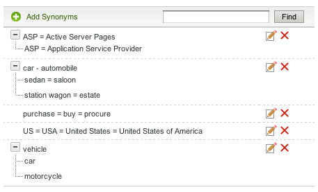

# Info zu Wörterbüchern{#about-dictionaries}

Sie können Wörterbücher verwenden, um eine Sammlung von Wörterbüchern und deren zugehörige Synonyme und Hyponyme zu verwalten.

## Wörterbücher {#concept_B8028B71EC8144669614C64578EDB034}

Synonyme sind Wörter, die dieselbe oder eine ähnliche Bedeutung haben, wie Hosen, Jeans, Hosen und Schläge, oder kaufen, kaufen, erwerben und bestellen.

Hyponyme sind einseitige Synonyme und bieten eine Lösung, wenn Synonyme unangemessen wären. So lautet beispielsweise der oberste Suchbegriff einer für den Handel bestimmten Bekleidung &quot;Hosen&quot;. Jeans werden jedoch nicht in den Suchergebnissen angezeigt. In diesem Fall können Sie mit einem Hypo-Namen Jeans mit Hosen verbinden, aber damit eine Suche nach Jeans nur Jeans zurückgeben kann. Verwenden Sie Hyponyme, um auch für gestoppte Produkte oder Wettbewerbsbedingungen eine Übereinstimmung zu erzielen. Diese Strategie gewährleistet minimale Auswirkungen auf andere Suchergebnisse. Wenn beispielsweise das Produkt &quot;S2000&quot;eingestellt wird und das Produkt &quot;S3000&quot;dessen Nachfolger ist, verwenden Sie ein Hyponym anstelle eines Synonyms, um sicherzustellen, dass die Suchergebnisse für &quot;S3000&quot;keine streunenden &quot;S2000&quot;-Ergebnisse enthalten.

Synonyme und Hyponyme helfen Kunden, relevante Suchergebnisse zu finden, wenn sie nicht exakte Übereinstimmungsbegriffe eingeben, die auf den Webseiten nicht vorhanden sind. Wenn beispielsweise das Wort &quot;Hose&quot;auf Ihrer Website verwendet wird, können Sie ein Synonym erstellen, das &quot;Hosen&quot;und &quot;Hosen&quot;miteinander verbindet. Wenn Kunden wiederum nach &quot;Hosen&quot;suchen, werden Suchergebnisse zurückgegeben, die mit Hosen zusammenhängen.

Synonyme und Hyponyme werden als Domänenwörterbücher gruppiert. Dies sind spezielle Wörterbücher, die Sie für ein bestimmtes Thema oder einen bestimmten Zweck erstellen.

Auf der Seite &quot;Wörterbuchmenü&quot;werden alle Domänenwörterbücher Liste, die Ihr Konto zurzeit definiert hat. Auf dieser Hauptseite können Sie Domänenwörterbücher umbenennen, bearbeiten, löschen oder aktivieren und deaktivieren.

## Synonym und Hyponym-Notation {#section_B459CCB850974F4FB16A14E489BBBEC0}

Die folgende Abbildung zeigt eine Gruppe von Begriffen mit Synonymen und Hyponymen Beziehungen.

Sechs wichtige Synonyme-Beziehungen werden explizit definiert. Jeder Begriff wird durch gleiche Zeichen (=) getrennt.

* &quot;Auto&quot; ist ein Synonym für Automobil.
* &quot;Sedan&quot; ist ein Synonym des Salons.
* &quot;Bahnhofswagen&quot; ist ein Synonym für das Vermögen.
* &quot;ASP&quot;ist ein Synonym für Active Server Pages and Application Dienstleister.
* &quot;Kauf&quot;, &quot;Kauf&quot;und &quot;Beschaffung&quot;sind Synonyme voneinander.
* &quot;USA&quot;, &quot;USA&quot;und &quot;Vereinigte Staaten von Amerika&quot;sind Synonyme voneinander.

Zeilen, die ein einzelnes Wort enthalten, sind einfache Synonyme. Zeilen mit erweiterbaren Bäumen bilden hyponyme Beziehungen. In diesem Beispiel definiert der zweite Baum Sedan, Saloon, Bahnhofswagen und Anwesen als Hyponyme von Auto und Automobil. Im Gegensatz dazu sind Autos und Autos Hypernyms der übrigen Begriffe im Baum.

Der dritte Baum definiert Auto und Motorrad als Hyponyme des Fahrzeugs.

Sie können mehr als ein Akronym und/oder eine Erweiterung mit mehreren Wörtern in jedes Synonym einschließen, wie im oben stehenden Synonym-Beispiel &quot;US&quot;dargestellt. Wenn ein Wort oder ein Akronym mehrere Bedeutungen hat, erstellen Sie ein Synonym für jede Bedeutung, wie im Beispiel &quot;ASP&quot;oben dargestellt. Durch das Hinzufügen mehrerer Synonyme stellen Sie sicher, dass eine Suche nach &quot;Application Dienstleister&quot;z. B. keine Suchergebnisse für &quot;Active Server Pages&quot;zurückgibt.

Hyponyme werden nicht mit anderen Hyponymen erweitert. Hyponyme erweitern höchstens eine Ebene mit ihren Synonymen. Beispielsweise gibt eine Suche nach &quot;Fahrzeug&quot;Ergebnisse für &quot;Auto&quot;und &quot;Auto&quot;zurück, gibt jedoch keine Ergebnisse für &quot;Sedan&quot;und &quot;Kombi&quot;zurück.

## Grundlagen zur Suche nach Begriffen in Wörterbüchern {#section_28E7F80CE68D4481BBF4F51EED237C67}

Sie können in allen Wörterbüchern, die Sie hinzufügen, nach Hyponymen und Synonymen suchen. Diese Funktion ist nützlich, wenn Sie einen bestimmten Begriff bearbeiten oder löschen möchten, der in mehreren Wörterbüchern vorhanden sein kann. Jedes Wörterbuch mit übereinstimmenden Ergebnissen wird mit den zugehörigen Wortgruppen angezeigt. Wenn die Abfrage mehr als 1000 Sätze oder Bäume zurückgibt, werden nur die ersten 1000 angezeigt.

Siehe [Suchen nach Wörterbüchern](../c-about-linguistics-menu/c-about-dictionaries.md#task_8D2BACC6F9B4487FA82367CBEDEE306F).

Siehe [Bearbeiten eines Wörterbuchs](../c-about-linguistics-menu/c-about-dictionaries.md#task_7B349B2D385048D7A06E754FAB75316A).

## Grundlagen zum Konfigurieren eines Wörterbuchs als stemmendes Wörterbuch {#section_B859E2E957674F558AC6F8D05A0ED190}

Stemming, die Möglichkeit, auf der Wurzel eines Wortes zu suchen, das mehrere Endungen haben kann, kann in einem der drei folgenden Modi funktionieren: Domänenwörterbücher, Standardalternative Word-Forms und Keine.

Siehe [Info zu Wörtern und Sprachen](../c-about-linguistics-menu/c-about-words-and-language.md#concept_CEB4B9576F3C4E2EB87B352EEC738D79).

Bei den folgenden Informationen wird davon ausgegangen, dass für Ihr Konto **[!UICONTROL Alternative Word Forms]** **[!UICONTROL Domain Dictionaries]** festgelegt ist, damit Sie bestimmte Domänenwörterbücher als Quelle für die Zeichenfolge konfigurieren können.

Sie können jedes Domänenwörterbuch in ein &quot;stemming-Wörterbuch&quot;umwandeln. Seine Synonyme und Hyponyme werden erwartungsgemäß erweitert, allerdings mit zusätzlichen Nebenwirkungen. Mit allen Begriffen, die in einem anderen Wörterbuch häufig vorkommen, oder sogar selbst, führt es seine Wortgruppe mit diesen Synonymen oder Hyponymen zusammen. Sie können sich das als eine weitere Worterweiterung vorstellen.

Ohne Wortstamm müssen Synonyme und Hyponyme ausführlich und vollständig sein und jedes relevante Wort als Mitglied auflisten.

Im Folgenden finden Sie ein Beispiel für Synonyme ohne Stemming:

* Synonyme: jog = running
* Eine Abfrage für &quot;joggen&quot;liefert Dokumente mit den Worten &quot;laufen&quot;und &quot;joggen&quot;.
* Eine Abfrage für &quot;Laufen&quot;liefert die gleichen Dokumente wie &quot;joggen&quot;.
* Webseiten ohne &quot;joggen&quot;und &quot;laufend&quot;mit anderen Wortformen wie &quot;run&quot;und &quot;run&quot;fehlen im Ergebnis der Abfrage.

In diesem Beispiel wird ein Abfrage-Wort nur erweitert, wenn es Mitglied eines bestimmten Synonyms oder eines bestimmten Hyponyms ist.

Im Folgenden finden Sie ein Beispiel für Synonyme und Stemming:

* Synonyme: jog = running
* Synonymer Eintrag aus einem stemming-Wörterbuch: running = run = run
* Eine Abfrage für &quot;jogg&quot;oder &quot;running&quot;gibt alle Webseiten mit den Wörtern &quot;run&quot;, &quot;running&quot;, &quot;run&quot;und &quot;jog&quot;zurück.
* Eine Abfrage für &quot;Run&quot;und &quot;run&quot;gibt die gleichen oder ähnliche Ergebnisse zurück.

In diesem Beispiel kann ein Synonym aus einem stemming-Wörterbuch seine Gruppe gleichwertiger Wörter mit jedem anderen Synonym oder jeder anderen Kurzbezeichnung in einem anderen Wörterbuch zusammenführen, das mindestens einen Begriff gemeinsam hat.

Das Festlegen zu vieler Wörterbücher mit zu vielen Wörtern kann Auswirkungen auf die Leistung haben. Sie sollten Domänenwörterbücher nur sparsam als stemmende Wörterbücher festlegen. Die Worterweiterung kann während der Suchzeit auch unerwartete Worterweiterungen erzeugen und den Prozess des Debuggens und Ablaufens von Worterweiterungen erschweren.

Siehe [Konfigurieren eines Wörterbuchs als stemming-Wörterbuch](../c-about-linguistics-menu/c-about-dictionaries.md#task_541E8453A12F4A8E89CF6F595469F074).

## Hinzufügen eines neuen Wörterbuchs {#task_F31AC6723E894C4F91D12AB2A4CEE9FB}

Sie können ein neues Wörterbuch mit Synonymen und Hyponymen hinzufügen, um Ihre Kunden bei der Suche nach relevanten Suchergebnissen zu unterstützen. Diese Funktion ist besonders nützlich, wenn Kunden Begriffe eingeben, die nicht exakt übereinstimmen und die möglicherweise nicht auf Ihren Webseiten vorhanden sind.

Siehe auch [Hinzufügen einer neuen Geschäftsregel](../c-about-rules-menu/c-about-business-rules.md#task_BD3B31ED48BB4B1B8F1DCD3BFA2528E7).

**So fügen Sie ein neues Wörterbuch hinzu**

1. Klicken Sie im Produktmenü auf **[!UICONTROL Linguistics]** > **[!UICONTROL Dictionaries]**.
1. Klicken Sie auf der Seite **[!UICONTROL Dictionary Menu]** auf **[!UICONTROL Add New Dictionary]**.
1. Geben Sie auf der Seite **[!UICONTROL Dictionary]** im Feld **[!UICONTROL Name]** den Namen des neuen Wörterbuchs ein.
1. Klicken **[!UICONTROL Add Synonyms]**.
1. Führen Sie im Dialogfeld **[!UICONTROL Add Terms]** einen der folgenden Schritte aus:

   * Um Synonyme hinzuzufügen, geben Sie zwei oder mehr Begriffe in das Haupttextfeld ein, wobei jedes Wort bzw. jede Wortgruppe durch ein Gleichheitszeichen (=) getrennt wird. Beispiel: pants = housers = slacks.
   * Um Hyponyme hinzuzufügen, geben Sie einen Hyperbelbegriff in das Textfeld ein. Klicken Sie auf **[!UICONTROL Add Hyponym]** und geben Sie dann ein Hyponym ein, das sich auf den von Ihnen eingegebenen Hyperlink bezieht. Beispielsweise könnten &quot;Sedan&quot;, &quot;Saloon&quot;, &quot;Bahnhofswagen&quot;und &quot;Nachlass&quot;hyponyme &quot;Auto&quot;und &quot;Automobil&quot;(beide Hyperbeln) sein, wie unten dargestellt.

      

      Hyponyme Einträge können auch Synonyme wie &quot;Sedan&quot;und &quot;Saloon&quot;bilden.

1. Klicken **[!UICONTROL Save]**.
1. Führen Sie einen der folgenden Schritte aus:

   * Wiederholen Sie die Schritte 4 bis 6, um weitere Synonyme und Hyponyme hinzuzufügen.
   * Fahren Sie mit dem nächsten Schritt fort.

1. Um die Ergebnisse Ihrer Änderungen Vorschau, klicken Sie auf **[!UICONTROL regenerate your staged site index]**, um den Index Ihrer gestaffelten Website neu zu erstellen.

   Siehe [Ausführen eines vollständigen Indexes einer Live- oder Staged-Website...](../c-about-index-menu/c-about-full-index.md#task_F7FE04D8A1654A7787FCCA31B45EB42D).

   Siehe [Ausführen eines inkrementellen Indexes einer Live- oder Staged-Website...](../c-about-index-menu/c-about-incremental-index.md#task_9BFB6157F3884B2FAECB7E0E9CA318CB).
1. (Optional) Klicken Sie im Produktmenü auf **[!UICONTROL Linguistics]** > **[!UICONTROL Dictionaries]** und führen Sie dann einen der folgenden Schritte aus:

   * Klicken Sie auf **[!UICONTROL History]**, um alle vorgenommenen Änderungen wiederherzustellen.

      Siehe [Verwenden der Option Verlauf](../t-using-the-history-option.md#task_70DD3F87A67242BBBD2CB27156F43002).

   * Klicken **[!UICONTROL Live]**.

      Siehe [Live-Einstellungen anzeigen](../c-about-staging.md#task_401A0EBDB5DB4D4CA933CBA7BECDC10F).

   * Klicken **[!UICONTROL Push Live]**.

      Siehe [Pushing stage settings live](../c-about-staging.md#task_44306783B4C0408AAA58B471DAF2D9A4).

## Aktivieren oder Deaktivieren eines Wörterbuchs {#task_EC282EA0846942F6913918EA8218220B}

Die Beziehungen der einzelnen Wörter werden zu dem Zeitpunkt generiert, zu dem Sie Ihre Website indizieren. Vor dem nächsten Indexierungsvorgang können Sie ein Wörterbuch, das Sie hinzugefügt haben, aktivieren oder deaktivieren.

**So aktivieren oder deaktivieren Sie ein Wörterbuch**

1. Klicken Sie im Produktmenü auf **[!UICONTROL Linguistics]** > **[!UICONTROL Dictionaries]**.
1. Führen Sie auf der Seite **[!UICONTROL Dictionary Menu]** unter der Spalte **[!UICONTROL Enabled]** der Tabelle einen der folgenden Schritte aus:

   * Markieren Sie das Kästchen eines Wörterbuchs, das Sie aktivieren und indiziert haben möchten.
   * Deaktivieren Sie das Kontrollkästchen eines Wörterbuchs, das Sie deaktivieren möchten und nicht indiziert sind.

1. Klicken **[!UICONTROL Save Changes]**.
1. Um die Ergebnisse Ihrer Änderungen Vorschau, klicken Sie auf **[!UICONTROL regenerate your staged site index]**, um den Index Ihrer gestaffelten Website neu zu erstellen.

   Siehe [Ausführen eines vollständigen Indexes einer Live- oder Staged-Website...](../c-about-index-menu/c-about-full-index.md#task_F7FE04D8A1654A7787FCCA31B45EB42D).

   Siehe [Ausführen eines inkrementellen Indexes einer Live- oder Staged-Website...](../c-about-index-menu/c-about-incremental-index.md#task_9BFB6157F3884B2FAECB7E0E9CA318CB).
1. (Optional) Klicken Sie im Produktmenü auf **[!UICONTROL Linguistics]** > **[!UICONTROL Dictionaries]** und führen Sie dann einen der folgenden Schritte aus:

   * Klicken Sie auf **[!UICONTROL History]**, um alle vorgenommenen Änderungen wiederherzustellen.

      Siehe [Verwenden der Option Verlauf](../t-using-the-history-option.md#task_70DD3F87A67242BBBD2CB27156F43002).

   * Klicken **[!UICONTROL Live]**.

      Siehe [Live-Einstellungen anzeigen](../c-about-staging.md#task_401A0EBDB5DB4D4CA933CBA7BECDC10F).

   * Klicken **[!UICONTROL Push Live]**.

      Siehe [Pushing stage settings live](../c-about-staging.md#task_44306783B4C0408AAA58B471DAF2D9A4).

## Bearbeiten eines Wörterbuchs {#task_7B349B2D385048D7A06E754FAB75316A}

Sie können Synonym- und Hyponymisierungsgruppen, die ein bestimmtes Wörterbuch bilden, bearbeiten oder löschen.

<!-- 

t_editing_a_dictionary.xml

 -->

Sie können **[!UICONTROL Find]** auch verwenden, um bestimmte Synonyme und Hyponyme zu finden, die Sie in all Ihren Wörterbüchern bearbeiten oder löschen möchten.

**So bearbeiten Sie ein Wörterbuch**

1. Klicken Sie im Produktmenü auf **[!UICONTROL Linguistics]** > **[!UICONTROL Dictionaries]**.
1. Führen Sie einen der folgenden Schritte aus:

   * Klicken Sie auf der Seite [!DNL Dictionary Menu] in der Tabelle auf den Hyperlink-Namen eines einzelnen Wörterbuchs, dessen Begriffe Sie bearbeiten oder löschen möchten.
   * Geben Sie auf der Seite [!DNL Dictionary Menu] im Textfeld **[!UICONTROL Find]** einen Begriff ein, den Sie in allen Wörterbüchern suchen möchten, und klicken Sie dann auf **[!UICONTROL Find]**.

      Verwenden Sie auf der Seite [!DNL Find in Dictionaries] die zugehörigen Dropdown-Listen, um die gewünschten Verfeinerungsoptionen festzulegen.

      <table> 
      <thead> 
        <tr> 
        <th colname="col1" class="entry"> 
Option 
 </th> 
        <th colname="col2" class="entry"> 
Beschreibung 
 </th> 
        </tr> 
      </thead>
      <tbody> 
        <tr> 
        <td colname="col1"> 
Suchen 
 </td> 
        <td colname="col2"> 
Ermöglicht die Eingabe des Begriffs, nach dem Sie in allen Wörterbüchern suchen möchten. 
 </td> 
        </tr> 
        <tr> 
        <td colname="col1"> 
Dropdown-Liste Übereinstimmung 
 </td> 
        <td colname="col2"> 
Hier können Sie aus den folgenden vier Übereinstimmungstypen auswählen: 
        <ul id="ul_D656F159677946938050115F610EEF4B"> 
        <li id="li_2D6B302E021A4CE7A47F028812633EDC">  Exakte Übereinstimmung   
Die Abfrage muss exakt mit einem Hyponym oder Synonym übereinstimmen. 
 </li> 
        <li id="li_30AD5976E43041E98190F4757E821092">  Enthält Text   
Für die Abfrage ist nur eine Übereinstimmung mit einer Unterzeichenfolge erforderlich. eine Übereinstimmung innerhalb eines Hyponyms oder Synonyms. 
 </li> 
        <li id="li_9BF911EFB54345BB82679BDE51DDF8AF">  Beginnt mit  
Die Abfrage wird nur mit dem Anfang jedes Hyponyms und Synonyms abgeglichen. 
 </li> 
        <li id="li_CB791C7F5B5A4496B329ED505E7D97BC">  Wortübereinstimmung   
Die Abfrage wird mit jedem Wort eines Synonyms oder eines Hyponyms verglichen, das Wort muss jedoch exakt übereinstimmen. 
 </li> 
        </ul> 
 </td> 
        </tr> 
        <tr> 
        <td colname="col1"> 
Dropdown-Liste "Wörterbuch aktivieren/deaktivieren" 
 </td> 
        <td colname="col2"> 
Hier können Sie aus den folgenden Optionen auswählen: 
        <ul id="ul_EBBD3F3A2D854952A35CBDDBECB40958"> 
        <li id="li_7F5654C284BE485EAC9B000A663C6C60">  Aktivierte und deaktivierte Wörterbücher   
Suchen Sie in aktivierten und deaktivierten Wörterbüchern nach dem angegebenen Begriff. 
 </li> 
        <li id="li_4A83EECF38044287A923EC0AAF639079">  Nur aktivierte Wörterbücher   
Die Suche nach aktivierten Wörterbüchern ist nur zum Debugging des aktuellen Indexes hilfreich. 
 </li> 
        </ul> 
 
Siehe <a href="../c-about-linguistics-menu/c-about-dictionaries.md#task_EC282EA0846942F6913918EA8218220B" type="task" format="dita" scope="local"> Aktivieren oder Deaktivieren eines Wörterbuchs </a>. 
 </td> 
        </tr> 
        <tr> 
        <td colname="col1"> 
Dropdown-Liste "Stage/Live" 
 </td> 
        <td colname="col2"> 
Hier können Sie aus den folgenden Optionen auswählen: 
        <ul id="ul_BD0733A30E6B470E942B21F499A4373B"> 
        <li id="li_F9A8C39C22EA4FBF86536F5924ED973C">  Stage-/Live-Wörterbücher   
Sucht nach dem angegebenen Begriff in gestaffelten und Live-Wörterbüchern. Es wird jedoch nur die gestaffelte Version des Wörterbuchs durchsucht, wenn es vorhanden ist. Wenn die gestaffelte Version nicht vorhanden ist, wird die Live-Version des Wörterbuchs durchsucht. 
 </li> 
        <li id="li_DB0944DB18564269AA10676BDFDB0460">  Live-Wörterbücher   
Suchen Sie nur in den Live-Wörterbüchern nach dem angegebenen Begriff. 
 </li> 
        </ul> 
 </td> 
        </tr> 
      </tbody> 
      </table>

1. Führen Sie in der Tabelle einen der folgenden Schritte aus:

   * Klicken Sie auf , der mit dem Begriff verknüpft ist, den Sie aktualisieren möchten. Ändern Sie im Dialogfeld **[!UICONTROL Edit Terms]** die gewünschten Begriffe. Klicken Sie abschließend auf **[!UICONTROL Save]**.

   * Klicken Sie auf , der mit dem Begriff verknüpft ist, den Sie entfernen möchten. Klicken Sie im Dialogfeld **[!UICONTROL Delete Terms]** auf **[!UICONTROL Delete]**. Achten Sie darauf, den richtigen Begriff zu löschen. Es gibt kein Dialogfeld zur Bestätigung des Löschvorgangs.

1. Um die Ergebnisse Ihrer Änderungen Vorschau, klicken Sie auf **[!UICONTROL regenerate your staged site index]**, um den Index Ihrer gestaffelten Website neu zu erstellen.

   Siehe [Ausführen eines vollständigen Indexes einer Live- oder Staged-Website...](../c-about-index-menu/c-about-full-index.md#task_F7FE04D8A1654A7787FCCA31B45EB42D).

   Siehe [Ausführen eines inkrementellen Indexes einer Live- oder Staged-Website...](../c-about-index-menu/c-about-incremental-index.md#task_9BFB6157F3884B2FAECB7E0E9CA318CB).
1. (Optional) Klicken Sie im Produktmenü auf **[!UICONTROL Linguistics]** > **[!UICONTROL Dictionaries]** und führen Sie dann einen der folgenden Schritte aus:

   * Klicken Sie auf **[!UICONTROL History]**, um alle vorgenommenen Änderungen wiederherzustellen.

      Siehe [Verwenden der Option Verlauf](../t-using-the-history-option.md#task_70DD3F87A67242BBBD2CB27156F43002).

   * Klicken **[!UICONTROL Live]**.

      Siehe [Live-Einstellungen anzeigen](../c-about-staging.md#task_401A0EBDB5DB4D4CA933CBA7BECDC10F).

   * Klicken **[!UICONTROL Push Live]**.

      Siehe [Pushing stage settings live](../c-about-staging.md#task_44306783B4C0408AAA58B471DAF2D9A4).

## Umbenennen eines Wörterbuchs {#task_7F1F372B337B4853BFA2A60AD267B092}

Sie können den Namen eines Wörterbuchs ändern, das Sie hinzugefügt haben.

<!-- 

t_renaming_a_dictionary.xml

 -->

Wenn Sie die Option **[!UICONTROL Alternate Word Forms]** in **[!UICONTROL Words & Language]** auf **[!UICONTROL Domain Dictionaries]** setzen, wird die Option **[!UICONTROL Configure]** anstelle von **[!UICONTROL Rename]** verwendet.

Siehe [Info zu Wörtern und Sprachen](../c-about-linguistics-menu/c-about-words-and-language.md#concept_CEB4B9576F3C4E2EB87B352EEC738D79).

**So benennen Sie ein Wörterbuch um**

1. Klicken Sie im Produktmenü auf **[!UICONTROL Linguistics]** > **[!UICONTROL Dictionaries]**.
1. Führen Sie auf der Seite **[!UICONTROL Dictionary Menu]** unter der Spalte **[!UICONTROL Actions]** der Tabelle einen der folgenden Schritte aus:

   * Klicken Sie für das zugehörige Wörterbuch, dessen Name Sie ändern möchten, auf **[!UICONTROL Rename]**.

      Im Dialogfeld **[!UICONTROL Rename Dictionary]**. Geben Sie im Feld **[!UICONTROL Name]** den neuen Namen des Wörterbuchs ein.

      Klicken **[!UICONTROL Rename File]**.

   * Klicken Sie für das zugehörige Wörterbuch, dessen Name Sie ändern möchten, auf **[!UICONTROL Configure]**.

      Im Dialogfeld **[!UICONTROL Configure Dictionary]**. Geben Sie im Feld **[!UICONTROL Name]** den neuen Namen des Wörterbuchs ein.

      Klicken **[!UICONTROL Save Configuration]**.

1. (Optional) Führen Sie einen der folgenden Schritte aus:

   * Klicken Sie auf **[!UICONTROL History]**, um alle vorgenommenen Änderungen wiederherzustellen.

      Siehe [Verwenden der Option Verlauf](../t-using-the-history-option.md#task_70DD3F87A67242BBBD2CB27156F43002).

   * Klicken **[!UICONTROL Live]**.

      Siehe [Live-Einstellungen anzeigen](../c-about-staging.md#task_401A0EBDB5DB4D4CA933CBA7BECDC10F).

   * Klicken **[!UICONTROL Push Live]**.

      Siehe [Pushing stage settings live](../c-about-staging.md#task_44306783B4C0408AAA58B471DAF2D9A4).

## Konfigurieren eines Wörterbuchs als stemmendes Wörterbuch {#task_541E8453A12F4A8E89CF6F595469F074}

Sie können ein Wörterbuch auf den erweiterten Wortstammermodus einstellen, um die Wortstammerkennung bei Suchvorgängen zu nutzen.

<!-- 

t_configuring_a_dictionary_as_a_stemming_dictionary.xml

 -->

Bei einem solchen Modus werden Webseiten zurückgegeben, die mit Varianten der Suche Ihrer Kunden übereinstimmen.

Siehe [Info zu Wörterbüchern](../c-about-linguistics-menu/c-about-dictionaries.md#concept_B8028B71EC8144669614C64578EDB034).

Siehe [Info zu Wörtern und Sprachen](../c-about-linguistics-menu/c-about-words-and-language.md#concept_CEB4B9576F3C4E2EB87B352EEC738D79).

**So konfigurieren Sie ein Wörterbuch als stemmendes Wörterbuch**

1. Klicken Sie im Produktmenü auf **[!UICONTROL Linguistics]** > **[!UICONTROL Words & Language]**.
1. Wählen Sie auf der Seite [!DNL Words & Languages] in der Dropdown-Liste **[!UICONTROL Alternate Words Forms]** **[!UICONTROL Domain Dictionaries]** aus.

   Jedes Domänenwörterbuch, das als stemmendes Wörterbuch festgelegt ist (siehe Schritt 7 unten), wird als Quelle für alternative Wortformulare verwendet.

1. Klicken **[!UICONTROL Save Changes]**.
1. Klicken Sie im Produktmenü auf **[!UICONTROL Linguistics]** > **[!UICONTROL Dictionaries]**.
1. Klicken Sie auf der Seite [!DNL Dictionaries Menu] unter der Spalte **[!UICONTROL Actions]** in der Tabelle für ein verknüpftes Wörterbuch, das Sie als stemmendes Wörterbuch festlegen möchten, auf **[!UICONTROL Configure]**.
1. Wählen Sie im Dialogfeld **[!UICONTROL Configure Dictionary]** in der Dropdown-Liste **[!UICONTROL Advanced Stemming Mode]** **[!UICONTROL Yes]** aus.
1. Klicken **[!UICONTROL Save Configuration]**.
1. Klicken Sie auf **[!UICONTROL regenerate your staged site index]**, um den Index der gestaffelten Website neu zu erstellen.

   Siehe [Ausführen eines vollständigen Indexes einer Live- oder Staged-Website...](../c-about-index-menu/c-about-full-index.md#task_F7FE04D8A1654A7787FCCA31B45EB42D).

   Siehe [Ausführen eines inkrementellen Indexes einer Live- oder Staged-Website...](../c-about-index-menu/c-about-incremental-index.md#task_9BFB6157F3884B2FAECB7E0E9CA318CB).
1. (Optional) Klicken Sie im Produktmenü auf **[!UICONTROL Linguistics]** > **[!UICONTROL Dictionaries]** und führen Sie dann einen der folgenden Schritte aus:

   * Klicken Sie auf **[!UICONTROL History]**, um alle vorgenommenen Änderungen wiederherzustellen.

      Siehe [Verwenden der Option Verlauf](../t-using-the-history-option.md#task_70DD3F87A67242BBBD2CB27156F43002).

   * Klicken **[!UICONTROL Live]**.

      Siehe [Live-Einstellungen anzeigen](../c-about-staging.md#task_401A0EBDB5DB4D4CA933CBA7BECDC10F).

   * Klicken **[!UICONTROL Push Live]**.

      Siehe [Pushing stage settings live](../c-about-staging.md#task_44306783B4C0408AAA58B471DAF2D9A4).

## Suchen nach Wörterbüchern {#task_8D2BACC6F9B4487FA82367CBEDEE306F}

Sie können in allen Wörterbüchern, die der Site-Suche/dem Merchandising hinzugefügt werden, nach Hyponymen und Synonymen suchen.

<!-- 

t_searching_across_dictionaries.xml

 -->

Diese Funktion ist nützlich, wenn Sie einen bestimmten Begriff bearbeiten oder löschen möchten, der in mehreren Wörterbüchern vorhanden sein kann. Jedes Wörterbuch mit übereinstimmenden Ergebnissen wird mit den zugehörigen Wortgruppen angezeigt. Wenn die Abfrage mehr als 1000 Sätze oder Bäume zurückgibt, werden nur die ersten 1000 angezeigt.

Siehe [Bearbeiten eines Wörterbuchs](../c-about-linguistics-menu/c-about-dictionaries.md#task_7B349B2D385048D7A06E754FAB75316A).

**So suchen Sie nach mehreren Wörterbüchern**

1. Klicken Sie im Produktmenü auf **[!UICONTROL Linguistics]** > **[!UICONTROL Dictionaries]**.
1. Geben Sie auf der Seite [!DNL Dictionary Menu] im Textfeld **[!UICONTROL Find]** einen Begriff ein, den Sie in allen Wörterbüchern suchen möchten, und klicken Sie dann auf **[!UICONTROL Find]**.
1. Verwenden Sie auf der Seite [!DNL Find in Dictionaries] die zugehörigen Dropdown-Listen, um die gewünschten Verfeinerungsoptionen festzulegen.

   Siehe [Bearbeiten eines Wörterbuchs](../c-about-linguistics-menu/c-about-dictionaries.md#task_7B349B2D385048D7A06E754FAB75316A).
1. (Optional) Verwenden Sie die Dropdownliste **[!UICONTROL Show]**, um die maximale Anzahl der Ergebnisse anzugeben, die pro Seite angezeigt werden sollen.

## Löschen eines Wörterbuchs {#task_DBAAEE624BC14D2590444B0B7869ECCA}

Sie können Wörterbücher löschen, die Sie nicht mehr benötigen oder verwenden.

<!-- 

t_deleting_a_dictionary.xml

 -->

Wenn Sie ein Live-Wörterbuch löschen, wird es zum Löschen gestaffelt. Wenn Sie ein gestaffeltes Wörterbuch löschen, wird es sofort gelöscht.

Stellen Sie sicher, dass Sie ein Wörterbuch löschen, das Sie länger benötigen. Es ist keine Verlaufsfunktion verfügbar, um den Löschvorgang rückgängig zu machen.

**So löschen Sie ein Wörterbuch**

1. Klicken Sie im Produktmenü auf **[!UICONTROL Linguistics]** > **[!UICONTROL Dictionaries]**.
1. Klicken Sie auf der Seite [!DNL Dictionary Menu] unter der Spalte **[!UICONTROL Actions]** der Tabelle für das zugehörige Wörterbuch, das Sie entfernen möchten, auf **[!UICONTROL Delete]**.
1. Im Dialogfeld **[!UICONTROL Delete Dictionary]**. Klicken Sie auf **[!UICONTROL Yes]**, um den Löschvorgang zu bestätigen.
1. (Optional) Wenn Sie ein Live-Wörterbuch gelöscht haben, führen Sie einen der folgenden Schritte aus:

   * Klicken **[!UICONTROL Live]**.

      Siehe [Live-Einstellungen anzeigen](../c-about-staging.md#task_401A0EBDB5DB4D4CA933CBA7BECDC10F).

   * Klicken **[!UICONTROL Push Live]**.

      Siehe [Pushing stage settings live](../c-about-staging.md#task_44306783B4C0408AAA58B471DAF2D9A4).

