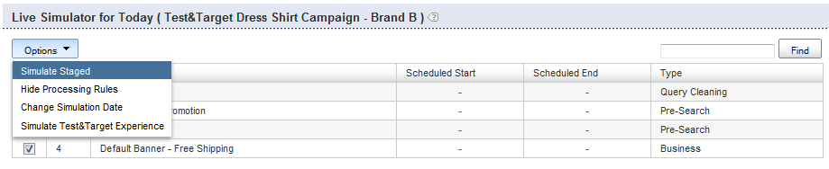

# Geschäftsregeln{#about-business-rules}

Sie können Geschäftsregeln verwenden, um Ihre Suche zu vermarkten.

## Geschäftsregeln {#concept_2A93D76216754D3D8412CDEA00BD26BD}

Sie können beispielsweise konfigurieren, wann Banner angezeigt werden, welche Ergebnisse angezeigt werden und in welcher Reihenfolge. Sie können auch die Position eines Elements in Ihrer Facette und die Vorlage für eine bestimmte Suche konfigurieren. Die Regeln werden in der Reihenfolge ausgeführt, in der sie festgelegt wurden. Je höher die Ordnungsnummer einer Regel ist, desto später wird sie im Prozess ausgeführt, wodurch frühere Regeln übertroffen werden. Sie können die Regeln per Drag &amp; Drop verschieben, um ihre Reihenfolge zu ändern, oder Sie können sie neu anordnen, indem Sie eine neue Nummer in das Textfeld für die Regelreihenfolge eingeben.

Jede Geschäftsregel besteht aus Triggern und Aktionen.

Der Trigger definiert, wann die Regel ausgeführt wird. Wenn der Begriff &quot;Abfrage&quot;beispielsweise &quot;Männer&quot;lautet oder die Ergebnisse überwiegend &quot;Hüte&quot;sind. Der Trigger besteht aus mehreren Bedingungen, die entweder alle oder alle erfüllt sein müssen, damit der gesamte Trigger wahr ist. Sie können die Priorität angeben, indem Sie den Trigger-Operator ändern.

Die Aktion definiert, was passiert, wenn die Bedingung des Triggers erfüllt ist. Sie können beispielsweise festlegen, dass das Banner ein bestimmtes Ergebnis an Position 1 anzeigt oder verschiebt. Die Regeltabelle enthält zusammenfassende Informationen zur Regel. Sie können auf einen Regelnamen klicken, um ihn zu öffnen und weitere Informationen anzuzeigen.

Die Regeltabelle zeigt eine Liste aller Geschäftsregeln. Die Tabelle zeigt standardmäßig die letzten zehn hinzugefügten Regeln in absteigender Reihenfolge an. Sie können auf die Spaltenüberschriften in der Tabelle klicken, um die Regeln in auf- oder absteigender Reihenfolge zu sortieren.

Geschäftsregeln können aus drei Staaten bestehen: Genehmigt, Ausgesetzt oder WIP (laufende Arbeit)

<table> 
 <thead> 
  <tr> 
   <th colname="col1" class="entry"> 
Stand der Geschäftstätigkeit 
 </th> 
   <th colname="col2" class="entry"> 
Beschreibung 
 </th> 
  </tr> 
 </thead>
 <tbody> 
  <tr> 
   <td colname="col1"> 
Genehmigt 
 </td> 
   <td colname="col2"> 
Genehmigte Geschäftsregeln werden in Ihrer Live-Umgebung und in Ihrer gestaffelten Umgebung ausgeführt. Sie genehmigen eine Geschäftsregel im erweiterten Regelaufbau. 
 </td> 
  </tr> 
  <tr> 
   <td colname="col1"> 
Zeitweilig eingestellt 
 </td> 
   <td colname="col2"> 
Ausgesetzte Geschäftsregeln werden nie in Ihrer gestaffelten Umgebung oder in Ihrer Live-Umgebung ausgeführt. 
 </td> 
  </tr> 
  <tr> 
   <td colname="col1"> 
WIP 
 </td> 
   <td colname="col2"> 
WIP (Work In Progress) sind Geschäftsregeln, die weder genehmigt noch ausgesetzt werden. Das heißt, Sie arbeiten vielleicht noch daran, oder Sie möchten sie vielleicht erst testen, bevor Sie sie genehmigen. Geschäftsregeln in einem WIP-Status werden nur in Ihrer gestaffelten Umgebung ausgeführt. 
 </td> 
  </tr> 
 </tbody> 
</table>

Sie genehmigen Geschäftsregeln und veröffentlichen sie live, damit sie in Ihrer Live-Umgebung ausgeführt werden. Derzeit können Sie nur *alle*-Regeln live übertragen. Sie können jedoch den Status einer Regel ändern, um zu steuern, welche Regeln ausgeführt werden und nicht in Ihrer Live-Umgebung ausgeführt werden.

Standardmäßig werden Regeln immer dann ausgeführt, wenn die zugehörigen Trigger erfüllt sind. Sie können jedoch optional planen, dass eine Regel für ein bestimmtes Datum und einen bestimmten Zeitraum ausgeführt wird.

Außerdem werden Regeln standardmäßig ausgeführt, wenn die zugehörigen Trigger für alle Stores erfüllt sind. Wenn die Regel nur für bestimmte Stores gelten soll, können Sie im Bedienfeld &quot;Stores&quot;einen oder mehrere Stores auswählen, auf die die Regel angewendet wird.

## Hinzufügen einer neuen Geschäftsregel {#task_BD3B31ED48BB4B1B8F1DCD3BFA2528E7}

Sie können [!DNL Visual Rule Builder] oder [!DNL Advanced Rule Builder] verwenden, um Geschäftsregeln hinzuzufügen, die das Sucherlebnis Ihres Kunden anpassen.

**So fügen Sie eine neue Geschäftsregel hinzu**

Bei den folgenden Schritten wird davon ausgegangen, dass Sie den Visual Rule Builder verwenden.

1. Führen Sie einen der folgenden Schritte aus:

   * Klicken Sie im Produktmenü auf **[!UICONTROL Rules]** > **[!UICONTROL Business Rules]**. Klicken Sie auf der Seite [!DNL Business Rules] auf **[!UICONTROL Add New Rule]**.

   * Klicken Sie im Produktmenü auf **[!UICONTROL Simulator]**. Klicken Sie auf der Seite **[!UICONTROL Simulator for Today]** rechts neben dem Dropdown-Menü **[!UICONTROL Options]** auf **[!UICONTROL Add New Rule]**.

      Wenn die Option **[!UICONTROL Add New Rule]** auf der Seite nicht sichtbar ist, klicken Sie im Dropdown-Menü **[!UICONTROL Options]** auf **[!UICONTROL Simulate Staged]**.

      

1. Geben Sie im Textfeld **[!UICONTROL Name]** den neuen Namen der Geschäftsregel ein.

   Klicken Sie noch nicht auf **[!UICONTROL Save Rule]**.
1. (Optional) Wenn Sie eine große Anzahl von Geschäftsregeln verwalten, können Sie Geschäftsregeln mit bestimmten Beschriftungen versehen. Geben Sie im Feld **[!UICONTROL Tags]** eine oder mehrere Tag-Beschriftungen ein, verwenden Sie ein Komma, eine Registerkarte oder die Eingabetaste als Trennzeichen.

   Verwenden Sie auf der Seite [!DNL Business Rules] die Funktion **[!UICONTROL Filter by tag]**, um nach Regeln zu filtern, die einer angegebenen Bezeichnung entsprechen. 1. Legen Sie auf der Seite [!DNL Business Rule Builder] die Trigger und Aktionen fest, die Sie verwenden möchten.

   **Optionen für Trigger**

   Trigger sind die Bedingungen, die erfüllt sein müssen, damit eine Geschäftsregel ausgeführt werden kann. Wenn eine Geschäftsregel mehrere Trigger hat, können Sie die Reaktion von Triggern mit einer der folgenden drei Methoden konfigurieren:

   * Eine Antwort, bei der alle Trigger wie im folgenden Beispiel true (Standardeinstellung) sein müssen:

      `if a AND b AND c then ...`

   * Eine Antwort, bei der einer der Trigger wie im folgenden Beispiel wahr sein muss:

      `if a OR b OR c then ...`

   * Eine Antwort, bei der eine benutzerspezifische Kombination von Triggern angegeben wird. Das heißt, Sie kombinieren einzelne Trigger oder &quot;Bedingungen&quot; mit den Operatoren `AND` und `OR`.

      Sie können die Priorität der Bewertung auch ändern, indem Sie Kombinationen aus Links- und Rechtsklammern hinzufügen, wie im folgenden Beispiel dargestellt:

      `if (a OR b) AND c then ...`

      >[!NOTE]
      >
      >Wenn Sie die Operatoren `AND` mit den Operatoren `OR` in einem benutzerspezifischen Geschäftsregelsatz kombinieren, stellen Sie sicher, dass Sie die Klammern entsprechend angeben, um sicherzustellen, dass die Trigger in der richtigen Reihenfolge ausgewertet werden.

      Diese spezielle Funktion zum Anpassen einer Kombination von Triggern ist nicht standardmäßig aktiviert. Wenden Sie sich an den technischen Support, um diese Funktion für Ihre Verwendung zu aktivieren.
   <table> 
      <thead> 
      <tr> 
      <th colname="col1" class="entry"> 
Trigger, Option 
 </th> 
      <th colname="col2" class="entry"> 
Beschreibung 
 </th> 
      </tr> 
    </thead>
    <tbody> 
      <tr> 
      <td colname="col1"> 
Suchbegriffsübereinstimmungen 
 </td> 
      <td colname="col2"> 
Trigger ist "true", wenn der Suchbegriff mit dem angegebenen, in der Groß- und Kleinschreibung unterschieden wird. Der Trigger gilt sowohl für den Suchbegriff als auch für alle seine Synonyme, wie im Linguistik-Wörterbuch definiert. 
 </td> 
      </tr> 
      <tr> 
      <td colname="col1"> 
 Abfrage stimmt überein 
 </td> 
      <td colname="col2"> 
 Trigger ist "true", wenn alle Suchparameter übereinstimmen. 
 </td> 
      </tr> 
      <tr> 
      <td colname="col1"> 
 Ergebnisgruppe ist Dominant 
 </td> 
      <td colname="col2"> 
 Trigger ist "true", wenn die durch die jeweilige Suche definierte Ergebnisgruppe die Ergebnismenge dominiert. 
 
Standardmäßig ist die Dominanz auf 50 % festgelegt. Diese Einstellung ist eine Merchandising-Voreinstellung, die Sie festlegen können. 
 
 
        <!--See <xref href="t_Configuring_Merchandising_preferences.xml#task_7AC7B9F5D9F44E10AB5BC0B8CB31C37A" type="task" format="dita" scope="local">Configuring Merchandising preferences</xref>. --> 
 
Die gesamte Gruppe muss innerhalb des Ergebnissatzes vorhanden sein, damit dieser Trigger true (wahr) ist. Die Ergebnisgruppe ist dynamisch. Sie können sich nach Indexvorgängen ändern, je nachdem, welche Ergebnisse mit den ursprünglichen Suchkriterien übereinstimmen. 
 </td> 
      </tr> 
      <tr> 
      <td colname="col1"> 
Ergebnisgruppe vorhanden 
 </td> 
      <td colname="col2"> 
 Trigger ist "true", wenn die durch die jeweilige Suche definierte Ergebnisgruppe in der Ergebnismenge vorhanden ist. Die gesamte Gruppe muss innerhalb des Ergebnissatzes vorhanden sein, damit dieser Trigger erfüllt werden kann (die Ergebnisse können auf jeder Seite angezeigt werden). Die Ergebnisgruppe ist dynamisch und kann sich nach Indexvorgängen ändern, je nachdem, welche Ergebnisse mit den ursprünglichen Suchkriterien übereinstimmen. 
 </td> 
      </tr> 
      <tr> 
      <td colname="col1"> 
 Vorgegebenes Ergebnis 
 </td> 
      <td colname="col2"> 
 Trigger ist "true", wenn das einzelne Ergebnis innerhalb der Ergebnismenge gefunden wird. Das Ergebnis kann sich an einer beliebigen Stelle im Ergebnissatz befinden, muss sich nicht auf der Seite befinden, die der Benutzer derzeit anzeigt. 
 </td> 
      </tr> 
    </tbody> 
    </table>

   **Aktionsoptionen**

   Wenn die Trigger einer Geschäftsregel erfüllt sind, werden die mit der Regel verknüpften Aktionen ausgeführt. Während Sie mit dem visuellen Regelaufbau die folgenden Aktionen erstellen können, können Sie mit dem erweiterten Regelaufbau weitere Aktionstypen erstellen.

   Die Aktionen &quot;Facet-Element entfernen&quot;, &quot;Facet-Element einblenden&quot;, &quot;Facette einblenden&quot;, &quot;Facette entfernen&quot;, &quot;Facet-Element pushen&quot;in der folgenden Tabelle erfordern eine Facette. Die Oberfläche zur Auswahl einer Facette hängt von der Konfiguration Ihres Kontos ab. Ein Normalkonto verwendet beispielsweise eine Dropdown-Liste zur Auswahl von Facetten. Wenn Ihr Konto jedoch Facetten mit Zuschnitten aufweist, wird ein Textfeld mit automatischer Vervollständigung angezeigt, in das Sie den Namen einer beliebigen Facette eingeben können. Die automatische Vervollständigung schlägt Facetten in einer Dropdown-Liste vor, während Sie den Namen der Facette eingeben. Die Vorschläge enthalten derzeit definierte Facetten. Wenn Ihr Konto über eine Steckplatzzuordnung verfügt, werden auch formatierte Facetten vorgeschlagen.

   <table> 
    <thead> 
      <tr> 
      <th colname="col1" class="entry"> 
Aktionsoption 
 </th> 
      <th colname="col2" class="entry"> 
Beschreibung 
 </th> 
      </tr> 
    </thead>
    <tbody> 
      <tr> 
      <td colname="col1"> 
Push-Gruppe 
 </td> 
      <td colname="col2"> 
 Verschiebt die Gruppe der Suchergebnisse, wie sie durch die angegebenen Suchkriterien definiert wurde, an eine bestimmte Position. 
 
Durch das Übermitteln einer Gruppe von Suchergebnissen wird die Gruppe nicht implizit hinzugefügt. 
 </td> 
      </tr> 
      <tr> 
      <td colname="col1"> 
hinzufügen 
 </td> 
      <td colname="col2"> 
 hinzufügen die Gruppe von Suchergebnissen, die durch die angegebenen Suchkriterien definiert ist. 
 </td> 
      </tr> 
      <tr> 
      <td colname="col1"> 
Gruppe entfernen 
 </td> 
      <td colname="col2"> 
 Entfernen Sie die Gruppe der Suchergebnisse, die durch die angegebenen Suchkriterien definiert wurde. 
 </td> 
      </tr> 
      <tr> 
      <td colname="col1"> 
Einfach schieben 
 </td> 
      <td colname="col2"> 
 Verschiebt das Suchergebnis an die ausgewählte Position. 
 </td> 
      </tr> 
      <tr> 
      <td colname="col1"> 
hinzufügen 
 </td> 
      <td colname="col2"> 
 Fügt der ausgewählten Position ein Suchergebnis hinzu. 
 </td> 
      </tr> 
      <tr> 
      <td colname="col1"> 
Single löschen 
 </td> 
      <td colname="col2"> 
 Entfernt ein einzelnes Suchergebnis aus der Suchergebnisgruppe. 
 </td> 
      </tr> 
      <tr> 
      <td colname="col1"> 
Alle Ergebnisse entfernen 
 </td> 
      <td colname="col2"> 
Entfernt alle Ergebnisse aus der Suchergebnisgruppe. 
 
 
        <!-- Bug #3331637 The option is meant to be used in conjunction with other rule actions in order to create "canned landing pages" where we want to create a page's content solely by rule actions, and need to completely discard the "natural" results of the search. Given that the other options don't have any kind of "here's how/why you might use this", I don't see much point in breaking that precedent here.--> 
 </td> 
      </tr> 
      <tr> 
      <td colname="col1"> 
Wählen Sie ein anderes Banner 
 </td> 
      <td colname="col2"> 
 Ändert das Banner im ausgewählten Bannerbereich. 
 
Diese Option ist verfügbar, wenn Sie mit der rechten Maustaste auf ein Banner im Anzeigebereich der Webseite klicken. 
 </td> 
      </tr> 
      <tr> 
      <td colname="col1"> 
hinzufügen Banner-Befehle 
 </td> 
      <td colname="col2"> 
Gilt nur für Adobe Dynamic Media Classic-Vorlagen. 
 
Ermöglicht die Änderung der Standardparameter, die in der Bannervorlage verwendet werden. 
 
Siehe die Tabelle der Optionen unter <a scope="local" href="../c-about-design-menu/c-about-banners.md#task_AD1E0C00A9E04B1FA819EB93288786B3" type="reference" format="dita"> Hinzufügen eines Banners mit der Adobe Dynamic Media Classic </a>. 
 
Siehe auch <a href="../c-about-design-menu/c-about-banners.md#task_C3E782477FBF428ABEA220751781ACA9" type="task" format="dita" scope="local"> Bearbeiten eines Banners mit der Adobe Dynamic Media Classic </a>. 
 </td> 
      </tr> 
      <tr> 
      <td colname="col1"> 
Banner entfernen 
 </td> 
      <td colname="col2"> 
 Entfernt das Banner aus dem ausgewählten Bannerbereich; Es wird kein Banner angezeigt, es sei denn, eine andere Regel, die ein Banner festlegt, setzt diese Regel außer Kraft. 
 
Diese Option ist verfügbar, wenn Sie mit der rechten Maustaste auf ein Banner im Anzeigebereich der Webseite klicken. 
 </td> 
      </tr> 
      <tr> 
      <td colname="col1"> 
Push-Facet-Element 
 </td> 
      <td colname="col2"> 
 Verschiebt ein Element innerhalb einer Facette an die ausgewählte Position. 
 </td> 
      </tr> 
      <tr> 
      <td colname="col1"> 
Zone entfernen 
 </td> 
      <td colname="col2"> 
 Entfernt eine Zone von der Suchergebnisseite. 
 
Siehe auch die Aktion Facet entfernen unten. 
 </td> 
      </tr> 
      <tr> 
      <td colname="col1"> 
Einzugszone 
 </td> 
      <td colname="col2"> 
 Zeigt eine Zone auf der Suchergebnisseite an. 
 
Siehe auch die unten stehende Aktion Facet anzeigen. 
 </td> 
      </tr> 
      <tr> 
      <td colname="col1"> 
Facet-Element entfernen 
 </td> 
      <td colname="col2"> 
 Entfernt ein Facettenelement aus einer Facette. 
 </td> 
      </tr> 
      <tr> 
      <td colname="col1"> 
Facettenelement einblenden 
 </td> 
      <td colname="col2"> 
 Zeigt ein bestimmtes Facettenelement an. 
 </td> 
      </tr> 
      <tr> 
      <td colname="col1"> 
Facette anzeigen 
 </td> 
      <td colname="col2"> 
 Zeigt eine bestimmte Facette an. Diese Aktion wird gegenüber der Aktion "Einzugszone"bevorzugt. 
 </td> 
      </tr> 
      <tr> 
      <td colname="col1"> 
Facette entfernen 
 </td> 
      <td colname="col2"> 
 Entfernt eine bestimmte Facette. Diese Aktion wird gegenüber der Aktion "Zone entfernen"bevorzugt. 
 </td> 
      </tr> 
    </tbody> 
    </table>

   Je nach aktivem (nicht gefaltetem) Regelaufbau-Bedienfeld können Sie auch die folgenden Schritte ausführen, um Trigger und Aktionen festzulegen.

   * Wenn das Bedienfeld **[!UICONTROL Triggers]** entfaltet wird - Klicken Sie im Bereich &quot;Präsentationsvorlage&quot;der Seite &quot;Business Rule Builder&quot;mit der rechten Maustaste auf ein beliebiges Suchergebnis oder eine Suchfacette und klicken Sie dann auf **[!UICONTROL Add "result present" trigger]**.

      Klicken Sie im Bedienfeld &quot;Trigger&quot;auf das X links neben einem Trigger, um ihn aus der Liste der Trigger zu entfernen.

   * Wenn das Bedienfeld **[!UICONTROL Actions]** ausgeklappt ist - Klicken Sie im Bereich &quot;Präsentationsvorlage&quot;der Seite &quot;Business Rule Builder&quot;mit der rechten Maustaste auf ein Suchergebnis. Klicken Sie auf **[!UICONTROL Add Result]**, **[!UICONTROL Remove Result]**, **[!UICONTROL Push to bottom]** oder **[!UICONTROL Push to #`<n>`]** (wobei `<n>` eine Ziffer ist).

1. (Optional) Führen Sie in einem beliebigen Business Rule Builder-Bedienfeld ( [!DNL Triggers], [!DNL Actions] oder [!DNL Schedule]) einen der folgenden Schritte aus:

   * Klicken Sie im Bereich &quot;Präsentationsvorlage&quot;des Seitenbereichs &quot;Business Rule Builder&quot;mit der rechten Maustaste auf ein Banner und dann auf **[!UICONTROL Select different banner]**. Klicken Sie auf der Seite **[!UICONTROL Pick Banner]** unter der Bannerminiatur auf **[!UICONTROL Pick this banner]**, um sie Ihrer Präsentationsvorlage hinzuzufügen. Sie können nur Banner auswählen, die der Größe und dem Bereich des ursprünglichen Banners in der Präsentationsvorlage entsprechen.

      Die Aktion &quot;Banner hinzufügen&quot;wird dem Bedienfeld [!DNL Actions] hinzugefügt.

   * Klicken Sie im Vorlagenbereich der Seite [!DNL Business Rule Builder] mit der rechten Maustaste auf ein Adobe Dynamic Media Classic-Vorlagenbanner, dessen Parameter Sie ändern möchten, und klicken Sie dann auf **[!UICONTROL Add banner commands]**. Legen Sie im Dialogfeld [!DNL Change Parameters] die gewünschten Parameteroptionen fest.

      Siehe die Tabelle der Optionen unter [Hinzufügen eines Banners mit der Adobe Dynamic Media Classic](../c-about-design-menu/c-about-banners.md#task_AD1E0C00A9E04B1FA819EB93288786B3).

      Klicken **[!UICONTROL Save]**.

      Die Parameteränderungen werden dem Bedienfeld [!DNL Actions] hinzugefügt.

      Siehe auch [Bearbeiten eines Banners mit der Adobe Dynamic Media Classic](../c-about-design-menu/c-about-banners.md#task_C3E782477FBF428ABEA220751781ACA9).

   * Klicken Sie im Bereich &quot;Präsentationsvorlage&quot;auf der Seite &quot;Business Rule Builder&quot;mit der rechten Maustaste auf ein Banner, das Sie von der Seite löschen möchten, und klicken Sie dann auf **[!UICONTROL Remove banner]**. Die Aktion zum Entfernen von Bannern wird dem Bedienfeld &quot;Aktionen&quot;hinzugefügt.

1. (Optional) Führen Sie im Bedienfeld **[!UICONTROL Schedule]** einen der folgenden Schritte aus:

   * Klicken Sie auf **[!UICONTROL Run Indefinitely]**, damit die Regel ausgeführt wird, sobald die zugehörigen Trigger erfüllt sind. Diese Option ist die Standardeinstellung.
   * Klicken Sie auf **[!UICONTROL Fixed Schedule]** und geben Sie das Datum und die Uhrzeit des Beginns sowie das Enddatum und die Uhrzeit für die Ausführung der Regel an, sobald der zugehörige Trigger erfüllt ist.

1. Klicken **[!UICONTROL Save Rule]**.
1. (Optional) Führen Sie auf der Seite [!DNL Business Rules] einen der folgenden Schritte aus:

   * Klicken Sie auf **[!UICONTROL History]**, um alle vorgenommenen Änderungen wiederherzustellen.

      Siehe [Verwenden der Option Verlauf](../t-using-the-history-option.md#task_70DD3F87A67242BBBD2CB27156F43002).

   * Klicken **[!UICONTROL Live]**.

      Siehe [Live-Einstellungen anzeigen](../c-about-staging.md#task_401A0EBDB5DB4D4CA933CBA7BECDC10F).

   * Klicken **[!UICONTROL Push Live]**.

      Siehe [Pushing stage settings live](../c-about-staging.md#task_44306783B4C0408AAA58B471DAF2D9A4).

## Bearbeiten einer Geschäftsregel {#task_375CFA75D1D94D9E92A35DE1228E5087}

Sie können den Visual Rule Builder oder den erweiterten Regelaufbau verwenden, um von Ihnen hinzugefügte Geschäftsregeln zu bearbeiten.

**So bearbeiten Sie eine neue Geschäftsregel**

1. Klicken Sie im Produktmenü auf **[!UICONTROL Rules]** > **[!UICONTROL Business Rules]**.
1. Führen Sie auf der Seite [!DNL Business Rules] einen der folgenden Schritte aus:

   * Klicken Sie unter der Spalte [!DNL Name] auf den Namen einer Geschäftsregel, die Sie ändern möchten.

      Die Geschäftsregel wird in der Standardschnittstelle geöffnet, die unter **[!UICONTROL Settings]** > **[!UICONTROL My Profile]** > **[!UICONTROL My Preferences]** angegeben ist.

   * Klicken Sie in der Dropdown-Liste neben dem Geschäftsregelnamen, den Sie bearbeiten möchten, auf **[!UICONTROL Edit in advanced mode]** oder **[!UICONTROL Edit in visual mode]**.

1. Geben Sie im Textfeld [!DNL Name] den neuen Namen der Geschäftsregel ein.

   Klicken Sie noch nicht auf **[!UICONTROL Save Rule]**. 1. Legen Sie auf der Seite [!DNL Business Rule Builder] die Trigger und Aktionen fest, die Sie verwenden möchten.

   Siehe die Tabelle der Optionen unter [Hinzufügen einer neuen Geschäftsregel](../c-about-rules-menu/c-about-business-rules.md#task_BD3B31ED48BB4B1B8F1DCD3BFA2528E7).
1. (Optional) Führen Sie in einem beliebigen **[!UICONTROL Business Rule Builder]**-Bedienfeld ( [!DNL Triggers], [!DNL Actions] oder [!DNL Schedule]) einen der folgenden Schritte aus:

   * Klicken Sie im Vorlagenbereich der Seite [!DNL Business Rule Builder] mit der rechten Maustaste auf ein Banner und dann auf **[!UICONTROL Select different banner]**. Klicken Sie auf [!DNL Pick Banner page] unter der Bannerminiatur auf **[!UICONTROL Pick this banner]**, um sie Ihrer Präsentationsvorlage hinzuzufügen. Sie können nur Banner auswählen, die der Größe und dem Bereich des ursprünglichen Banners in der Präsentationsvorlage entsprechen.

      Die Aktion &quot;Banner hinzufügen&quot;wird dem Bedienfeld [!DNL Actions] hinzugefügt.

   * Klicken Sie im Vorlagenbereich der Seite [!DNL Business Rule Builder] mit der rechten Maustaste auf ein Adobe Dynamic Media Classic-Vorlagenbanner, dessen Parameter Sie ändern möchten, und klicken Sie dann auf **[!UICONTROL Add banner commands]**. Legen Sie im Dialogfeld [!DNL Change Parameters] die gewünschten Parameteroptionen fest.

      Siehe die Tabelle der Optionen unter [Hinzufügen eines Banners mit der Adobe Dynamic Media Classic](../c-about-design-menu/c-about-banners.md#task_AD1E0C00A9E04B1FA819EB93288786B3).

      Klicken **[!UICONTROL Save]**.

      Die Parameteränderungen werden dem Bedienfeld [!DNL Actions] hinzugefügt.

      Siehe auch [Bearbeiten eines Banners mit der Adobe Dynamic Media Classic](../c-about-design-menu/c-about-banners.md#task_C3E782477FBF428ABEA220751781ACA9).

   * Klicken Sie im Vorlagenbereich der Seite [!DNL Business Rule Builder] mit der rechten Maustaste auf ein Banner, das Sie von der Seite löschen möchten, und klicken Sie dann auf **[!UICONTROL Remove banner]**. Die Aktion zum Entfernen des Banners wird dem Bedienfeld [!DNL Actions] hinzugefügt.

1. (Optional) Führen Sie im Bedienfeld [!DNL Schedule] einen der folgenden Schritte aus:

   * Klicken Sie auf **[!UICONTROL Run Indefinitely]**, damit die Regel ausgeführt wird, sobald die zugehörigen Trigger erfüllt sind. Diese Option ist die Standardeinstellung.
   * Klicken Sie auf **[!UICONTROL Fixed Schedule]** und geben Sie dann das Datum und die Uhrzeit des Beginns sowie das Enddatum und die Uhrzeit für die Ausführung der Regel an, sobald der zugehörige Trigger erfüllt ist.

1. Klicken **[!UICONTROL Save Rule]**.

   Die Seite [!DNL Business Rule Builder] wird geschlossen und Sie kehren zur Seite **[!UICONTROL Business Rule]** zurück. Ihre Regeln werden in der Tabelle angezeigt. Klicken Sie auf die Spaltenüberschrift **[!UICONTROL Modified]**, um die Regeln nach Bearbeitungsdatum zu sortieren. 1. (Optional) Führen Sie einen der folgenden Schritte aus:

   * Klicken Sie auf **[!UICONTROL History]**, um alle vorgenommenen Änderungen wiederherzustellen.

      Siehe [Verwenden der Option Verlauf](../t-using-the-history-option.md#task_70DD3F87A67242BBBD2CB27156F43002).

   * Klicken **[!UICONTROL Live]**.

      Siehe [Live-Einstellungen anzeigen](../c-about-staging.md#task_401A0EBDB5DB4D4CA933CBA7BECDC10F).

   * Klicken **[!UICONTROL Push Live]**.

      Siehe [Pushing stage settings live](../c-about-staging.md#task_44306783B4C0408AAA58B471DAF2D9A4).

## Kopieren einer Geschäftsregel {#task_89F1879C71A54EE9B7454439302C03EC}

Sie können eine vorhandene Geschäftsregel kopieren, um sie als Grundlage für eine neue Geschäftsregel zu verwenden, die Sie erstellen möchten.

**So kopieren Sie eine Geschäftsregel**

1. Klicken Sie im Produktmenü auf **[!UICONTROL Rules]** > **[!UICONTROL Business Rules]**.
1. Klicken Sie auf der Seite **[!UICONTROL Business Rules]** in der Dropdown-Liste neben dem Geschäftsregelnamen, den Sie kopieren möchten, auf **[!UICONTROL Copy rule]**.
1. Bearbeiten Sie die kopierte Geschäftsregel wie gewohnt.

   Siehe [Bearbeiten einer Geschäftsregel](../c-about-rules-menu/c-about-business-rules.md#task_375CFA75D1D94D9E92A35DE1228E5087).

## Geschäftsregeln {#task_BD569D18BF664272B8692294C162E2C1} genehmigen

Sie können Geschäftsregeln aktivieren, die entweder den Status &quot;WIP&quot;(Work In Progress) oder &quot;Suspendierung&quot;aufweisen.

**So genehmigen Sie Geschäftsregeln**

1. Klicken Sie im Produktmenü auf **[!UICONTROL Rule]** > **[!UICONTROL Business Rules]**.
1. Ordnen Sie auf der Seite [!DNL Business Rules] mithilfe der Statusspaltenüberschrift in der Spalte [!DNL Status] der Geschäftsregeltabelle die Regeln mit dem Status **[!UICONTROL WIP]** oder **[!UICONTROL suspended]** an.

   Verwenden Sie die Kontrollkästchen-Spaltenüberschrift auf der linken Seite der Tabelle, um alle aktuell auf der Seite angezeigten Regeln zu überprüfen oder nur die Regeln mit dem Status **[!UICONTROL WIP]** oder **[!UICONTROL suspended]** zu überprüfen. 1. Klicken Sie in der Menüleiste oben auf der Seite auf **[!UICONTROL Approve]**.
1. Klicken Sie im Dialogfeld **[!UICONTROL Confirm Action]** auf **[!UICONTROL OK]**.
1. (Optional) Führen Sie einen der folgenden Schritte aus:

   * Klicken Sie auf **[!UICONTROL History]**, um alle vorgenommenen Änderungen wiederherzustellen.

      Siehe [Verwenden der Option Verlauf](../t-using-the-history-option.md#task_70DD3F87A67242BBBD2CB27156F43002).

   * Klicken **[!UICONTROL Live]**.

      Siehe [Live-Einstellungen anzeigen](../c-about-staging.md#task_401A0EBDB5DB4D4CA933CBA7BECDC10F).

   * Klicken **[!UICONTROL Push Live]**.

      Siehe [Pushing stage settings live](../c-about-staging.md#task_44306783B4C0408AAA58B471DAF2D9A4).

## Geschäftsregeln aussetzen {#task_364E1FFB905141C08E306C8F1794A20E}

Sie können Geschäftsregeln aussetzen, die entweder den Status WIP (Work In Progress) oder Genehmigt haben.

Wenn Sie eine Regel ausgesetzt haben, geben Sie in der Benutzeroberfläche an, dass Sie sie vorübergehend deaktiviert haben, und Sie verschieben die Bearbeitung um ein weiteres Mal. Sie können jedoch weiterhin eine ausgesetzte Regel bearbeiten.

**So setzen Sie Geschäftsregeln aus**

1. Klicken Sie im Produktmenü auf **[!UICONTROL Rule]** > **[!UICONTROL Business Rules]**.
1. Überprüfen Sie auf der Seite [!DNL Business Rules] mithilfe des Status in der Spalte Status der Tabelle der Geschäftsregeln in der Spalte ganz links die Regeln, die den Status **[!UICONTROL WIP]** oder **[!UICONTROL approved]** haben.
1. Klicken Sie in der Menüleiste oben auf der Seite auf **[!UICONTROL Suspend]**.
1. Klicken Sie im Dialogfeld **[!UICONTROL Confirm Action]** auf **[!UICONTROL OK]**.
1. (Optional) Führen Sie einen der folgenden Schritte aus:

   * Klicken Sie auf **[!UICONTROL History]**, um alle vorgenommenen Änderungen wiederherzustellen.

      Siehe [Verwenden der Option Verlauf](../t-using-the-history-option.md#task_70DD3F87A67242BBBD2CB27156F43002).

   * Klicken **[!UICONTROL Live]**.

      Siehe [Live-Einstellungen anzeigen](../c-about-staging.md#task_401A0EBDB5DB4D4CA933CBA7BECDC10F).

   * Klicken **[!UICONTROL Push Live]**.

      Siehe [Pushing stage settings live](../c-about-staging.md#task_44306783B4C0408AAA58B471DAF2D9A4).

## Geschäftsregeln {#task_E67D678C765B436EA2A3D6ADD7A49ABA} fortsetzen

Sie können Geschäftsregeln fortsetzen, um eine ausgesetzte Regel erneut zu aktivieren. Nachdem Sie die Geschäftsregel wiederaufgenommen haben, wird ihr Status auf WIP (Work In Progress) eingestellt.

**So nehmen Sie die Geschäftsregeln wieder auf**

1. Klicken Sie im Produktmenü auf **[!UICONTROL Rule]** > **[!UICONTROL Business Rules]**.
1. Überprüfen Sie auf der Seite [!DNL Business Rules] mithilfe des Status in der Spalte Status der Tabelle der Geschäftsregeln in der Spalte ganz links die Regeln, die den Status **[!UICONTROL suspended]** haben.
1. Klicken Sie in der Menüleiste oben auf der Seite auf **[!UICONTROL Resume]**.
1. Klicken Sie im Dialogfeld [!DNL Confirm Action] auf **[!UICONTROL OK]**.
1. (Optional) Führen Sie einen der folgenden Schritte aus:

   * Klicken Sie auf **[!UICONTROL History]**, um alle vorgenommenen Änderungen wiederherzustellen.

      Siehe [Verwenden der Option Verlauf](../t-using-the-history-option.md#task_70DD3F87A67242BBBD2CB27156F43002).

   * Klicken **[!UICONTROL Live]**.

      Siehe [Live-Einstellungen anzeigen](../c-about-staging.md#task_401A0EBDB5DB4D4CA933CBA7BECDC10F).

   * Klicken **[!UICONTROL Push Live]**.

      Siehe [Pushing stage settings live](../c-about-staging.md#task_44306783B4C0408AAA58B471DAF2D9A4).

## Ändern der Reihenfolge, in der Geschäftsregeln ausgeführt werden{#task_FE3B1C17307F49B49050C2EC5A063991}

Sie können Geschäftsregeln neu anordnen, um die Reihenfolge zu ändern, in der sie auf Präsentationsvorlagen ausgeführt werden.

Geschäftsregeln werden in der Reihenfolge ausgeführt, in der sie festgelegt wurden. Je höher die Ordnungsnummer einer Regel ist, desto später wird sie im Prozess ausgeführt, wodurch frühere Regeln übertroffen werden. Sie können Regeln neu anordnen, indem Sie auf der Seite [!DNL Business Rules] in die Spalte Reihenfolge der Tabelle eine neue Zahl eingeben. Sie können die Ausführungsreihenfolge auch per Drag &amp; Drop ändern.

**So ändern Sie die Reihenfolge, in der Geschäftsregeln ausgeführt werden**

1. Klicken Sie im Produktmenü auf **[!UICONTROL Rule]** > **[!UICONTROL Business Rules]**.
1. Führen Sie auf der Seite [!DNL Business Rules] in der Tabelle einen der folgenden Schritte aus:

   * Klicken Sie auf die Spaltenüberschrift **[!UICONTROL Order]**, um die Regeln in auf- oder absteigender Reihenfolge zu sortieren.
   * Geben Sie in der Spalte **[!UICONTROL Order]** im Textfeld links neben dem Namen einer Geschäftsregel die Bestellnummer ein, die die Regel ausgeführt werden soll.
   * Ziehen Sie eine Tabellenzeile an die gewünschte Position. Alle Bestellnummern werden aktualisiert, um die neue Reihenfolge zu widerspiegeln, in der die Regeln ausgeführt werden.

1. Klicken **[!UICONTROL Save Changes]**.

   Ihre Geschäftsregeln werden nun in der von Ihnen angegebenen Reihenfolge ausgeführt. Die Ausnahme ist, wenn eine Umleitungs-Geschäftsregel angegeben ist. Wenn und wann die umgeleitete Geschäftsregel ausgelöst oder getroffen wird, stoppt die Verarbeitung der Geschäftsregel, um die Umleitung zu ermöglichen.
1. (Optional) Führen Sie einen der folgenden Schritte aus:

   * Klicken Sie auf **[!UICONTROL History]**, um alle vorgenommenen Änderungen wiederherzustellen.

      Siehe [Verwenden der Option Verlauf](../t-using-the-history-option.md#task_70DD3F87A67242BBBD2CB27156F43002).

   * Klicken **[!UICONTROL Live]**.

      Siehe [Live-Einstellungen anzeigen](../c-about-staging.md#task_401A0EBDB5DB4D4CA933CBA7BECDC10F).

   * Klicken **[!UICONTROL Push Live]**.

      Siehe [Pushing stage settings live](../c-about-staging.md#task_44306783B4C0408AAA58B471DAF2D9A4).

## Löschen von Geschäftsregeln {#task_AE37B42412044541BCC6D46CF8793DFF}

Sie können Geschäftsregeln, deren Status WIP, ausgesetzt oder genehmigt ist, über das Dropdownmenü Massenaktionen löschen.

**So löschen Sie Geschäftsregeln**

1. Klicken Sie im Produktmenü auf **[!UICONTROL Rules]** > **[!UICONTROL Business Rules]**.
1. Führen Sie auf der Seite [!DNL Business Rules] einen der folgenden Schritte aus:

   * Verwenden Sie die Spaltenüberschrift des Kontrollkästchens, um alle Regeln zu überprüfen, die aktuell auf der Seite angezeigt werden.
   * Markieren Sie nur die Geschäftsregeln, die Sie löschen möchten, basierend auf dem Status in der Spalte Status der Tabelle.

1. Klicken Sie in der Dropdown-Liste [!DNL Bulk Actions] auf **[!UICONTROL Delete]**.
1. Klicken Sie im Dialogfeld [!DNL Confirm Action] auf **[!UICONTROL OK]**.
1. (Optional) Führen Sie einen der folgenden Schritte aus:

   * Klicken Sie auf **[!UICONTROL History]**, um alle vorgenommenen Änderungen wiederherzustellen.

      Siehe [Verwenden der Option Verlauf](../t-using-the-history-option.md#task_70DD3F87A67242BBBD2CB27156F43002).

   * Klicken **[!UICONTROL Live]**.

      Siehe [Live-Einstellungen anzeigen](../c-about-staging.md#task_401A0EBDB5DB4D4CA933CBA7BECDC10F).

   * Klicken **[!UICONTROL Push Live]**.

      Siehe [Pushing stage settings live](../c-about-staging.md#task_44306783B4C0408AAA58B471DAF2D9A4).
