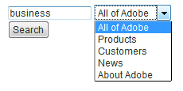
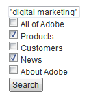
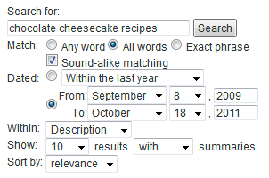

# Suchformulare{#search-forms}

## Verwenden von Sammlungen in Suchformularen {#reference_5A079AEEEFB84457892EF0870D0605C3}

Mit Sammlungen können Ihre Kunden bestimmte Bereiche Ihrer Website durchsuchen. Je nachdem, ob Sie eine Dropdown-Liste oder eine Liste von Kontrollkästchen implementieren, können Sie Ihren Kunden das Durchsuchen einer oder mehrerer Sammlungen ermöglichen.

Siehe auch [Sammlungen](../c-about-settings-menu/c-about-searching-menu.md#concept_62E42ACE53D54EEE9273433B86259127).

Das folgende Beispiel zeigt vier verschiedene Sammlungsnamen und die zugehörigen Bereiche der Website, die sie behandeln:

<table> 
 <thead> 
  <tr> 
   <th colname="col1" class="entry"> <p>Name der Kollektion </p> </th> 
   <th colname="col2" class="entry"> <p> </p> </th> 
  </tr> 
 </thead>
 <tbody> 
  <tr> 
   <td colname="col1"> <p>Produkte </p> </td> 
   <td colname="col2"> <p> 
     <ul id="ul_7AE70789C0914EBFBCCC7695C6F53B9E"> 
      <li id="li_72525BAA34E2442D86152F2FD8CA83D5"> https://www.mycompany.com/products.htm </li> 
      <li id="li_5CA4152239124BDBB251E6C94B15D45B"> https://www.mycompany.com/publish/ </li> 
      <li id="li_6E266736B3494696A3AFD841C4AFEC57"> https://www.mycompany.com/search/ </li> 
     </ul> </p> </td> 
  </tr> 
  <tr> 
   <td colname="col1"> <p>Bekannte </p> </td> 
   <td colname="col2"> <p>https://www.mycompany.com/customers/ </p> </td> 
  </tr> 
  <tr> 
   <td colname="col1"> <p>Nachrichten </p> </td> 
   <td colname="col2"> <p>https://www.mycompany.com/news/ </p> </td> 
  </tr> 
  <tr> 
   <td colname="col1"> <p>Info zur Adobe </p> </td> 
   <td colname="col2"> <p>https://www.mycompany.com/company/ </p> </td> 
  </tr> 
 </tbody> 
</table>

Über die Oberfläche des Dropdown-Suchformulars können Benutzer eine Sammlung auswählen und sieht wie folgt aus:



Das Dropdown-Suchformular wird mit dem folgenden HTML-Code generiert:

```
<select name="sp_k"> 
<option value="">All of Adobe</option> 
<option value="Products">Products</option> 
<option value="Customers">Customers</option> 
<option value="News">News</option> 
<option value="About Adobe">About Adobe</option> 
</select>
```

Alternativ können Sie auch eine Gruppe von Kontrollkästchen in Ihrem Suchformular verwenden, damit Besucher mehrere Sammlungen auswählen können:



Das Kontrollkästchen-Suchformular wird mit dem folgenden HTML-Code generiert:

```
<input type="checkbox" name="sp_k" value="">All of Adobe<br> 
<input type="checkbox" name="sp_k" value="Products">Products<br> 
<input type="checkbox" name="sp_k" value="Customers">Customers<br> 
<input type="checkbox" name="sp_k" value="News">News<br> 
<input type="checkbox" name="sp_k" value="About Adobe">About Adobe<br>
```

## Suchergebnisse {#section_BBDD5B44E2B349BC88D937F44583D350}

Das Suchvorlagentag `<search-input-collections>` generiert das HTML des Sammlungsfelds in den Suchergebnissen und wählt automatisch die in der Suche angegebene Liste aus. Wenn Sie stattdessen Kontrollkästchen generieren möchten, verwenden Sie das `<search-input>`-Tag anstelle des `<input>`-Tags wie folgt:

```
<search-input type="checkbox" name="sp_k" value="">All of Adobe<br> 
<search-input type="checkbox" name="sp_k" value="Products">Products<br> 
<search-input type="checkbox" name="sp_k" value="Customers">Customers<br> 
<search-input type="checkbox" name="sp_k" value="News">News<br> 
<search-input type="checkbox" name="sp_k" value="About Adobe">About Adobe<br>
```

Das `<search-input>`-Tag gibt ein `<input>`-Tag aus und enthält das `checked`-Attribut, wenn die Sammlung in der Suche angegeben wurde.

## Verwenden von Frames mit Formularen {#reference_82CDDDA1E37042E4849EBF7EA05407C5}

Sie können Ihre Framesets so konfigurieren, dass sie mit der Site-Suche/dem Merchandising funktionieren.

Weitere Informationen zu HTML-Frames und dem HTML-Frameset-Element finden Sie in der folgenden URL:

[https://www.w3schools.com/html/html_frames.asp](https://www.w3schools.com/html/html_frames.asp)

Wenn Ihre Site Frames verwendet, können Sie einen Zielgruppe-Frame für Suchergebnislinks angeben. Die standardmäßige Zielgruppe lautet _self, mit der Links im aktuellen Frame oder Browserfenster geöffnet werden. Sie können stattdessen Site- oder browserbezogene Zielgruppen angeben:

* _top (browser-reserviert) wird im aktuellen Browserfenster geöffnet und ersetzt alle aktuellen Frames.
* _blank (browser-reserviert) Ergebnisse werden in einem neuen Browserfenster geöffnet.
* _parent (browser-reserviert) wird im übergeordneten Frame des aktuellen Frames geöffnet.
* frame2 (site-spezifisch) Ergebnisse werden in einem Frame mit dem Namen &quot;frame2&quot;geöffnet. Sie können den Namen eines beliebigen Rahmens als Wert angeben (z. B. Haupt- oder Inhaltsname).

Wenn Ihre Site keine Frames verwendet, sollten Sie den Standardnamen der Zielgruppe wahrscheinlich nicht ändern.

Wenn Sie eine Vorlage für benutzerdefinierte Suchergebnisse für Ihre Website erstellen, können Sie die angegebene Einstellung mit dem `target`-Attribut des `<search-link>`-Tags überschreiben.

Das Konfigurieren von Framesets erfolgt wie folgt:

<table> 
 <thead> 
  <tr> 
   <th colname="col1" class="entry"> <p>Prozessschritt </p> </th> 
   <th colname="col02" class="entry"> <p>Prozessbeschreibung </p> </th> 
   <th colname="col2" class="entry"> <p>Link </p> </th> 
  </tr> 
 </thead>
 <tbody> 
  <tr> 
   <td colname="col1"> <p>1 </p> </td> 
   <td colname="col02"> <p>hinzufügen Sie das Formular in den gewünschten Rahmen auf Ihrer Webseite. </p> </td> 
   <td colname="col2"> <p> <a href="#section_BAA8A502BB2243F8B5FF9783CDF2BFFD" type="section" format="dita" scope="local"> Hinzufügen des Suchformularcodes zu einem Rahmen in Ihrer...  </a> </p> </td> 
  </tr> 
  <tr> 
   <td colname="col1"> <p>2 </p> </td> 
   <td colname="col02"> <p>Legen Sie die Zielgruppe für die Suchergebnisseite fest. </p> </td> 
   <td colname="col2"> <p> <a scope="local" href="#section_532CACB90888467093D95EACB64FDFA1" type="section" format="dita"> Einstellen der Zielgruppe für die Suchergebnisseite  </a> </p> </td> 
  </tr> 
  <tr> 
   <td colname="col1"> <p>3 </p> </td> 
   <td colname="col02"> <p>Legen Sie die Zielgruppe für Links fest, die über die Suchergebnisseite erstellt werden. </p> </td> 
   <td colname="col2"> <p> <a scope="local" href="#section_523248C5AC424D878321C21A23A5CD66" type="section" format="dita"> Zielgruppe für Links aus den Suchergebnissen festlegen...  </a> </p> </td> 
  </tr> 
  <tr> 
   <td colname="col1"> <p>4 </p> </td> 
   <td colname="col02"> <p>Bearbeiten Sie die Navigationsrahmenseiten, um zu verhindern, dass sie indiziert werden. </p> </td> 
   <td colname="col2"> <p> <a scope="local" href="#section_C62E5F0EE1294D5EBD97E123E54433FC" type="section" format="dita"> Bearbeiten der Navigationsrahmenseiten, um zu verhindern, dass sie...  </a> </p> </td> 
  </tr> 
  <tr> 
   <td colname="col1"> <p>5 </p> </td> 
   <td colname="col02"> <p>Testen Sie das Suchformular. </p> </td> 
   <td colname="col2"> <p> <a scope="local" href="#section_43D8D4A7BF524DC480DFE5442F6A2E3C" type="section" format="dita"> Testen des Suchformulars  </a> </p> </td> 
  </tr> 
 </tbody> 
</table>

## Hinzufügen des Suchformularcodes zu einem Frame auf Ihrer Webseite {#section_BAA8A502BB2243F8B5FF9783CDF2BFFD}

1. Klicken Sie im Produktmenü auf **[!UICONTROL Design]** > **[!UICONTROL Auto-Complete]** > **[!UICONTROL Form Source]**.

   Der Code des HTML-Suchformulars sieht wie folgt aus:

   ```
   <!-- Adobe Target HTML for [your customer name] --> 
   <form method="get" action="https://search.atomz.com/search/"> 
   <input size=15 name="sp_q"><br> 
   <input type=submit value="Search"> 
   <input type=hidden name="sp_a" value="[your account number]"> 
   </form>
   ```

1. Wählen Sie auf der Seite [!DNL Standard Form Source] den HTML-Suchformularcode aus, der im Textfeld angezeigt wird, und kopieren Sie ihn.
1. Fügen Sie den Code des Suchformulars in den Rahmen ein, den Sie im Frameset verwenden möchten.

   Im folgenden Beispiel wird der Code des Suchformulars in den Navigationsrahmen eingefügt - den schmalen vertikalen Rahmen auf der linken Seite des Bildschirms.

   

## Einstellen der Zielgruppe für die Suchergebnisseite {#section_532CACB90888467093D95EACB64FDFA1}

Wenn Sie Ihren Suchformularcode wie oben in den vertikalen Navigationsrahmen platziert haben, können Sie die Suchergebnisse im größeren Hauptframe anzeigen. In diesem Beispiel rufen Sie das Hauptbild &quot;body&quot;auf und legen es als Zielgruppe-Frame fest.


1. Um den Zielgruppen-Rahmen für die Ergebnisseite festzulegen, fügen Sie dem Formular eine Zielgruppe und einen Wert hinzu, indem Sie die folgende Zeile im Suchformularcode wie folgt ändern:

   `<form method="get" action="https://search.atomz.com/search/">`

   Folgendes:

   `<form target="body" method="get" action="https://search.atomz.com/search/">`

   Stellen Sie sicher, dass Sie den Wert für die Zielgruppe des Formulars in Anführungszeichen setzen.

Wenn ein Kunde eine Suche nach Ihrer Website durchführt, werden die Suchergebnisse im Textrahmen der Webseite angezeigt.

## Zielgruppe für Links auf der Suchergebnisseite {#section_523248C5AC424D878321C21A23A5CD66} festlegen

Sie können den Zielrahmen festlegen, indem Sie die Vorlage direkt bearbeiten.

Wenn Ihre Suchergebnisse im Textrahmen erscheinen, sollten Sie die Links wahrscheinlich auch im Textrahmen öffnen. Da es sich hierbei um denselben Frame handelt, d. h. um den Standardwert `"_self"`, müssen Sie keine Änderungen vornehmen.

Sie können auch den Zielrahmen für Ergebnislinks festlegen. Die folgenden Beispiele zeigen, was Sie tun können:

* Geben Sie verschiedene Frames für die Suchergebnisse und deren Links an, damit die Suchergebnisse in ihrem eigenen Frame aktiv bleiben, während jedes angeklickte Ergebnis in einem separaten Frame geöffnet wird.
* Geben Sie an, dass die Suchergebnisse in ein neues leeres Fenster geöffnet werden, sodass Ihr altes Fenster mit seinem ursprünglichen Inhalt aktiv bleibt, wodurch auch die Suchergebnisse erhalten bleiben.

Der Name der Zielgruppe kann entweder der Name eines Rahmens sein, der in Ihrem HTML-Code angegeben ist, oder einer der folgenden HTML-Standardwerte sein:

* `target="_blank"` Öffnen Sie Links in einem neuen, leeren, unbenannten Fenster.

* `target="_self"` Standard. Öffnen Sie Links im selben Fenster, in dem sich die Suchergebnisse befinden. In diesem Fall das Fenster mit den ursprünglichen Suchergebnissen. Verwenden Sie diese Option, um eine global zugewiesene Basisversion zu überschreiben.

* `target="_parent"` Öffnen Sie Links im übergeordneten Frameset der Link-Seite. Wenn das Dokument kein übergeordnetes Element hat, funktioniert dies standardmäßig wie `"_self"`.

* `target="_top"` Öffnen Sie die Links im vollständigen Fenster. Wenn sich das Dokument bereits oben befindet, funktioniert dies standardmäßig wie `"_self"`. Verwenden Sie diese Option, um aus einer willkürlich tiefen Rahmenverschachtelung auszubrechen.

Um beispielsweise den Zielrahmen für die Zielgruppe `_blank` festzulegen, können Sie die Vorlage wie folgt bearbeiten:

1. Klicken Sie im Produktmenü auf **[!UICONTROL Design]** > **[!UICONTROL Templates]**.

1. Klicken Sie auf der Seite [!DNL Staged Templates] in der Tabelle auf den Namen der Vorlage mit dem Ziel-Frame.
1. Suchen Sie das Tag `<search-link>`. Ihr standardmäßiges `<search-link>`-Tag sollte wie folgt aussehen:

   `<search-link><search-title length=100></search-link>`

1. hinzufügen Sie die Zielgruppe &quot;frame&quot;auf das Tag `<search-link>`. Geben Sie im obigen Beispiel `target="_blank"` ein. Achten Sie darauf, den Unterstrich und die Anführungszeichen um den Wert der Zielgruppe einzufügen.

   Das `<search-link>`-Tag wird nun wie folgt angezeigt:

   `<search-link target="_blank"><search-title length=100></search-link>`

Wenn ein Site-Besucher einen Link zu den Suchergebnissen wählt, wird die verknüpfte Seite jetzt in einem neuen, leeren Fenster geöffnet.

## Bearbeiten der Navigations-Frame-Seiten, um zu verhindern, dass sie indiziert werden{#section_C62E5F0EE1294D5EBD97E123E54433FC}

Normalerweise sollten Sie Ihre Navigationsrahmen davon ausschließen, mit Ihren Suchergebnissen indiziert zu werden. Um diese Funktion zu nutzen, können Sie diesen Seiten `noindex`-Meta-Tag hinzufügen.

1. Öffnen Sie die HTML-Seitenquelle für Ihren Navigationsrahmen.
1. hinzufügen Sie das folgende Meta-Tag im Abschnitt `<head>` Ihres HTML-Codes:

   `<meta name="robots" content="noindex">`

   Beispiel:

   ```
   <html> 
   <head> 
   <title>This page is a frameset that I do not want indexed</title> 
   <meta http-equiv="Content-Type" content="text/html; charset=iso-8859-1"> 
   <meta name="robots" content="noindex"> 
   </head>
   ```

## Testen des Suchformulars {#section_43D8D4A7BF524DC480DFE5442F6A2E3C}

1. Gehen Sie zu Ihrer Website und navigieren Sie zu einem Formular.
1. Geben Sie im Suchfeld einige Suchbegriffe ein und klicken Sie dann auf **[!UICONTROL Search]**.

   Folgendes trifft zu:

   * Die Suchergebnisseite wird in der angegebenen Zielgruppe angezeigt.
   * Die Links aus den Suchergebnissen befinden sich im Rahmen der angegebenen Zielgruppe.
   * Ergebnisse von Navigationsrahmen werden nicht angezeigt.

   Wenn nach dem Testen des Suchformulars Probleme mit Frames auftreten, wenden Sie sich an den Kundensupport.

## Beispiel für ein erweitertes Suchformular {#reference_82E1051918744EBA88A01E9E6AE42C4A}

Sie können den erweiterten Formularcode an Ihre Design- und Inhaltsanforderungen anpassen oder zusätzliche Suchparameter hinzufügen oder entfernen.

Ihre Startseite eignet sich gut zum Einfügen eines erweiterten Suchformulars, da viele Kunden dort Suchfunktionen erwarten. Sie können auch eine HTML-Seite erstellen, die das Suchformular und andere hilfreiche Informationen enthält, und dann auf der gesamten Website eine Verknüpfung zu dieser Seite herstellen.

Wenn Sie geschützten Inhalt indizieren, können Sie die Suchergebnisse von sicheren Search Web-Servern bereitstellen lassen. Ändern Sie die URL im Aktionsattribut des Suchformulars in: action=&quot;https://search.atomz.com/search/&quot; verwenden.

>[!NOTE]
>
>Einige HTML-Editoren haben Probleme beim Einfügen von HTML-Code aus anderen Anwendungen. Wenn der HTML-Code als Text auf Ihrer Webseite angezeigt wird, kopieren Sie den Suchcode in einen einfachen Texteditor, z. B. Notepad unter Windows oder Simple Text unter Mac, und kopieren Sie ihn dann erneut in Ihren HTML-Editor.

Suchparameter werden im Code des erweiterten Suchformulars verwendet, um Optionsfelder, Kontrollkästchen und Listen zu erstellen, die Kunden zur individuellen Suche verwenden können. Kunden können beispielsweise die Anzahl der angezeigten Suchergebnisse oder einen Datumsbereich angeben oder ob Zusammenfassungen mit den Suchergebnissen angezeigt werden, die alle in den erweiterten Suchformularen angezeigt werden.

Mithilfe des folgenden Beispiels für die erweiterte Suche wird im restlichen Verlauf dieses Themas gezeigt, wie jede Option im Formular mithilfe von Suchparametern erstellt wird.



Sie können den gesamten HTML-Code für das erweiterte Suchformular des obigen Beispiels Ansicht haben.

Siehe [HTML-Code für erweiterte Suche](#reference_9AAD4A46B68D4D48865508982CB86DB9).

Siehe [Konfigurieren von CSS zum automatischen Ausfüllen](../c-about-auto-complete.md#task_EECE35DEB6C94F4A8A5B42B4DED76D96).

Siehe [Kopieren des HTML-Codes des Suchformulars in die...](../c-about-auto-complete.md#task_A3A01EA800F24C0AA33902387E0362C7).

<table> 
 <thead> 
  <tr> 
   <th colname="col2" class="entry"> <p>Position im Formular </p> </th> 
   <th colname="col1" class="entry"> <p>Parameter </p> </th> 
   <th colname="col3" class="entry"> <p>HTML-Code </p> </th> 
   <th colname="col4" class="entry"> <p>Beschreibung </p> </th> 
  </tr> 
 </thead>
 <tbody> 
  <tr> 
   <td colname="col2"> <p>Optionen für erweiterte Suchformulare aktivieren (ausgeblendetes Feld) </p> </td> 
   <td colname="col1"> <p> <span class="codeph"> sp_advanced  </span> </p> </td> 
   <td colname="col3"> <p> <span class="syntax html codeph"> &lt;input type="hidden" name="sp_advanced" value="1"&gt; </span> </p> </td> 
   <td colname="col4"> <p>Erweiterte Suchoptionen aktivieren oder deaktivieren. Sie können beispielsweise ein Standardsuchformular auf Ihre Startseite mit einem Link zu einer zweiten Seite mit einem erweiterten Formular einfügen. In diesem Fall würden Sie eine Kopie Ihres Standardformulars in <span class="codeph"> &lt;search-if-not-advanced&gt; einfügen...&lt;/search-if-not-advanced&gt; </span>-Vorlagen-Tags. </p> <p>Ein Kunde, der eine Suche über das Standardformular durchführt, sieht ein Standardsuchformular, wenn die Suchergebnisse angezeigt werden. Im Bildschirm für das erweiterte Suchformular fügen Sie das Tag <span class="codeph"> &lt;input type=hidden name="sp_advanced" value=1&gt; </span> mit den anderen erweiterten Formularoptionen ein. </p> <p>Sie fügen auch eine Kopie des erweiterten Suchformulars in der Datei "&lt;search-if-advanced&gt;"ein... &lt;/search-if-advanced&gt;-Vorlagen-Tags. Ein Kunde, der über das erweiterte Suchformular eine Suche durchführt, sieht ein erweitertes Suchformular, wenn die Suchergebnisse angezeigt werden. </p> </td> 
  </tr> 
  <tr> 
   <td colname="col2"> <p> Übereinstimmung mit allen, allen oder Wortgruppen </p> </td> 
   <td colname="col1"> <p> <span class="codeph"> sp_p  </span> </p> <p> </p> </td> 
   <td colname="col3"> <p> <code class="syntax html"> &lt;!--&nbsp;Allow&nbsp;"any,"&nbsp;"all,"&nbsp;or&nbsp;"phrase"&nbsp;--&gt; 
      &lt;input&nbsp;type=radio&nbsp;name="sp_p"&nbsp;value="any"&gt;Any&nbsp;word 
      &lt;input&nbsp;type=radio&nbsp;name="sp_p"&nbsp;value="all"&nbsp;checked&gt;All&nbsp;words 
      &lt;input&nbsp;type=radio&nbsp;name="sp_p"&nbsp;value="phrase"&gt;Exact&nbsp;phrase </code> </p> </td> 
   <td colname="col4"> <p>Erlauben Sie Ihrem Kunden, anzugeben, dass "beliebiges Wort", "alle Wörter"oder "der genaue Wortlaut"vorhanden sein muss, damit ein Dokument übereinstimmt. Wenn der Parameter <span class="codeph"> sp_p </span> angegeben ist, müssen Kunden nicht "+"oder "-"oder beides in der Abfrage der Suche verwenden. </p> <p> Wenn der Parameter <span class="codeph"> sp_p </span> weggelassen wird oder wenn er auf ""oder "any"festgelegt ist, können Kunden weiterhin die Spezifikatoren "+"und "-"verwenden. Wenn der Parameter <span class="codeph"> sp_p </span> auf "all"oder "Satz"festgelegt ist, werden die angegebenen Werte "+"und "-"ignoriert. </p> <p>Sie können mehr über die Verwendung von "+"und "-"in einer Suche erfahren. </p> <p>Siehe <a href="../c-about-settings-menu/c-about-searching-menu.md#concept_207105CF26B1448F8A3D223787C56AB8" type="concept" format="dita" scope="local">Info zu Suchen</a> </p> </td> 
  </tr> 
  <tr> 
   <td colname="col2"> <p> Klanggleiche Übereinstimmung </p> </td> 
   <td colname="col1"> <p> <span class="codeph"> sp_w  </span> </p> <p>und </p> <p> <span class="codeph"> sp_w_control  </span> </p> <p> </p> </td> 
   <td colname="col3"> <p> <code class="syntax html"> &lt;!--&nbsp;Checkbox&nbsp;enables&nbsp;sound-alike&nbsp;matching&nbsp;--&gt; 
      &lt;input&nbsp;type=hidden&nbsp;name="sp_w_control"&nbsp;value=1&gt; 
      &lt;input&nbsp;type=checkbox&nbsp;name="sp_w"&nbsp;value="alike"&gt;&nbsp;Sound-alike&nbsp;matching </code> </p> </td> 
   <td colname="col4"> <p>Ermöglicht Kunden die Aktivierung oder Deaktivierung der Klangabstimmung. Geräuschgleiche Übereinstimmungen ermöglichen es falsch geschriebenen Suchbegriffen, Abfragen zu entsprechen, die in Ihren Dokumenten "ähnlich"klingen. </p> <p>Wenn der Parameter <span class="codeph"> sp_w_control </span> auf 1 gesetzt und der Parameter <span class="codeph"> sp_w </span> auf "alike"gesetzt ist, wird das generierte Kontrollkästchen aktiviert, sodass standardmäßig eine Übereinstimmung mit dem Ton möglich ist. </p> <p>Wenn der Parameter <span class="codeph"> sp_w </span> auf "" eingestellt ist, wird das Kontrollkästchen nicht aktiviert. </p> <p>Wenn Sie während des letzten Indexierungsvorgangs keine Klangalibrierung aktiviert haben, ist eine Klangalike-Übereinstimmung nicht möglich und der Parameter <span class="codeph"> sp_w </span> wird ignoriert. Um die Klangübereinstimmung zu aktivieren, klicken Sie im Produktmenü auf <span class="uicontrol"> Linguistik </span> &gt; <span class="uicontrol"> Wörter und Sprache </span> &gt; <span class="uicontrol"> Audioähnliche Übereinstimmung </span>. </p> <p>Sie können die Parameter <span class="codeph"> sp_w </span> und <span class="codeph"> sp_w_control </span> wie folgt zuweisen: </p> <p> <code class="syntax html"> &lt;!--&nbsp;Checkbox&nbsp;disables&nbsp;sound-alike&nbsp;matching&nbsp;--&gt; 
      &lt;input&nbsp;type=hidden&nbsp;name="sp_w_control"&nbsp;value=0&gt; 
      &lt;input&nbsp;type=checkbox&nbsp;name="sp_w"&nbsp;value="exact"&gt; 
      No&nbsp;sound-alike&nbsp;matching </code> </p> <p>Wenn in diesem Fall der Parameter <span class="codeph"> sp_w_control </span> auf 0 gesetzt und der Parameter <span class="codeph"> sp_w </span> auf "exakt"gesetzt ist, ist die Klangübereinstimmung standardmäßig deaktiviert. Wenn der Parameter <span class="codeph"> sp_w </span> auf ""festgelegt ist, wird die Klangalibrierung aktiviert. </p> </td> 
  </tr> 
  <tr> 
   <td colname="col2"> <p>Datumsbereich passend </p> </td> 
   <td colname="col1"> <p> <span class="codeph"> sp_d  </span> </p> <p> </p> </td> 
   <td colname="col3"> <p> <code class="syntax html"> &lt;!--Specifies&nbsp;type&nbsp;of&nbsp;date&nbsp;range&nbsp;searching&nbsp;to&nbsp;perform.--&gt; 
      &lt;input&nbsp;type=radio&nbsp;name="sp_d"&nbsp;value="custom"&nbsp;checked&gt; 
      &lt;input&nbsp;type=radio&nbsp;name="sp_d"&nbsp;value="specific"&gt; </code> </p> </td> 
   <td colname="col4"> <p>Der Parameter <span class="codeph"> sp_d </span> gibt einen benutzerspezifischen Datenbereich an, der für die Ausführung passend ist, oder einen bestimmten Datumsbereich, der mit der Ausführung übereinstimmt. </p> <p>Im standardmäßigen erweiterten Suchformular wird diese Option als Optionsfeldgruppe mit einer Dropdown-Liste von "benutzerspezifischen"Datumsbereichen angezeigt, die mit einem Parameter <span class="codeph"> sp_date_range </span> generiert wurde. Es enthält außerdem und eine Gruppe von "spezifischen" Beginn- und Enddaten, die mit <span class="codeph"> sp_Beginn_day </span>, <span class="codeph"> sp_Beginn_month </span>, <span class="codeph"> sp_Beginn_year </span>, <span class="codeph"> sp_end_day </span>, <span class="codeph"> sp_end_month &lt;a9/ &gt; und <span class="codeph"> sp_end_year </span>-Parameter.</span> </p> <p>Ein "benutzerdefinierter"Datumsbereich ist ein benannter Datumsbereich, der durchsucht werden soll. Zum Beispiel "Jederzeit", "Heute", "Im letzten Jahr"usw. </p> <p>Ein "spezifischer"Datumsbereich besteht aus einem Beginn- und einem Enddatum. Beispiel: vom 8. September 2009 bis zum 18. Oktober 2011. </p> </td> 
  </tr> 
  <tr> 
   <td colname="col2"> <p>Datumsbereich-Übereinstimmung: benutzerdefinierter Datumsbereich </p> </td> 
   <td colname="col1"> <p> <span class="codeph"> sp_date_range  </span> </p> <p> </p> </td> 
   <td colname="col3"> <p> <code class="syntax html"> &lt;!--Selection&nbsp;list&nbsp;for&nbsp;custom&nbsp;date&nbsp;range.--&gt; 
      &lt;select&nbsp;name="sp_date_range"&nbsp;size=1&gt; 
      &lt;option&nbsp;value=-1&nbsp;selected&gt;Anytime&lt;/option&gt; 
      &lt;option&nbsp;value=7&gt;Within&nbsp;the&nbsp;last&nbsp;week&lt;/option&gt; 
      &lt;option&nbsp;value=14&gt;Within&nbsp;the&nbsp;last&nbsp;2&nbsp;weeks&lt;/option&gt; 
      &lt;option&nbsp;value=30&gt;Within&nbsp;the&nbsp;last&nbsp;30&nbsp;days&lt;/option&gt; 
      &lt;option&nbsp;value=60&gt;Within&nbsp;the&nbsp;last&nbsp;60&nbsp;days&lt;/option&gt; 
      &lt;option&nbsp;value=90&gt;Within&nbsp;the&nbsp;last&nbsp;90&nbsp;days&lt;/option&gt; 
      &lt;option&nbsp;value=180&gt;Within&nbsp;the&nbsp;last&nbsp;180&nbsp;days&lt;/option&gt; 
      &lt;option&nbsp;value=365&gt;Within&nbsp;the&nbsp;last&nbsp;year&lt;/option&gt; 
      &lt;option&nbsp;value=730&gt;Within&nbsp;the&nbsp;last&nbsp;two&nbsp;years&lt;/option&gt; 
      &lt;/select&gt; </code> </p> </td> 
   <td colname="col4"> <p>Der Parameter <span class="codeph"> sp_date_range </span> wird verwendet, um einen "benutzerspezifischen"Datumsbereich zu erstellen. Zum Beispiel "Jederzeit", "Heute", "Im letzten Jahr"usw. </p> <p>Werte größer als oder gleich null geben die Anzahl der Tage an, die vor dem heutigen Tag gesucht werden sollen. Beispielsweise gibt der Wert 0 "Heute"an, der Wert 1 "Heute und Gestern", der Wert 30 "In den letzten 30 Tagen"usw. Werte unter null geben einen benutzerdefinierten Bereich wie folgt an: </p> <p> 
     <ul id="ul_E65DDE33883F441F9730F315E485AD98"> 
      <li id="li_83E9466AB9D7438A8544001F6B007186"> <p>-1 = "Jederzeit"entspricht der Angabe eines Datumsbereichs. </p> </li> 
      <li id="li_38AB8D97179A47F9B860A96EA09119BB"> <p>-2 = "Diese Woche", die von Sonntag bis Samstag der aktuellen Woche durchsucht. </p> </li> 
      <li id="li_F4C3A8658428418A8A06FBAAB4733C68"> <p>-3 = "Letzte Woche", die von Sonntag bis Samstag der Woche vor der aktuellen Woche durchsucht. </p> </li> 
      <li id="li_DF2D0B043A4E4DE9BE8D82E69A76E793"> <p>-4 = "Dieser Monat", der Daten innerhalb des aktuellen Monats durchsucht. </p> </li> 
      <li id="li_76BC4C2CED574E2A81448158828BFF1B"> <p>-5 = "Letzter Monat", der Daten innerhalb des Monats vor dem aktuellen Monat durchsucht. </p> </li> 
      <li id="li_17FF849384FB46D58AF6FF1D3BC408C8"> <p>-6 = "Dieses Jahr", das Daten innerhalb des aktuellen Jahres durchsucht. </p> </li> 
      <li id="li_E2B8B4DFF3914BBDB86D0EB77F52B305"> <p>-7 = "Letztes Jahr", das Daten innerhalb des Jahres vor dem aktuellen Jahr durchsucht. </p> </li> 
     </ul> </p> </td> 
  </tr> 
  <tr> 
   <td colname="col2"> <p>Datumsbereich-Übereinstimmung: Beginn </p> </td> 
   <td colname="col1"> <p> <span class="codeph"> sp_Beginn_day, sp_Beginn_month, sp_Beginn_year  </span> </p> <p> </p> </td> 
   <td colname="col3"> </td> 
   <td colname="col4"> <p>Dieses Dreieck mit numerischen Werten gibt das Datum des Beginns eines bestimmten zu suchenden Datumsbereichs an. Achten Sie darauf, alle drei Werte anzugeben, da ein teilweise angegebenes Datum ignoriert wird. </p> <p>Es ist zulässig, nur das Datum des Beginns, nur das Enddatum oder sowohl das Datum des Beginns als auch das Enddatum anzugeben. Wenn nur das Datum des Beginns angegeben ist, enthält die Suche passende Dokumente, die am oder nach dem Datum des Beginns datiert sind. Wenn nur das Enddatum angegeben ist, enthält die Suche passende Dokumente am oder vor dem Enddatum. Wenn sowohl das Beginns- als auch das Enddatum angegeben sind, enthält die Suche passende Dokumente vom Beginn bis zum Enddatum. </p> <p>Alle Datumsangaben werden relativ zur Greenwich Mean Time durchsucht. </p> </td> 
  </tr> 
  <tr> 
   <td colname="col2"> <p> Datumsbereich-Übereinstimmung: Enddaten </p> </td> 
   <td colname="col1"> <p> <span class="codeph"> sp_end_day, sp_end_month, sp_end_year  </span> </p> <p> </p> </td> 
   <td colname="col3"> </td> 
   <td colname="col4"> <p>Dieses Dreieck aus numerischen Werten gibt das Enddatum des zu suchenden Datumsbereichs an. Achten Sie darauf, alle drei Werte anzugeben, da ein teilweise angegebenes Datum ignoriert wird. </p> <p>Es ist zulässig, nur das Beginn-, das Enddatum oder sowohl das Beginns- als auch das Enddatum anzugeben. Wenn nur das Datum des Beginns angegeben ist, enthält die Suche passende Dokumente, die am oder nach dem Datum des Beginns datiert sind. Wenn nur das Enddatum angegeben ist, enthält die Suche passende Dokumente am oder vor dem Enddatum. Wenn sowohl der Beginn als auch das Enddatum angegeben sind, enthält die Suche passende Dokumente vom Beginn bis zum Enddatum. </p> <p>Alle Datumsangaben werden relativ zur Greenwich Mean Time durchsucht. </p> </td> 
  </tr> 
  <tr> 
   <td colname="col2"> <p>Innerhalb des Suchfelds </p> </td> 
   <td colname="col1"> <p> <span class="codeph"> sp_x  </span> </p> </td> 
   <td colname="col3"> <p> <code class="syntax html"> &lt;!--&nbsp;List&nbsp;box&nbsp;selects&nbsp;the&nbsp;search&nbsp;field&nbsp;--&gt; 
      Within&nbsp;&lt;select&nbsp;name="sp_x"&nbsp;size=1&gt; 
      &lt;option&nbsp;value="any"&nbsp;selected&gt;Anywhere&lt;/option&gt; 
      &lt;option&nbsp;value="title"&gt;Title&lt;/option&gt; 
      &lt;option&nbsp;value="desc"&gt;Description&lt;/option&gt; 
      &lt;option&nbsp;value="keys"&gt;Keywords&lt;/option&gt; 
      &lt;option&nbsp;value="body"&gt;Body&lt;/option&gt; 
      &lt;option&nbsp;value="alt"&gt;Alternate&nbsp;text&lt;/option&gt; 
      &lt;option&nbsp;value="url"&gt;URL&lt;/option&gt; 
      &lt;option&nbsp;value="target"&gt;Target&lt;/option&gt; 
      &lt;option&nbsp;value="date"&gt;Date&lt;/option&gt;* 
      &lt;/select&gt; </code> </p> </td> 
   <td colname="col4"> <p>Im Feld <span class="codeph"> sp_x </span> Liste können Ihre Kunden das Feld angeben, in dem nach den Abfragen-Zeichenfolgen gesucht werden soll. </p> <p>Die Kunden können entweder alle Felder, den Titel, die Beschreibung des Dokuments, die Schlüsselwörter des Dokuments, den Haupttext, den Alternativtext, die URL, das Datum oder die Zielgruppe des Dokuments auswählen. </p> <p>Wenn der Parameter <span class="codeph"> sp_x </span> verwendet wird, müssen Kunden nicht "title:", "desc:", "keys:", "body:", "alt:", "url:"und "Zielgruppe:"in den Zeichenfolgen für die Abfrage der Suche angeben. </p> <p>Wenn der Parameter <span class="codeph"> sp_x </span> weggelassen wird oder wenn er auf ""oder "any"festgelegt ist, können Kunden weiterhin die Feldspezifizierungs-Zeichenfolgen verwenden. Wenn der Parameter <span class="codeph"> sp_x </span> auf ein bestimmtes Feld eingestellt ist, werden alle anderen Feldkennzeichenfolgen ignoriert. </p> <p>Siehe <a href="../c-about-settings-menu/c-about-searching-menu.md#concept_207105CF26B1448F8A3D223787C56AB8" type="concept" format="dita" scope="local">Info zu Suchen</a> </p> </td> 
  </tr> 
  <tr> 
   <td colname="col2"> <p>Ergebnisanzahl anzeigen </p> </td> 
   <td colname="col1"> <p> <span class="codeph"> sp_c  </span> </p> </td> 
   <td colname="col3"> <p> <code class="syntax html"> &lt;!--&nbsp;List&nbsp;box&nbsp;selects&nbsp;number&nbsp;of&nbsp;results&nbsp;to&nbsp;show&nbsp;per&nbsp;page&nbsp;--&gt; 
      Show&nbsp;&lt;select&nbsp;name="sp_c"&nbsp;size=1&gt; 
      &lt;option&nbsp;value=5&gt;5&lt;/option&gt; 
      &lt;option&nbsp;value=10&nbsp;selected&gt;10&lt;/option&gt; 
      &lt;option&nbsp;value=25&gt;25&lt;/option&gt; 
      &lt;option&nbsp;value=50&gt;50&lt;/option&gt; 
      &lt;option&nbsp;value=100&gt;100&lt;/option&gt; 
      &lt;/select&gt;&nbsp;results </code> </p> </td> 
   <td colname="col4"> <p>Ermöglicht Kunden die Auswahl der Anzahl der Suchergebnisse, die auf jeder Suchergebnisseite angezeigt werden. </p> <p>Sie können so viele oder so wenige Auswahlmöglichkeiten im Formular haben, wie Sie möchten. Stellen Sie sicher, dass der Wert "value="mit dem angezeigten Wert übereinstimmt. </p> </td> 
  </tr> 
  <tr> 
   <td colname="col2"> <p>Zusammenfassungen ein- oder ausblenden </p> </td> 
   <td colname="col1"> <p> <span class="codeph"> sp_m  </span> </p> </td> 
   <td colname="col3"> <p> <code class="syntax html"> &lt;!--&nbsp;Show&nbsp;or&nbsp;hide&nbsp;summaries&nbsp;in&nbsp;search&nbsp;results&nbsp;--&gt; 
      &lt;select&nbsp;name="sp_m"&nbsp;size=1&gt; 
      &lt;option&nbsp;value=1&nbsp;selected&gt;with&lt;/option&gt; 
      &lt;option&nbsp;value=0&gt;without&lt;/option&gt; 
      &lt;/select&gt;&nbsp;summaries&nbsp; </code> </p> </td> 
   <td colname="col4"> <p>Ermöglicht Kunden die Auswahl, ob für jede Übereinstimmung Zusammenfassungstext angezeigt wird. </p> <p>Setzen Sie den Wert auf 1, wenn Sie Zusammenfassungen anzeigen möchten. Setzen Sie den Wert auf 0, wenn Sie Zusammenfassungen ausblenden möchten. Sie können den Parameter auch mit einer Reihe von Optionsfeldern verwenden, wie im folgenden Beispiel: </p> <p> <code class="syntax html"> &lt;!--&nbsp;Show&nbsp;or&nbsp;hide&nbsp;summaries&nbsp;in&nbsp;search&nbsp;results&nbsp;--&gt; 
      &lt;input&nbsp;type=radio&nbsp;name="sp_m"&nbsp;value=1&nbsp;selected&gt;Show&nbsp;summaries 
      &lt;input&nbsp;type=radio&nbsp;name="sp_m"&nbsp;value=0&gt;Hide&nbsp;summaries </code> </p> </td> 
  </tr> 
  <tr> 
   <td colname="col2"> <p>Nach Ergebnissen sortieren </p> </td> 
   <td colname="col1"> <p> <span class="codeph"> sp_s  </span> </p> </td> 
   <td colname="col3"> <p> <code class="syntax html"> &lt;!--&nbsp;Sort&nbsp;results&nbsp;by&nbsp;relevance&nbsp;or&nbsp;by&nbsp;date&nbsp;--&gt; 
      Sort&nbsp;by&nbsp;&lt;select&nbsp;name="sp_s"&nbsp;size=1&gt; 
      &lt;option&nbsp;value=0&nbsp;selected&gt;relevance&lt;/option&gt; 
      &lt;option&nbsp;value=1&gt;date&lt;/option&gt; 
      &lt;/select&gt; </code> </p> </td> 
   <td colname="col4"> <p>Ermöglicht Kunden die Auswahl, ob die Ergebnisse in der Reihenfolge ihrer Relevanz oder ihres Datums aufgeführt werden. </p> <p>Wenn der Wert auf 1 gesetzt ist, werden die Ergebnisse vom zuletzt geänderten Dokument zum am wenigsten geänderten Dokument aufgelistet. Wenn der Wert auf 0 gesetzt ist, werden die Ergebnisse aus der Liste der relevantesten bis zum am wenigsten relevanten aufgeführt. Sie können diesen Parameter auch mit Optionsfeldern wie im folgenden Beispiel verwenden: </p> <p> <code class="syntax html"> &lt;!--&nbsp;Sort&nbsp;results&nbsp;by&nbsp;relevance&nbsp;or&nbsp;by&nbsp;date&nbsp;--&gt; 
      &lt;input&nbsp;type=radio&nbsp;name="sp_s"&nbsp;value=0&nbsp;selected&gt;Sort&nbsp;by&nbsp;relevance 
      &lt;input&nbsp;type=radio&nbsp;name="sp_s"&nbsp;value=1&gt;Sort&nbsp;by&nbsp;date </code> </p> </td> 
  </tr> 
 </tbody> 
</table>

## Erweiterter HTML-Code für das Suchformular {#reference_9AAD4A46B68D4D48865508982CB86DB9}

Der HTML-Formularcode, mit dem das erweiterte Suchformular erstellt wird, das oben im Thema Beispiel für das erweiterte Suchformular angezeigt wird.

Siehe [Beispiel für ein erweitertes Suchformular](#reference_82E1051918744EBA88A01E9E6AE42C4A).

Wenn Sie diesen Code verwenden, denken Sie daran, den `sp_a`-Wert von `sp99999999` durch Ihre tatsächliche Kontonummer zu ersetzen.

Um Ihre Kontonummer zu finden, klicken Sie im Produktmenü auf **[!UICONTROL Settings]** > **[!UICONTROL Account Options]** > **[!UICONTROL Account Settings]**.

```
<form method="get" action="https://search.atomz.com/search/"> 
<table cellspacing=0 cellpadding=0 border=0> 
<tr><td colspan=4> 
<b>Search For:</b><br> 
<input size=35 name="sp_q"> 
<!-- The "Search" button --> 
<input type=submit value="Search"> 
<input type=hidden name="sp_a" value="sp99999999"> 
<input type=hidden name="sp_f" value="ISO-8859-1"> 
</td></tr> 
<input type=hidden name="sp_advanced" value=1> 
<!-- Allow "any," "all," or "phrase" --> 
<tr><td valign=top> 
<b>Match: </b> 
</td><td colspan=4> 
<input type=radio name="sp_p" value="any">Any word 
<input type=radio name="sp_p" value="all" checked>All words 
<input type=radio name="sp_p" value="phrase">Exact phrase<br> 
<!-- Checkbox enables sound-alike matching --> 
<input type=hidden name="sp_w_control" value=1> 
<input type=checkbox name="sp_w" value="alike" checked> 
Sound-alike matching 
</td></tr> 
<!-- Date range criteria --> 
<tr><td><b>Dated:</b></td><td colspan=4> 
<input type=radio name="sp_d" value="custom" checked> 
<select name="sp_date_range" size=1> 
<option value=-1 selected>Anytime</option> 
<option value=7>Within the last week</option> 
<option value=14>Within the last 2 weeks</option> 
<option value=30>Within the last 30 days</option> 
<option value=60>Within the last 60 days</option> 
<option value=90>Within the last 90 days</option> 
<option value=180>Within the last 180 days</option> 
<option value=365>Within the last year</option> 
<option value=730>Within the last two years</option> 
</select> 
</td></tr> 
<tr><td></td><td rowspan=2> 
<input type=radio name="sp_d" value=specific> 
</td><td align=right>From:</td><td> 
<select name="sp_start_month" size=1> 
<option value=0 selected></option> 
<option value=1>January</option> 
<option value=2>February</option> 
<option value=3>March</option> 
<option value=4>April</option> 
<option value=5>May</option> 
<option value=6>June</option> 
<option value=7>July</option> 
<option value=8>August</option> 
<option value=9>September</option> 
<option value=10>October</option> 
<option value=11>November</option> 
<option value=12>December</option> 
</select> 
<select name="sp_start_day" size=1> 
<option value=0 selected></option> 
<option value=1>1</option> 
<option value=2>2</option> 
<option value=3>3</option> 
<option value=4>4</option> 
<option value=5>5</option> 
<option value=6>6</option> 
<option value=7>7</option> 
<option value=8>8</option> 
<option value=9>9</option> 
<option value=10>10</option> 
<option value=11>11</option> 
<option value=12>12</option> 
<option value=13>13</option> 
<option value=14>14</option> 
<option value=15>15</option> 
<option value=16>16</option> 
<option value=17>17</option> 
<option value=18>18</option> 
<option value=19>19</option> 
<option value=20>20</option> 
<option value=21>21</option> 
<option value=22>22</option> 
<option value=23>23</option> 
<option value=24>24</option> 
<option value=25>25</option> 
<option value=26>26</option> 
<option value=27>27</option> 
<option value=28>28</option> 
<option value=29>29</option> 
<option value=30>30</option> 
<option value=31>31</option> 
</select> 
<!--comma-->, 
<input size=4 name="sp_start_year"> 
</td></tr> 
<tr><td></td> 
<td align=right>To:</td><td> 
<select name="sp_end_month" size=1> 
<option value=0 selected></option> 
<option value=1>January</option> 
<option value=2>February</option> 
<option value=3>March</option> 
<option value=4>April</option> 
<option value=5>May</option> 
<option value=6>June</option> 
<option value=7>July</option> 
<option value=8>August</option> 
<option value=9>September</option> 
<option value=10>October</option> 
<option value=11>November</option> 
<option value=12>December</option> 
</select> 
<select name="sp_end_day" size=1> 
<option value=0 selected></option> 
<option value=1>1</option> 
<option value=2>2</option> 
<option value=3>3</option> 
<option value=4>4</option> 
<option value=5>5</option> 
<option value=6>6</option> 
<option value=7>7</option> 
<option value=8>8</option> 
<option value=9>9</option> 
<option value=10>10</option> 
<option value=11>11</option> 
<option value=12>12</option> 
<option value=13>13</option> 
<option value=14>14</option> 
<option value=15>15</option> 
<option value=16>16</option> 
<option value=17>17</option> 
<option value=18>18</option> 
<option value=19>19</option> 
<option value=20>20</option> 
<option value=21>21</option> 
<option value=22>22</option> 
<option value=23>23</option> 
<option value=24>24</option> 
<option value=25>25</option> 
<option value=26>26</option> 
<option value=27>27</option> 
<option value=28>28</option> 
<option value=29>29</option> 
<option value=30>30</option> 
<option value=31>31</option> 
</select> 
<!--comma-->, 
<input size=4 name="sp_end_year"> 
</td></tr> 
<!-- List box selects the search field --> 
<tr><td valign=top> 
<b>Within: </b> 
</td><td colspan=4><select name="sp_x" size=1> 
<option value="any" selected>Anywhere</option> 
<option value="title">Title</option> 
<option value="desc">Description</option> 
<option value="keys">Keywords</option> 
<option value="body">Body</option> 
<option value="alt">Alternate text</option> 
<option value="url">URL</option> 
<option value="target">Target</option> 
</select> 
</td></tr> 
<!-- List box selects number of results to show per page --> 
<tr><td valign=top> 
<b>Show: </b> 
</td><td colspan=4><select name="sp_c" size=1> 
<option value=5>5</option> 
<option value=10 selected>10</option> 
<option value=25>25</option> 
<option value=50>50</option> 
<option value=100>100</option> 
</select> results  
<!-- Show or hide summaries in search results --> 
<select name="sp_m" size=1> 
<option value=1 selected>with</option> 
<option value=0>without</option> 
</select> summaries<br> 
</td></tr> 
<!-- Sort results by relevance or by date --> 
<tr><td valign=top> 
<b>Sort by: </b> 
</td><td colspan=4><select name="sp_s" size=1> 
<option value=0 selected>relevance</option> 
<option value=1>date</option> 
</select> 
</td></tr> 
</table> 
</form>
```

## Erweiterter Vorlagencode für Suchformulare {#reference_D762C22E754E462DBEECD88D2C3FA579}

Sie können der Vorlage den HTML-Code für das erweiterte Suchformular so hinzufügen, dass die Standardauswahl für jeden Parameter mit der vorherigen Suche übereinstimmt.

Anders ausgedrückt, wenn ein Kunde auf das Optionsfeld **[!UICONTROL Exact phrase]** klickt, können Sie sicherstellen, dass das Optionsfeld standardmäßig ausgewählt ist, wenn die Suchergebnisse angezeigt werden.

Diese Funktion wird ausgeführt, indem alle &quot;aktivierten&quot;oder &quot;ausgewählten&quot;Bezeichner aus den Standard-HTML-Tags entfernt und anschließend die folgenden HTML-Tags ersetzt werden:

* `<input>`
* `<select>`
* `<option>`
* `</option>`
* `</select>`

mit den folgenden Vorlagen-Tags:

* `<search-input>`
* `<search-select>`
* `<search-option>`
* `</search-option>`
* `</search-select>`

Dazu verwenden Sie den folgenden Code als `<form>`-Tag in Ihrer Suchvorlage.

```
<!-- Adobe Target results section.--> 
 
<!-- Show heading and logo graphic. --> 
<SEARCH-IF-RESULTS> 
<b>SEARCH RESULTS <SEARCH-LOWER> - <SEARCH-UPPER></b> 
of <SEARCH-TOTAL> total results for <b><SEARCH-QUERY></b><br> 
</SEARCH-IF-RESULTS> 
<SEARCH-IF-NOT-RESULTS> 
<b>SEARCH RESULTS</b> for <b><SEARCH-QUERY></b><br> 
</SEARCH-IF-NOT-RESULTS> 
<SEARCH-LOGO><br> 
 
<!-- Display Results. --> 
<SEARCH-RESULTS LENGTH=160> 
<p><b><SEARCH-LINK><SEARCH-TITLE LENGTH=160></SEARCH-LINK></b><br> 
<SEARCH-IF-SHOW-SUMMARIES> 
<SEARCH-IF-CONTEXT LENGTH=240><SEARCH-CONTEXT><br></SEARCH-IF-CONTEXT> 
<font size="-1"><SEARCH-URL LENGTH=60></font><br> 
</SEARCH-IF-SHOW-SUMMARIES> 
</SEARCH-RESULTS> 
 
<!-- If no results, show a message. --> 
<SEARCH-IF-NOT-RESULTS><p> 
Sorry, no matches were found containing <b><SEARCH-QUERY>.</b> 
</SEARCH-IF-NOT-RESULTS> 
<!-- Show By Relevance, By Date links, Show/Hide Summaries links. --> 
<SEARCH-IF-RESULTS><p> 
<SEARCH-IF-SORT-BY-DATE> 
<b><SEARCH-SORT-BY-SCORE COUNT=10>Sort By Relevance</SEARCH-SORT-BY-SCORE></b> 
</SEARCH-IF-SORT-BY-DATE> 
<SEARCH-IF-SORT-BY-SCORE> 
<b><SEARCH-SORT-BY-DATE COUNT=10>Sort By Date</SEARCH-SORT-BY-DATE></b> 
</SEARCH-IF-SORT-BY-SCORE> 
| <b> 
<SEARCH-IF-SHOW-SUMMARIES> 
<SEARCH-HIDE-SUMMARIES COUNT=20>Hide Summaries</SEARCH-HIDE-SUMMARIES> 
</SEARCH-IF-SHOW-SUMMARIES> 
<SEARCH-IF-HIDE-SUMMARIES> 
<SEARCH-SHOW-SUMMARIES COUNT=10>Show Summaries</SEARCH-SHOW-SUMMARIES> 
</SEARCH-IF-HIDE-SUMMARIES> 
</b><br> 
</SEARCH-IF-RESULTS> 
 
<!-- Display Prev & Next links. --> 
<SEARCH-IF-RESULTS> 
<SEARCH-IF-PREV-COUNT> 
<b><SEARCH-PREV>Prev <SEARCH-PREV-COUNT></SEARCH-PREV></b> 
<SEARCH-IF-NEXT-COUNT> | </SEARCH-IF-NEXT-COUNT> 
</SEARCH-IF-PREV-COUNT> 
<SEARCH-IF-NEXT-COUNT> 
<b><SEARCH-NEXT>Next <SEARCH-NEXT-COUNT></SEARCH-NEXT></b><br> 
</SEARCH-IF-NEXT-COUNT><p> 
</SEARCH-IF-RESULTS> 
 
<!-- Put up the next form. --> 
<form method="get" action="https://search.atomz.com/search/"> 
<SEARCH-IF-NOT-ADVANCED> 
<SEARCH-INPUT-ACCOUNT> 
<SEARCH-INPUT-GALLERY> 
<SEARCH-INPUT-QUERY SIZE=25> 
<SEARCH-INPUT type=hidden name=sp_p> 
<input type=submit value="New Search"> 
<SEARCH-IF-INPUT-COLLECTIONS> 
<br><SEARCH-INPUT-COLLECTIONS> 
</SEARCH-IF-INPUT-COLLECTIONS> 
</SEARCH-IF-NOT-ADVANCED> 
<SEARCH-IF-ADVANCED> 
<table cellspacing=0 cellpadding=0 border=0> 
<tr><td colspan=4> 
<b>Search For:</b><br> 
<SEARCH-INPUT-QUERY SIZE=35> 
 
<!-- The "Search" button --> 
<input type=submit value="New Search"> 
<SEARCH-INPUT-ACCOUNT> 
<SEARCH-INPUT-GALLERY> 
</td></tr> 
<SEARCH-IF-INPUT-COLLECTIONS> 
<!-- Collections --> 
<tr><td> 
<b>In: </b> 
</td><td colspan=4> 
<SEARCH-INPUT-COLLECTIONS> 
</td></tr> 
</SEARCH-IF-INPUT-COLLECTIONS> 
<input type=hidden name="sp_advanced" value=1> 
 
<!-- Allow "any," "all," or "phrase" --> 
<tr><td valign=top> 
<b>Match: </b> 
</td><td colspan=4> 
<SEARCH-INPUT type=radio name="sp_p" value="any">Any word 
<SEARCH-INPUT type=radio name="sp_p" value="all">All words 
<SEARCH-INPUT type=radio name="sp_p" value="phrase">Exact phrase<br> 
<!-- Checkbox enables sound-alike matching --> 
<input type=hidden name="sp_w_control" value=1> 
<SEARCH-INPUT type=checkbox name="sp_w" value="alike">Sound-alike matching 
</td></tr> 
 
<!-- Date range section --> 
<tr> 
<td><b>Dated:</b></td> 
<td colspan=3> 
<SEARCH-INPUT type=radio name="sp_d" value="custom"> 
<SEARCH-SELECT name="sp_date_range" size=1> 
<SEARCH-OPTION value=-1>Anytime</SEARCH-OPTION> 
<SEARCH-OPTION value=7>Within the last week</SEARCH-OPTION> 
<SEARCH-OPTION value=14>Within the last 2 weeks</SEARCH-OPTION> 
<SEARCH-OPTION value=30>Within the last 30 days</SEARCH-OPTION> 
<SEARCH-OPTION value=60>Within the last 60 days</SEARCH-OPTION> 
<SEARCH-OPTION value=90>Within the last 90 days</SEARCH-OPTION> 
<SEARCH-OPTION value=180>Within the last 180 days</SEARCH-OPTION> 
<SEARCH-OPTION value=365>Within the last year</SEARCH-OPTION> 
<SEARCH-OPTION value=730>Within the last two years</SEARCH-OPTION> 
</SEARCH-SELECT> 
</td></tr> 
<tr><td></td><td rowspan=2> 
<SEARCH-INPUT type=radio name="sp_d" value=specific></td> 
<td align=right>From:</td><td> 
<SEARCH-SELECT name="sp_start_month" size=1> 
<SEARCH-OPTION value=0></SEARCH-OPTION> 
<SEARCH-OPTION value=1>January</SEARCH-OPTION> 
<SEARCH-OPTION value=2>February</SEARCH-OPTION> 
<SEARCH-OPTION value=3>March</SEARCH-OPTION> 
<SEARCH-OPTION value=4>April</SEARCH-OPTION> 
<SEARCH-OPTION value=5>May</SEARCH-OPTION> 
<SEARCH-OPTION value=6>June</SEARCH-OPTION> 
<SEARCH-OPTION value=7>July</SEARCH-OPTION> 
<SEARCH-OPTION value=8>August</SEARCH-OPTION> 
<SEARCH-OPTION value=9>September</SEARCH-OPTION> 
<SEARCH-OPTION value=10>October</SEARCH-OPTION> 
<SEARCH-OPTION value=11>November</SEARCH-OPTION> 
<SEARCH-OPTION value=12>December</SEARCH-OPTION> 
</SEARCH-SELECT> 
<SEARCH-SELECT name="sp_start_day" size=1> 
<SEARCH-OPTION value=0></SEARCH-OPTION> 
<SEARCH-OPTION value=1>1</SEARCH-OPTION> 
<SEARCH-OPTION value=2>2</SEARCH-OPTION> 
<SEARCH-OPTION value=3>3</SEARCH-OPTION> 
<SEARCH-OPTION value=4>4</SEARCH-OPTION> 
<SEARCH-OPTION value=5>5</SEARCH-OPTION> 
<SEARCH-OPTION value=6>6</SEARCH-OPTION> 
<SEARCH-OPTION value=7>7</SEARCH-OPTION> 
<SEARCH-OPTION value=8>8</SEARCH-OPTION> 
<SEARCH-OPTION value=9>9</SEARCH-OPTION> 
<SEARCH-OPTION value=10>10</SEARCH-OPTION> 
<SEARCH-OPTION value=11>11</SEARCH-OPTION> 
<SEARCH-OPTION value=12>12</SEARCH-OPTION> 
<SEARCH-OPTION value=13>13</SEARCH-OPTION> 
<SEARCH-OPTION value=14>14</SEARCH-OPTION> 
<SEARCH-OPTION value=15>15</SEARCH-OPTION> 
<SEARCH-OPTION value=16>16</SEARCH-OPTION> 
<SEARCH-OPTION value=17>17</SEARCH-OPTION> 
<SEARCH-OPTION value=18>18</SEARCH-OPTION> 
<SEARCH-OPTION value=19>19</SEARCH-OPTION> 
<SEARCH-OPTION value=20>20</SEARCH-OPTION> 
<SEARCH-OPTION value=21>21</SEARCH-OPTION> 
<SEARCH-OPTION value=22>22</SEARCH-OPTION> 
<SEARCH-OPTION value=23>23</SEARCH-OPTION> 
<SEARCH-OPTION value=24>24</SEARCH-OPTION> 
<SEARCH-OPTION value=25>25</SEARCH-OPTION> 
<SEARCH-OPTION value=26>26</SEARCH-OPTION> 
<SEARCH-OPTION value=27>27</SEARCH-OPTION> 
<SEARCH-OPTION value=28>28</SEARCH-OPTION> 
<SEARCH-OPTION value=29>29</SEARCH-OPTION> 
<SEARCH-OPTION value=30>30</SEARCH-OPTION> 
<SEARCH-OPTION value=31>31</SEARCH-OPTION> 
</SEARCH-SELECT><!--comma-->, 
<SEARCH-INPUT size=4 name="sp_start_year"> 
</td></tr> 
<tr><td></td> 
<td align=right>To:</td><td> 
<SEARCH-SELECT name="sp_end_month" size=1> 
<SEARCH-OPTION value=0></SEARCH-OPTION> 
<SEARCH-OPTION value=1>January</SEARCH-OPTION> 
<SEARCH-OPTION value=2>February</SEARCH-OPTION> 
<SEARCH-OPTION value=3>March</SEARCH-OPTION> 
<SEARCH-OPTION value=4>April</SEARCH-OPTION> 
<SEARCH-OPTION value=5>May</SEARCH-OPTION> 
<SEARCH-OPTION value=6>June</SEARCH-OPTION> 
<SEARCH-OPTION value=7>July</SEARCH-OPTION> 
<SEARCH-OPTION value=8>August</SEARCH-OPTION> 
<SEARCH-OPTION value=9>September</SEARCH-OPTION> 
<SEARCH-OPTION value=10>October</SEARCH-OPTION> 
<SEARCH-OPTION value=11>November</SEARCH-OPTION> 
<SEARCH-OPTION value=12>December</SEARCH-OPTION> 
</SEARCH-SELECT> 
<SEARCH-SELECT name="sp_end_day" size=1> 
<SEARCH-OPTION value=0></SEARCH-OPTION> 
<SEARCH-OPTION value=1>1</SEARCH-OPTION> 
<SEARCH-OPTION value=2>2</SEARCH-OPTION> 
<SEARCH-OPTION value=3>3</SEARCH-OPTION> 
<SEARCH-OPTION value=4>4</SEARCH-OPTION> 
<SEARCH-OPTION value=5>5</SEARCH-OPTION> 
<SEARCH-OPTION value=6>6</SEARCH-OPTION> 
<SEARCH-OPTION value=7>7</SEARCH-OPTION> 
<SEARCH-OPTION value=8>8</SEARCH-OPTION> 
<SEARCH-OPTION value=9>9</SEARCH-OPTION> 
<SEARCH-OPTION value=10>10</SEARCH-OPTION> 
<SEARCH-OPTION value=11>11</SEARCH-OPTION> 
<SEARCH-OPTION value=12>12</SEARCH-OPTION> 
<SEARCH-OPTION value=13>13</SEARCH-OPTION> 
<SEARCH-OPTION value=14>14</SEARCH-OPTION> 
<SEARCH-OPTION value=15>15</SEARCH-OPTION> 
<SEARCH-OPTION value=16>16</SEARCH-OPTION> 
<SEARCH-OPTION value=17>17</SEARCH-OPTION> 
<SEARCH-OPTION value=18>18</SEARCH-OPTION> 
<SEARCH-OPTION value=19>19</SEARCH-OPTION> 
<SEARCH-OPTION value=20>20</SEARCH-OPTION> 
<SEARCH-OPTION value=21>21</SEARCH-OPTION> 
<SEARCH-OPTION value=22>22</SEARCH-OPTION> 
<SEARCH-OPTION value=23>23</SEARCH-OPTION> 
<SEARCH-OPTION value=24>24</SEARCH-OPTION> 
<SEARCH-OPTION value=25>25</SEARCH-OPTION> 
<SEARCH-OPTION value=26>26</SEARCH-OPTION> 
<SEARCH-OPTION value=27>27</SEARCH-OPTION> 
<SEARCH-OPTION value=28>28</SEARCH-OPTION> 
<SEARCH-OPTION value=29>29</SEARCH-OPTION> 
<SEARCH-OPTION value=30>30</SEARCH-OPTION> 
<SEARCH-OPTION value=31>31</SEARCH-OPTION> 
</SEARCH-SELECT><!--comma-->, 
<SEARCH-INPUT size=4 name="sp_end_year"> 
</td></tr> 
<!-- List box selects the search field --> 
<tr><td valign=top> 
<b>Within: </b> 
</td><td colspan=4><SEARCH-SELECT name="sp_x" size=1> 
<SEARCH-OPTION value="any">Anywhere</SEARCH-OPTION> 
<SEARCH-OPTION value="title">Title</SEARCH-OPTION> 
<SEARCH-OPTION value="desc">Description</SEARCH-OPTION> 
<SEARCH-OPTION value="keys">Keywords</SEARCH-OPTION> 
<SEARCH-OPTION value="body">Body</SEARCH-OPTION> 
<SEARCH-OPTION value="alt">Alternate text</SEARCH-OPTION> 
<SEARCH-OPTION value="url">URL</SEARCH-OPTION> 
<SEARCH-OPTION value="target">Target</SEARCH-OPTION> 
</SEARCH-SELECT></td></tr> 
<!-- List box selects number of results to show per page --> 
<tr><td valign=top> 
<b>Show:</b> 
</td><td colspan=4><SEARCH-SELECT name="sp_c" size=1> 
<SEARCH-OPTION value=5>5</SEARCH-OPTION> 
<SEARCH-OPTION value=10>10</SEARCH-OPTION> 
<SEARCH-OPTION value=25>25</SEARCH-OPTION> 
<SEARCH-OPTION value=50>50</SEARCH-OPTION> 
<SEARCH-OPTION value=100>100</SEARCH-OPTION> 
</SEARCH-SELECT> results  
<!-- Show or hide summaries in search results --> 
<SEARCH-SELECT name="sp_m" size=1> 
<SEARCH-OPTION value=1>with</SEARCH-OPTION> 
<SEARCH-OPTION value=0>without</SEARCH-OPTION> 
</SEARCH-SELECT> summaries<br></td></tr> 
<!-- Sort results by relevance or by date --> 
<tr><td valign=top> 
<b>Sort by: </b> 
</td><td colspan=4><SEARCH-SELECT name="sp_s" size=1> 
<SEARCH-OPTION value=0>relevance</SEARCH-OPTION> 
<SEARCH-OPTION value=1>date</SEARCH-OPTION> 
</SEARCH-SELECT></td></tr> 
</table> 
</SEARCH-IF-ADVANCED> 
</form>
```

